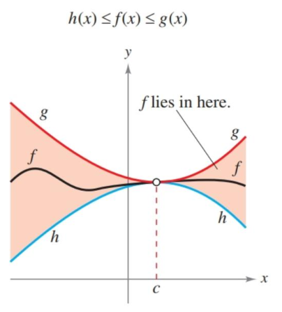

- Evaluate a limit using properties of limits.
- Develop and use a strategy for finding limits.
- Evaluate a limit using the dividing out technique.
- Evaluate a limit using the rationalizing technique.
- Evaluate a limit using the Squeeze Theorem.

## Assignment

- **Vocabulary** and **teal boxes**{: .teal-box}
- **p84**{: .calculus-teal} 2, 6, 8, 9–25 odd, 29–32, 34-86 even, 95, 98, 101, 104, 108, 113, 123–125 (26 problems)

## Additional Resources

- AP Topics: 1.2, 1.5, 1.6, 1.7, 1.8, 1.9
- Khan Academy
  - [Defining limits and using limit notation](https://www.khanacademy.org/math/ap-calculus-ab/ab-limits-new/ab-1-2/v/introduction-to-limits-hd){: target="_blank"}
  - [Determining limits using algebraic properties of limits: limit properties](https://www.khanacademy.org/math/ap-calculus-ab/ab-limits-new/ab-1-5a/v/limit-properties){: target="_blank"}
  - [Determining limits using algebraic properties of limits: direct substitution](https://www.khanacademy.org/math/ap-calculus-ab/ab-limits-new/ab-1-5b/v/limit-by-substitution){: target="_blank"}
  - [Determining limits using algebraic manipulation](https://www.khanacademy.org/math/ap-calculus-ab/ab-limits-new/ab-1-6/v/limit-example-1){: target="_blank"}
  - [Selecting procedures for determining limits](https://www.khanacademy.org/math/ap-calculus-ab/ab-limits-new/ab-1-7/v/flow-chart-of-limit-strategies){: target="_blank"}
  - [Determining limits using the squeeze theorem](https://www.khanacademy.org/math/ap-calculus-ab/ab-limits-new/ab-1-8/v/squeeze-sandwich-theorem){: target="_blank"}

---

## Steps for Finding a Limit

### Step 1: Direct Substitution

Last section, we saw examples where the value of a limit and its true value matched. For example, for $f(x)=x^2$.

$$\begin{align}
\lim_{x\to2}f(2)= f(2)
\end{align}$$

The function appears to be approaching 4 when $x=2$, and it also happens to be 2 when $x=2$. The book refers to this as *well-behaved*. And if you read the opening part of the section, a number of theorems and examples stress this basic strategy: if you want to find the limit, try substituting first.

If that fails, your next option is to find a function that looks just like the one you have, but with that problem area filled in.

### Step 2: Using a (Mostly) Equivalent Function

Turns out that if a function is identical to another save for one point, then the limits (as long as they exist) are identical, even at that one point.

> #### Example 1
>
> Find $\lim_{x \to 1} f(x)$, where
>
> $$\begin{align}
> f(x) = \begin{cases}
> x^2+x + 1, & x\neq 1 \\
> 1, & x=1
> \end{cases}
> \end{align}$$
{: .example}

**SOLUTION** Except for when $x=1$, this is just $x^2+x+1$, meaning we can use it to find our limit.

$$\begin{align}
\lim_{x\to1} f(x) = 3
\end{align}$$

$\blacksquare$
{: .qed}

This fact is the linchpin for the bulk of your limit-hunting algebra work.

> #### Example 2: Dividing Out
>
> Find the limit.
>
> $$\begin{align}
> \lim_{x\to -3} \frac{x^2+x-6}{x+3}
> \end{align}$$
{: .example}

**SOLUTION** Substitution gives us $0/0$, which is going to make something from Algebra 2 way more useful.

> ##### Factor Theorem
>
> A polynomial $f(x)$ has a factor $(x-a)$ if and only if $f(a)=0$.
{: .definition}

That means we can divide by $x+3$ to get an equivalent function, save for that pesky denominator.

$$\begin{align}
f(x)=\frac{x^2+x-6}{x+3} = \frac{(x+3)(x-2)}{x+3}=x-2
\end{align}$$

We've found our equivalent function, so substituting $x=-3$ gives us a limit of $-5$.

> As a reminder, the domain from the original carries over to the new function. Although $x-2$ can be evaluated when $x=-3$, that fact doesn't carry back over to the original function. We are using the new one to find the limit, not the value. They may seem similar, but they are different things.

$\blacksquare$
{: .qed}

> #### Example 3: Rationalizing
>
> Find the limit.
>
> $$\begin{align}
> \lim_{x\to0}\frac{\sqrt{x+1}-1}{x}
> \end{align}$$
{: .example}

**SOLUTION** Another method of producing an equivalent function is to rationalize the radicals, meaning multiplying by their conjugate. Multiplying by $\sqrt{x+1}+1$ will hopefully open up an avenue to find the limit.

$$\begin{align}
\frac{\sqrt{x+1}-1}{x} \cdot \frac{\sqrt{x+1}+1}{\sqrt{x+1}+1} &=
\frac{(x+1)-1}{x(\sqrt{x+1}+1)} \\
 &= \frac{x}{x(\sqrt{x+1}+1)} \\
 &= \frac{1}{\sqrt{x+1}+1}
\end{align}$$

To the surprise of no one, this carefully chosen problem yielded to the strategy. The new function can be evaluated at $0$ and the limit turns out to be $\frac{1}{2}$.

$\blacksquare$
{: .qed}

### Step 3: Tables and Tracing

What we did last section—tracing a function's graph and making tables—are not ideal strategies for finding the limit of a function. Though, they are good at reinforcing what you might have found earlier.

Worst case, they are your only option, particularly when you don't have a function rule to work with.

## The Squeeze Theorem

An underlying theme in this course is specific strategies for specific problems. Unlike pre-calculus problems, you will encounter a fair number of edge cases that don't fit the main algorithm you've been using.
For example, the limit below.

$$\begin{align}
\lim_{x\to0} \frac{\sin x}{x}
\end{align}$$

Nothing we did above, save for the tables and tracing, will get you an answer. And again, tables and tracing are good for reinforcing, not proving.

Enter the squeeze theorem, a specific theorem for specific limit problems. It states that if a function is less than or equal to another, and a third lies in between them, whenever the bounding functions have an equal limit, then the inner one shares the same limit. This strategy is used to prove that $\lim_{x\to0}\frac{\sin x}{x}=1$. It's in the book and worth a read, but I won't put it here.

> {: width="250"}
>
> **Figure 1.3.1** Visual of how the squeeze theorem works.
{: .figure}

There are three limits listed under Theorem 1.9 that require the squeeze theorem to prove, one of which is $\lim_{x\to0}\frac{\sin x}{x}$. Each comes in handy for the exercises, but as far as what you need to know for the exam, just knowing the squeeze theorem is enough. We'll come back to it later in the chapter, and with a more concrete example.

> ### Example 4: Using One of the Special Limits
>
> Find the limit.
>
> $$\begin{align}
> \lim_{x\to0}\frac{\tan x}{x}
> \end{align}$$
{: .example}

**SOLUTION** We can use trigonometric identities to rewrite this in a form that includes $\lim_{x\to0} \frac{\sin x}{x}$.

$$\begin{align}
\lim_{x\to0}\frac{\tan x}{x} &= \lim_{x\to0}\left(\frac{\sin x}{x}\right)\left(\frac{1}{\cos x}\right) \\
&= \lim_{x\to 0}\frac{\sin x}{x} \cdot \lim_{x\to 0}\frac{1}{\cos x} \\
&= 1\cdot 1 \\&=1
\end{align}$$

$\blacksquare$
{: .qed}
