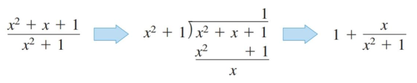

- Use the Log Rule for Integration to integrate a rational function.
- Integrate trigonometric functions.

## Assignment

- **Vocabulary** and **teal boxes**{: .teal-box}
- p353 (32 problems) 1, 5, 9, 13, 17, 21, 25, 29, 33, 37, 41, 43, 44, 47–49, 53, 55, 58, 68, 70, 71–77 odd, 81, 92, 94, 104–107

## Additional Resources

- AP Topics: 6.10
- Khan Academy
  - [Integrating functions using long division and completing the square](https://www.khanacademy.org/math/ap-calculus-ab/ab-integration-new/ab-6-10/v/integral-partial-fraction){: target="_blank"}

---

## Log Rule for Integration

Despite the section's length, it doesn't cover anything too new. Instead, it combines the logarithm rule with integration by substitution.

$$\begin{align}
\int \frac{1}{u} \, du = \ln|u| + C
\end{align}$$

> Note the use of absolute value. Logarithms are not defined when $x < 0$, so the absolute value is necessary to ensure $x$ stays positive.

There is also the alternative version which can be helpful depending on the situation.

$$\begin{align}
\int \frac{u'}{u} \, dx= \ln|u| + C
\end{align}$$

This rule can help with integrating any function where the degree of the denominator is one more than the degree of the numerator, along with any situation where the numerator resembles the derivative of the denominator.

> ### Log Rule Example 1
>
> Find $\displaystyle \int \frac{2}{x}\,dx$.
{: .example}

$$\begin{align}
\int \frac{2}{x}\,dx &= 2\int \frac{1}{x}\,dx \\
                     &= 2\ln |x| + C \label{ex1soln1}\\
                     &= \ln x^2 + C \label{ex1soln2}
\end{align}$$

$\blacksquare$
{: .qed}

You might want to [brush up on logarithm](https://www.khanacademy.org/math/college-algebra/xa5dd2923c88e7aa8:logarithms){: target="_blank"}, or at least have a [reference sheet nearby](https://www.geeksforgeeks.org/maths/log-rules/){: target="_blank"}.

> ### Log Rule Example 2
>
> Find $\displaystyle \int \frac{x}{x^2+1}\,dx$.
{: .example}

$$\begin{align}
\int \frac{x}{x^2+1}\,dx &= \frac{1}{2}\int \frac{1}{u}\, du &\text{Let $u=x^2+1$}\\[0.5em]
                         &= \frac{1}{2}\ln |u| + C \\[0.5em]
                         &= \frac{1}{2}\ln |x^2+1| + C
\end{align}$$

$\blacksquare$
{: .qed}

> ### Log Rule Example 3
>
> Find $\displaystyle \int \frac{\sec^2 x}{\tan x}\,dx$.
{: .example}

$$\begin{align}
\int \frac{\sec^2 x}{\tan x}\,dx &= \int \frac{1}{u}\,du &\text{Let $u=\tan x$}\\
                                 &= \ln |u| + C \\
                                 &= \ln |\tan x| + C
\end{align}$$

$\blacksquare$
{: .qed}

## Long Division

This section, like the one before on substitution, highlights what the book calls the "form-fitting" nature of integration. The typical first goal when working with an integral is to find a way to fit it into one of the forms you can work with. This is in contrast to differentiating, where you don't need to worry about rewriting as an initial step.

Like always, you should go through each of the examples in the book, but the one I want to specifically highlight is using long division to rewrite an integral.

> ## Long Division Example
>
> Find $\displaystyle \int \frac{x^2+x+1}{x^2+1}$.
{: .example}

Showing long division in this format is giant pain, so I am taking the easy way out and just giving you a picture from the book.

> {: width="400"}
>
> **Figure 4.7.1** Long division of $\frac{x^2+x+1}{x^2+1}$.
{: .figure}

From here, we can rewrite the integral and evaluate it.

$$\begin{align}
\int \frac{x^2+x+1}{x^2+1} &= \int 1 \, dx + \frac{x}{x^2+1} \, dx \\
                           &= \int 1 \, dx + \int \frac{x}{x^2+1} \, dx \\
                           &= \int 1 \, dx + \frac{1}{2}\int \frac{2x}{x^2+1} \, dx \\
                           &= x + \frac{1}{2}\ln |x^2 + 1| + C
\end{align}$$

$\blacksquare$
{: .qed}

In that last example, I skipped substitution. This is something you can start doing if you are comfortable with seeing the pattern that results from using the chain rule.
