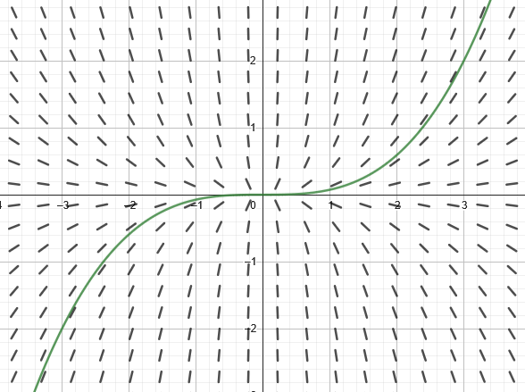

- Use initial conditions to find particular solutions of differential equations.
- Use slope fields to approximate solutions of differential equations.
- ~~Use Euler's Method to approximate solutions of differential equations.~~[^1]

## Assignment

- **Vocabulary** and **teal boxes**{: .teal-box}
- p375 (29 problems) 1–4, 9, 11, 29, 32, 33, 37, 39, 44, 46, 50, 52, 55–57, 59–64, 89–93 odd, 99, 101

## Additional Resources

- AP Topics: 7.1, 7.2, 7.3, 7.4, 7.5, 7.7
- Khan Academy
  - [Modeling situations with differential equations](https://www.khanacademy.org/math/ap-calculus-ab/ab-differential-equations-new/ab-7-1/v/differential-equation-introduction){: target="_blank"}
  - [Verifying solutions for differential equations](https://www.khanacademy.org/math/ap-calculus-ab/ab-differential-equations-new/ab-7-2/v/verifying-solutions-to-differential-equations){: target="_blank"}
  - [Sketching slope fields](https://www.khanacademy.org/math/ap-calculus-ab/ab-differential-equations-new/ab-7-3/v/creating-a-slope-field){: target="_blank"}
  - [Reasoning using slope fields](https://www.khanacademy.org/math/ap-calculus-ab/ab-differential-equations-new/ab-7-4/v/slope-field-to-visualize-solutions){: target="_blank"}
  - [Finding particular solutions using initial conditions and separation of variables](https://www.khanacademy.org/math/ap-calculus-ab/ab-differential-equations-new/ab-7-7/v/finding-constant-of-integration-rational){: target="_blank"}

---

## General and Particular Solutions

Over the next few sections, we'll be working with **differential equations**, which are equations that involve $x$, $y$ and the derivatives of $y$. Like any other equation, if you can plug something into it and it evaluates to true, then it's a solution. Unlike other equations you've worked with before, solutions to differential equations are often functions.

For example, ${y'+2y = 0}$ is a differential equation, and one of its solution is ${y=e^{-2x}}$. We can verify this by substituting in for $y$, then finding its derivative and substituting that in for $y'$.

$$\begin{align}
y'+2y &= 0 \\
\left(-2e^{-2x}\right) + 2\left(e^{-2x}\right) &= 0 \\
0 &= 0
\end{align}$$

You might have picked up on that I said "one of its solutions". Lots of other work.

$$\begin{align}
\text{Let }y &= 3e^{-2x} \\[1em]
y'+2y &= 0 \\
\left(-6e^{-2x}\right) + 2\left(3e^{-2x}\right) &= 0 \\
0 &= 0
\end{align}$$

$$\begin{align}
\text{Let }y &= -5e^{-2x} \\[1em]
y'+2y &= 0 \\
\left(10e^{-2x}\right) + 2\left(-5e^{-2x}\right) &= 0 \\
0 &= 0
\end{align}$$

In fact, anything in the form ${y=Ce^{-2x}}$ is a solution to that differential equation. This is called the **general solution**, and the general solution to a differential equation will have a number of constants equal to its **order**. Order is determined by the highest-order derivative in the equation. Our example includes a first derivative, so its order is one, and so the general solution ends up having one constant.

> You were introduced to differential equations [back in 4.1](./4-1-antiderivatives.md). Only $x$ and $y'$ were involved, like $y'=2x+4$, so solving only required antidifferentiating both sides. Now $y$ will enter the mix and new strategies for solving will be introduced over the next few sections. For now, don't worry too much about where these general solutions come from. We'll get there.
>
> Also, this is the likely the first time you've seen $C$ appear in a position other than added on at the end. This a consequence of $y$ now being being part of the equation. Again, how this happens is coming in later sections.

### Finding Particular Solutions

Once a general solution has been verified, it can be used to find particular solutions determined by initial conditions. The differential equation ${xy' - 3y = 0}$ has a general solution of ${y=Cx^3}$ (again, don't worry about where the solution came from), but we want the solution that passes through $(3,2)$. All that's needed to is to substitute your values into the general solution and solve for $C$.

$$\begin{align}
y &= Cx^3 \\
(2) &= C(3)^3 \\
\frac{2}{27} &= C
\end{align}$$

So, our particular solution is ${y = \frac{2}{27}x^3}$.

### Finding General Solutions

There are exercises on this topic, but no examples in the text since we covered this [back in 4.1](./4.1-antiderivatives.md). Here is #39 from the HW, which comes with a video, but I took a slightly different approach to prime you for what's coming in the next few sections.

$$\begin{align}
\frac{dy}{dx} &= 12x^2 \\
                 dy &= 12x^2 \, dx  && \text{Multiply both sides by } dx \\
\int dy &= \int 12x^2 \, dx && \text{Integrate both sides} \\
y &= 4x^3 + C
\end{align}$$

It's going to appear that you can just integrate both sides—in fact all the problems in the section work that way—but we'll soon run into differential equations where that isn't the case.

## Slope Fields

When you solved equations with one variable (e.g. $3x +2 = 7$), you got a single solution. One point on a number line (or coordinate plane). When you were introduced to equations with two variables, you now had an infinite number of solutions. Visualizing them was trickier, but you eventually learned that they could be drawn as curves. Some equations produced lines (technically still a curve), others parabolas, or sine waves, the list goes on and on.

Differential equations throw a new wrinkle into this visualization problem. We still have an infinite number of solutions, but instead of each solution being a singular point, each solution is a function (or curve). We are now tasked with trying to visualize an infinite number of curves, each with it's own infinite number of points. If if you tried drawing this on a coordinate plane, the preferred method would be a paint bucket.

So we have **slope fields** to help visualize solutions to differential equations. Rather than trying to draw every point on every curve, a selection of points is chosen, and the slopes of the curve that passes through that point is drawn.

> 
>
> **Figure 5.1.1** The slope field for ${xy' - 3y = 0}$ along with the particular solution ${y = \frac{2}{27}x^3}$. You can view [this graph in GeoGebra](https://www.geogebra.org/calculator/fywn9rxh){: target="_blank"}.
{: .figure}

Slope fields are created by first putting the differential in the form ${y'=F(x,y)}$ (i.e, solving for $y'$, or the slope), then plugging points into ${F(x,y)}$ to get the slope at that point. Short lines representing those slope are then drawn at the points that produced them.

You'll only need create these once or twice by hand in the homework, just so you get used to the process. Once you get the hang of it, switch to using technology to make any others. My recommendation for that is [GeoGebra](https://www.geogebra.org/calculator){: target="_blank"}. It's similar to Desmos, but with a lot more power and complexity. Also, Desmos can't do slope fields without a lot of work.[^2]

Let's use the differential from earlier, ${xy' - 3y = 0}$. We'll need to solve for $y'$ first, and that gives us ${y'=3y/x}$. In GeoGebra enter `SlopeField(3y/x)` to generate your slope field. Then, you can enter the particular solution on the next line to see how it matches up with the field.

Now that we can "see" the general solution of ${y=Cx^3}$, it's worth pointing out that the constant isn't added on to the end like it normally is when integrating. Instead, the constant is acting as a scaler in the solution. You can see that a bit better by adding a few more particular solutions.

## Identifying Slope Fields for Differential Equations

Reading slope fields and trying to determine what differential equation it represents is tricker. Example 4 in the book highlights what you can look for to make these easier. Generally, undefined slopes and slopes of $0$, $1$, or $-1$ are helpful, along with the points that run along the $x$- and $y$-axis. The points along $y=x$ and $y=-x$ are good place to look as well.

I suggest practicing a fair bit with these. [Khan Academy has an exercise for it](https://www.khanacademy.org/math/ap-calculus-ab/ab-differential-equations-new/ab-7-3/e/slope-fields){: target="_blank"}.

[^1]: Euler's method is an AP Calc BC topic, so we'll only be looking at slope fields.
[^2]: If you insist on Desmos, here's a [template that won't be very helpful for the AP exam](https://www.desmos.com/calculator/vyurathgr4){: target="_blank"}.
