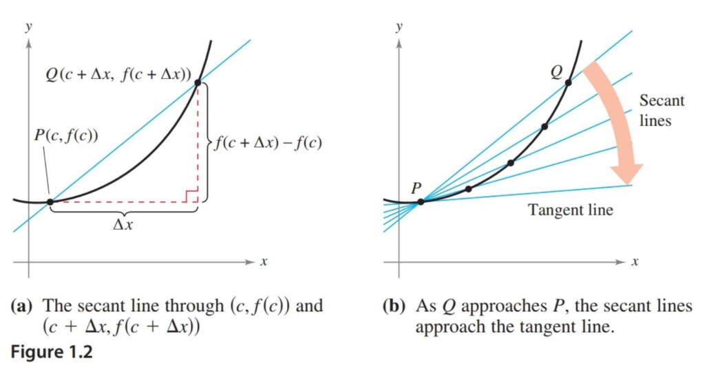
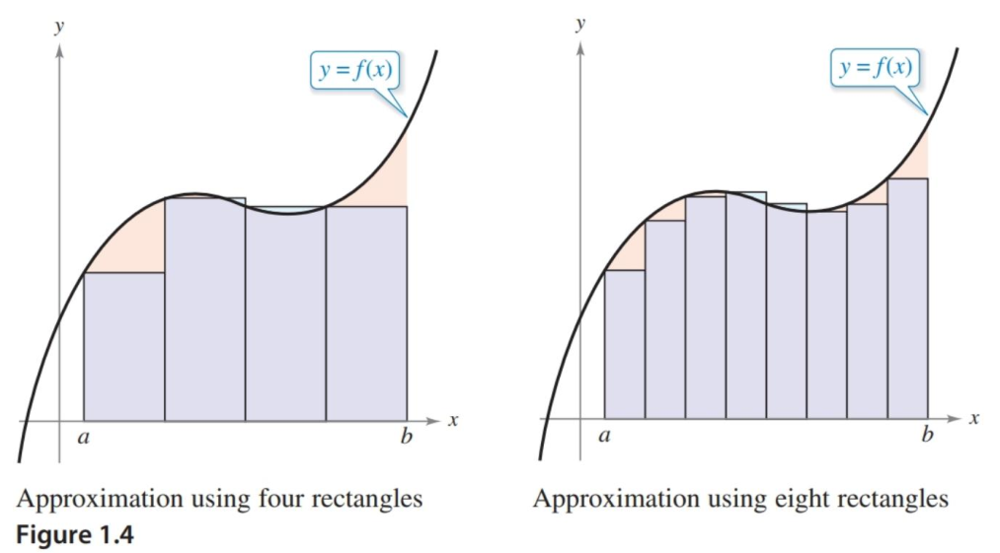

- Understand what calculus is and how it compares with precalculus.
- Understand that the tangent line problem is basic to calculus.
- Understand that the area problem is also basic to calculus.

## Assignment

- **Vocabulary** and **teal boxes**{: .teal-box}
- p63 5, 6, 10, 13, 16, 17, 19, 20 *22–24*{: .ap-problems}

*The vertical bar indicates the AP cut-off. Problems after the bar are recommended for AP prep, but not required for the assignment.*{: .small}

## Additional Resources

- AP Topics: 1.1

---

Calculus is the mathematics of change. Up until this point, math problems you've seen have involved static situations with a lof of the difficult wrinkles ironed out.

For example, you're able to determine the average velocity of object based on how far it's traveled and how long it took to get there. But what about how fast it's going at one particular point along its journey? You are also able to find the area of shapes made up of simple polygons, like triangles and rectangles. What about shapes that involve curves? Like the area between two overlapping parabolas?

The book provides more examples of what you can do with the math you've already been taught, and what you'll be able to do once you have calculus added to your tool belt. Today, we're just setting the stage for the shift in thinking that will come with this new topic.

## The Tangent Line Problem

You've already learned how to find the slope of secant lines, though you might not know it. Secant lines are lines that cross a curve at two points, so finding their slope is something you've been doing since Algebra I.

> Worth noting is that slope is also the average rate of change, and it's important that you start associating the two. It's defined as the ratio of two variables and should be thought of as a rate, like miles per hour.

In contrast, calculus focuses on finding the slope of tangent lines, where the line only crosses the curve at a single point. Imagine a secant line, but then start moving one of the points closer to the other. When those points are the same, you have a tangent line.

> {: width="500"}
>
> **Figure 1.1.1** On the left, a secant line. The right image shows how as the points get closer, the secant line eventually becomes a tangent line. You can find an interactive version of this [here on Desmos](https://www.desmos.com/calculator/ndruflgw8x){: target="_blank"}.
{: .figure}

Of course, if the points are the same the difference between your $x$-values is $0$, meaning to calculate slope we would have to divide by $0$. In the next section we'll introduce a concept known as the **limit** to get around this issue. Think of it as "what something looks like rather than what it is".

## The Area Problem

As a second example of where limits will be needed is when finding the area under a curve. A good way to start is by breaking the area into rectangles and adding up those individual areas. It won't be a terribly accurate estimate, but you can improve it by reducing the width of each and adding more. If you push this idea to its limit (get it?), you'll end up with an infinite number of rectangles, each with a width of $0$, but also a perfectly accurate measurement.

> {: width="500"}
>
> **Figure 1.1.2** Breaking the space under a curve into smaller and smaller rectangles to estimate it's true area. Interactive version [here on Geogebra](https://www.geogebra.org/m/CvMuWxcT){: target="_blank"}.
{: .figure}

OK, so now we have to figure out how to first calculate the area of something with no width, and then add up an infinite number of them. Limits will be our savior here again, but this is a problem we'll revisit about halfway through the course.
