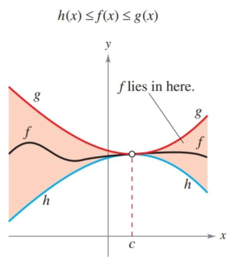

- Evaluate a limit using properties of limits.
- Develop and use a strategy for finding limits.
- Evaluate a limit using the dividing out technique.
- Evaluate a limit using the rationalizing technique.
- Evaluate a limit using the Squeeze Theorem.

## Assignment

- **Vocabulary** and **teal boxes**{: .teal-box}
- p84 2, 6, 8, 9–25 odd, 29–32, 34-86 even, 95, 98 *101, 104, 108, 113, 123–125*{: .ap-problems}

*The vertical bar indicates the AP cut-off. Problems after the bar are recommended for AP prep, but not required for the assignment.*{: .small}

## Additional Resources

- AP Topics: 1.2, 1.5, 1.6, 1.7, 1.8, 1.9
- Khan Academy
  - [Defining limits and using limit notation](https://www.khanacademy.org/math/ap-calculus-ab/ab-limits-new/ab-1-2/v/introduction-to-limits-hd){: target="_blank"}
  - [Determining limits using algebraic properties of limits: limit properties](https://www.khanacademy.org/math/ap-calculus-ab/ab-limits-new/ab-1-5a/v/limit-properties){: target="_blank"}
  - [Determining limits using algebraic properties of limits: direct substitution](https://www.khanacademy.org/math/ap-calculus-ab/ab-limits-new/ab-1-5b/v/limit-by-substitution){: target="_blank"}
  - [Determining limits using algebraic manipulation](https://www.khanacademy.org/math/ap-calculus-ab/ab-limits-new/ab-1-6/v/limit-example-1){: target="_blank"}
  - [Selecting procedures for determining limits](https://www.khanacademy.org/math/ap-calculus-ab/ab-limits-new/ab-1-7/v/flow-chart-of-limit-strategies){: target="_blank"}
  - [Determining limits using the squeeze theorem](https://www.khanacademy.org/math/ap-calculus-ab/ab-limits-new/ab-1-8/v/squeeze-sandwich-theorem){: target="_blank"}

---

Last section, we saw examples where the value of a limit and its true value matched. For example, for $f(x)=x^2$.

$$ \lim_{x\to2}f(2)= f(2) $$

The function appears to be approaching 4 when $x=2$, and it also happens to be 2 when $x=2$. This is an example of a well-behaved function. For well-behaved functions, substituting is a perfectly valid way to evaluate a limit.

There is one other theorem that addresses a situation we saw last section.

$$ f(x) = \begin{cases}
x^2+x + 1, & x\neq 1 \\
1, & x=1
\end{cases} \qquad g(x)=x^2+x + 1$$

If two functions are identical save for a specific value, than its safe to assume their limits agree. So, despite the first case not being defined when $x=1$, we can still use $g(x)$ to determine $\lim_{x\to1}f(x)$.

## A Strategy for Finding Limits

First off, tracing a function and tables are not definitive proofs for the limit of a function. They happen to work for most of our examples, but more concrete evidence is needed. Substitution works for the well-behaved functions, but for the rest we need rely on algebra. This means rewriting your function or simplifying to find a similar function.

### Dividing Out

One way to find the almost equivalent function is by dividing when presented with a rational function.

$$ \lim_{x\to -3} \frac{x^2+x-6}{x+3} $$

Substitution gives us $0/0$, also known as the indeterminate form, but $x-3$ is a factor of $x^2+x-6$.

$$f(x)=\frac{x^2+x-6}{x+3} = \frac{(x+3)(x-2)}{x+3}=x-2$$

We've found our equivalent function. Substituting $x=-3$ gives us a limit of $-5$.

As a reminder, the domain from the original carries over to the new function. Although $x-2$ can be evaluated when $x=-3$, as a function in this situation, it cannot. We are only using it to evaluate the limit. It might seem like a minor distinction, but it's important to remember that the limit of a function is not the same as the value of the function.

### Rationalizing

Another method is to rationalize the radicals, meaning multiplying by their conjugate.

$$ \lim_{x\to0}\frac{\sqrt{x+1}-1}{x}$$

Multiplying by $\sqrt{x+1}+1$ will hopefully open up an avenue to find the limit.

$$\begin{align*}
\frac{\sqrt{x+1}-1}{x} \cdot \frac{\sqrt{x+1}+1}{\sqrt{x+1}+1} &=
\frac{(x+1)-1}{x(\sqrt{x+1}+1)} \\
 &= \frac{x}{x(\sqrt{x+1}+1)} \\
 &= \frac{1}{\sqrt{x+1}+1}
\end{align*}$$

This new function can now be evaluated at $0$, and the limit turns out to be $\frac{1}{2}$.

## The Squeeze Theorem

If a function is less than or equal to another, and a third lies in between them, whenever the bounding function have an equal limit, then the inner one shares the same limit.

There is a proof in the book that uses the squeeze theorem to find the $\lim_{x\to0}\frac{\sin x}{x}=1$. You don't need to know it, but the logic used is worth a read through.

There are also two other limits listed under Theorem 1.9 that require the squeeze theorem to prove. Each comes in handy for the exercises (an example is below), but you don't need to memorize them for the exam.

$$\begin{align*}
\lim_{x\to0}\frac{\tan x}{x} &= \lim_{x\to0}\left(\frac{\sin x}{x}\right)\left(\frac{1}{\cos x}\right) \\
&= \lim_{x\to 0}\frac{\sin x}{x} \cdot \lim_{x\to 0}\frac{1}{\cos x} \\
&= 1\cdot 1 \\&=1
\end{align*}$$
