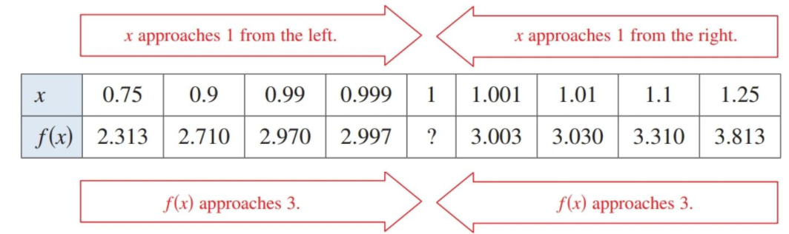

## Finding Limits Graphically and Numerically

### An Introduction to Limits

Here's a function.

$$ f(x) = \frac{x^3-1}{x-1} $$

Sketching this wouldn't be too difficult. Pick some $x$-values, plug them in, generate $y$-values, and you'll get a parabola as a result (degree 3 on top, divided by degree 1 on bottom, leaves you with $x^2$).

But what happens when $x=1$? The function it self won't evaluate since you are dividing by zero, but what does it look like the function is doing? What happens when you plug in values that get closer and closer to $x=1$? As you plug in numbers that approach 1 from the negative side (0.9, 0.99, etc.) and then numbers from the positive side (1.1, 1.01, etc.), you'll that both sets of numbers look like they are heading towards a value of 3.

And if you were to graph it with Desmos or a calculator, you would see the same thing. Technically, there's a gap, but it is definitely heading towards 3. The limit of $f(x)$ as $x$ approaches 1 is 3. We write that as

$$ \lim_{x\to1}f(x)=3 $$

Let's look at a different case.

$$ f(x) = \begin{cases}
1, & x\neq2 \\
0, & x=2
\end{cases}$$
