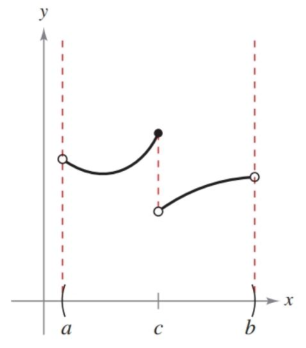

## {{ page.title }}

I've mentioned continuity briefly, but here's the full definition. A graph is continuous at a point if a) that point exists, and b) the limit also exists and matches the point.

Here it is in more formal language.

> **Continuity at a Point**
>
> A function $f$ is continuous at $c$ when these three conditions are met.
> 
> 1. $f(c)$ is defined
> 2. $\lim_{x\to c} f(x)$ exists
> 3. $\lim_{x\to c} f(x) = f(c)$

When those conditions are met for every point on an open interval, then the interval is continuous. And an entire function is continuous if that open interval is $(-\infty,\infty)$.

Where a graph is not continuous is called a discontinuity, and they can be classified as removable or non-removable. Removable discontinuities can be "fixed" by finding an equivalent function that fixes the hole. We worked with those functions last section when trying to find their limits.

$$ \frac{x^2-1}{x-1} = \frac{(x-1)(x+1)}{x-1} = x+1$$

Removable discontinuities can't be fixed. They usually see the function taking off to infinity or "jumping" to another function, like below.

### One-Sided Limits and Continuity on a Closed Interval

So far, we've talked about continuity on an open interval. On a closed-interval things change a bit, mostly because there is a hard break at the end of the interval.

Take the function $f(x)=\sqrt{x}$ for instance. Is the function continuous at $f(0)$? Does the limit exist at $f(0)$? Our old tricks don't work since we can only approach 0 from one side since negatives are not part of the domain.

So, in these cases we only worry about one-sided limits, where we just see what the function is doing as we approach from either the left or the right. In our square-root function that looks like

$$ \lim_{x\to 0^+} \sqrt{x} = 0 $$

Notice the '+' sign above the point we're approaching. That tells you which side we care about. Here, we're approaching from the positive side, or the right.

We can also take this and redefine our limits. If the left-side and right-side limits don't agree, then the limit does not exist.

The book goes into some other definitions and properties of continuity that are worth reading, but we'll skip them for now.

### Intermediate Value Theorem

Let's get the formal definition out of the way first.

> **Intermediate Value Theorem**
>
> If $f$ is continuous on the closed interval $[a,b]$, $f(a)\neq f(b)$, and $k$ is any real number between $f(a)$ and $f(b)$, then there is at least one number $c$ in $[a,b]$ such that
>
> $$f(c)=k$$

In other words, if you have a continuous function—which means every value between $a$ and $b$ exists—then every value between $f(a)$ and $f(b)$ also exists.

A real-world example, if you are driving somewhere and at some point you were 2 miles from home. Later on you were 5 miles from home. The Intermediate Value Theorem says that at some point you were 3 miles from, and 4 miles, and 2.5, and 4.7, and every other number in between 2 and 5. It might seem obvious, but things like this are foundational for other concepts higher up in math.

One immediate application is proving that zeros exist in certain intervals. Let

$$ f(x) = x^3 + 2x - 1 $$

We can determine if a zero exists in the interval $[0,1]$ by determining if one bound produces a negative and the other a positive.

$$ f(0) = - 1 \qquad f(1) = 2 $$

So, there must be some number $c$ in that interval where $f(c) = 0$.
