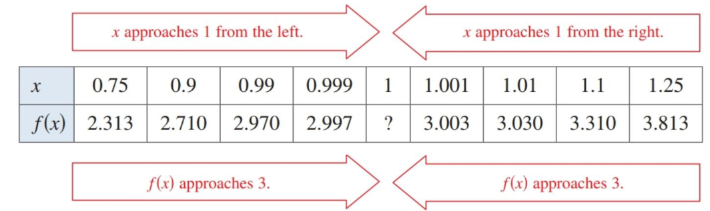
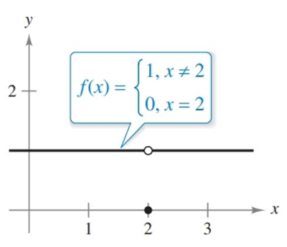
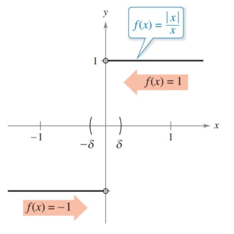
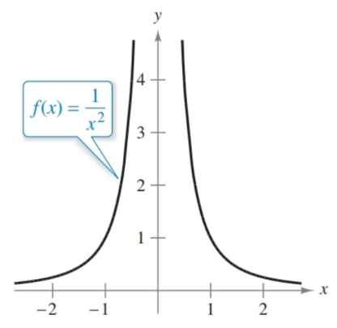
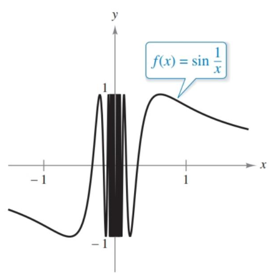

- Estimate a limit using a numerical or graphical approach.
- Learn different ways that a limit can fail to exist.
- Study and use a formal definition of limit.

## Assignment

- **Vocabulary** and **teal boxes**{: .teal-box}
- p72 1, 2, 5, 6, 9, 10, 15, 16, 19, 22, 24–27, 29, 30, 51–57 odd, 61 *64–68, 77–80*{: .ap-problems}

*The vertical bar indicates the AP cut-off. Problems after the bar are recommended for AP prep, but not required for the assignment.*{: .small}

## Additional Resources

- AP Topics: 1.2, 1.3, 1.4, 1.9
- Khan Academy
  - [Defining limits and using limit notation](https://www.khanacademy.org/math/ap-calculus-ab/ab-limits-new/ab-1-2/v/introduction-to-limits-hd){: target="_blank"}
  - [Estimating limit values from graphs](https://www.khanacademy.org/math/ap-calculus-ab/ab-limits-new/ab-1-3/v/limits-from-graphs){: target="_blank"}
  - [Estimating limit values from tables](https://www.khanacademy.org/math/ap-calculus-ab/ab-limits-new/ab-1-4/v/approximating-limit-from-table){: target="_blank"}

---

## An Introduction to Limits

Here's a function.

$$ f(x) = \frac{x^3-1}{x-1} $$

Sketching this wouldn't be too difficult. Pick some $x$-values, plug them in, generate $y$-values, and you'll get a parabola as a result (degree 3 on top, divided by degree 1 on bottom, leaves you with $x^2$).

But what happens when $x=1$? The function itself won't evaluate since you are dividing by zero, but what does it look like the function is doing? What happens when you plug in values that get closer and closer to $x=1$? As you plug in numbers that approach $1$ from the negative side ($0.9$, $0.99$, etc.) and then numbers from the positive side ($1.1$, $1.01$, etc.), you'll that both sets of numbers look like they are heading towards a value of $3$.

> {: width="500"}
>
> **Figure 1.2.1** Table of values showing that as $x$ approaches $1$, then $f(x)$ approaches $3$.
{: .figure}

And if you were to graph it with Desmos or a calculator, you would see the same thing. Technically, there's a gap, but it is definitely heading towards 3. This is referred to as the limit of $f(x)$ as $x$ approaches 1, which is written as

$$\begin{align}
  \lim_{x\to1}f(x)=3
\end{align}$$

Here's the informal definition of a limit (yes, there's a formal version of this too).

> ### Informal Definition of a Limit
>
> If $f(x)$ becomes arbitrarily close to a single number $L$ as $x$ approaches $c$ from either side, then the limit of $f(x)$ as $x$ approaches $c$ is $L$.
>
> $$\begin{align}
> \lim_{x\to c}f(x)=L
> \end{align}$$
{: .definition}

Another way to think of limits is to ask "what does the function look like it's doing?" Let's look at a different case.

### Example 1

> Find the limit of $f(x)$ as $x$ approaches $2$.
>
> $$\begin{align}
> f(x) = \begin{cases}
> 1, & x\neq2 \\
> 0, & x=2
> \end{cases}
> \end{align}$$
{: .example}

Here, there is difference between $f(2)$ and $\lim_{x\to2}f(x)$. The former is clearly defined—when $x$ is $2$, then $f(x)$ is $2$—but what the function appears to be doing, the limit, as it approaches $x=2$ is $1$.

> {: width="200"}
>
> **Figure 1.2.2** The graph of $f(x)$ from Example 1. The limit as $x\to 2$ is $1$, despite the functions defined value of $f(2)=0$.
{: .figure}

$\blacksquare$
{: .qed}

## Limits That Fail to Exist

There are some situations where limits do not exist, where it can't be determined what the graph is actually doing when it approaches a given value. One is different right and left behavior, which is when approaching a value from different directions yields different values. The graph of $f(x)=\frac{\|x\|}{x}$ is one example.

> {: width="200"}
>
> **Figure 1.2.3** The graph of $f(x)=\frac{\|x\|}{x}$. The limit does not exist at $x=0$ since the right- and left-hand behaviors do not agree.
{: .figure}

Unbounded behavior is example. This is where the graph takes off to infinitely while approaching the value in question.

> {:  width="200"}
>
> **Figure 1.2.4** Graph of $f(x)=1/x^2$ which shows limits that head toward infinity.
{: .figure}

The last one is oscillating behavior. This is when the oscillations of a function increase as they approach a value, never settling on a specific point.

> {: width="200"}
>
> **Figure 1.2.5** The graph of $\sin(1/x)$ which shows accelerating oscillation as it approaches $0$, and never settles on a value.
{: .figure}

## A Formal Definition of Limit

We looked at an informal definition of a limit earlier, which as math definitions go, was not great. What is meant by "really close" and "approaches"? The vagueness of the terms used was likely enough to get the point across, but stricter definitions are needed to make sure there is no ambiguity.

The more formal version is called the epsilon-delta definition, but CollegeBoard is very clear about this not appearing on the exam. The definition is written out in the textbook if you are curious, and I can also recommend [this Khan Academy video on the topic](https://www.youtube.com/watch?v=w70af5Ou70M){: target="_blank"}.
