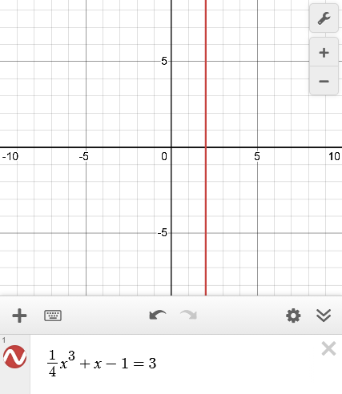

- Find the derivative of an inverse function.
- Differentiate an inverse trigonometric function.

## Assignment

- **Vocabulary** and **teal boxes**{: .teal-box}
- p187 1, 5, 8, 10, 11, 13, 16, 19, 22, 25, 28, 31, 34, 37, 40–45, 48, 52, 59, 61 *76, 85–88*{: .ap-problems}

## Additional Resources

- AP Topics: 3.3, 3.4, 3.5
- After this section, you can complete **Unit 3 Progress Checks MCQ, and FRQ Parts A and B**
- Khan Academy
  - [Differentiating inverse functions](https://www.khanacademy.org/math/ap-calculus-ab/ab-differentiation-2-new/ab-3-3/v/derivatives-of-inverse-functions){: target="_blank"}
  - [Differentiating inverse trigonometric functions](https://www.khanacademy.org/math/ap-calculus-ab/ab-differentiation-2-new/ab-3-4/v/derivative-inverse-sine){: target="_blank"}
  - [Selecting procedures for calculating derivatives: strategy](https://www.khanacademy.org/math/ap-calculus-ab/ab-differentiation-2-new/ab-3-5a/v/correcting-work-on-derivative-strategies){: target="_blank"}
  - [Selecting procedures for calculating derivatives: multiple rules](https://www.khanacademy.org/math/ap-calculus-ab/ab-differentiation-2-new/ab-3-5b/v/differentiating-using-multiple-rules-strategy){: target="_blank"}

---

Inverse functions are when your $x$ and $y$ values get reversed (lesson from chapter P [here](./0.4-inverse-functions.md)). Inverse functions are still functions, so differentiating them requires no extra knowledge. However, there is a relationship between the derivative of the original and the derivative of its inverse. That relationship is derived below, and it starts with a basic property of inverse functions: $f(f^{-1}(x)) = x$.

$$\begin{align}
f(g(x)) &= x \\
\frac{d}{dx}[f(g(x))] &= \frac{d}{dx}[x]\\
f'(g(x)) \cdot g'(x) &= 1 \\
g'(x) &= \frac{1}{f'(g(x))}
\end{align}$$

This relationship allows you to find the derivative of the inverse at a point, even when the function is unknown. And in fact, most AP problems involving derivatives and inverses provide points for you, so there's no need to figure out the inverse function and its derivative.

### Example 1

> Let $f(x) = \frac{1}{4}x^3 + x - 1$. Find $f^{-1}(3)$.
{: .example}

This is, more or less, the first example in the book. To find $f^{-1}(3)$, let's set up our relationship.

$$\begin{align}
(f^{-1})'(3) = \frac{1}{f'(f^{-1}(3))}
\end{align}$$

So, we'll need $f'$, which we can easily get since we know $f$, and $f^{-1}(3)$. For the latter, we don't know the function for $f^{-1}$ but we can find it by solving $f(x)=3$.

> Solving $f(x)=3$ in this problem boils down to solving a cubic, specifically $\frac{1}{4}x^3 + x - 1=3$. This is _not_ something the AP exam is interested in you knowing, so they will provide you with this value, at least in some way.
>
> With that said, the book is not the AP exam and assumes you should take the time to solve it. Somewhat ironically, the book glosses over how they actually solve $f(x)=3$, maybe assuming this is something you know by now. They just [draw the rest of the owl](https://duckduckgo.com/?q=draw+the+rest+of+the+owl){: target="_blank"} and do the same for any similar worked out exercises throughout the book.

Since solving $f(x)=3$ involves solving a cubic (one that can't be factored by grouping), this really should be done with a graphing calculator. There are ways of solving manually, but involve the rational root theorem and testing lots of factor combinations.

> {: width="300"}
>
> **Figure 2.6.1** $f(x)=3$ solved using Desmos.
{: .figure}

Since we found that $f(2)=3$, that means $f^{-1}(3)=2$ and we can move on to find $f'(2)$.

$$\begin{align}
f'(2) &= \frac{3}{4}(2)^2+1 \\
      &= 4
\end{align}$$

Which means we can complete the relationship we set up at the beginning.

$$\begin{align}
\left(f^{-1}\right)'(3) &= \frac{1}{f'\left(f^{-1}(3)\right)} \\[0.5em]
                        &= \frac{1}{f'(2)} \\[0.5em]
                        &= \frac{1}{4}

\end{align}$$

$\blacksquare$
{: .qed}

## Inverted Slopes

Another property of inverse functions and their derivatives is that their slopes are also inverses. We found that $(f^{-1})'(3) = \frac{1}{4}$, but we also saw that $f'(2)=4$. This inverted relationship becomes a bit more obvious when you realize the inverse of $\frac{dy}{dx}$ is $\frac{dx}{dy}$.

## Derivatives of Inverse Trigonometric Functions

As usual, there is another list of derivative rules. Arcsine and arctangent are the popular ones, but keep in mind their matching pair is just negated. We'll go through the proof of arcsine in class.
