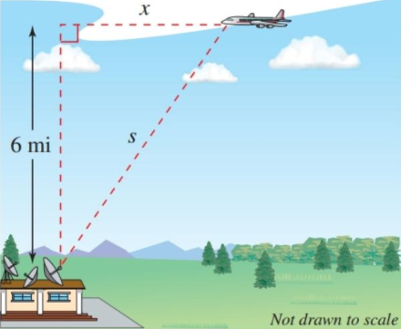

- Find a related rate.
- Use related rates to solve real-life problems.

## Assignment

- **Vocabulary** and **teal boxes**{: .teal-box}
- p195 2, 3, 7, 10–12, 14, 15–19 odd, 20, 23, 24, 28 *35, 36, 40, 45–47*{: .ap-problems}

## Additional Resources

- AP Topics: 4.2, 4.3, 4.4, 4.5
- Khan Academy
  - [Straight-line motion: connecting position, velocity, and acceleration](https://www.khanacademy.org/math/ap-calculus-ab/ab-diff-contextual-applications-new/ab-4-2/v/one-dimensional-motion-with-calculus){: target="_blank"}
  - [Rates of change in other applied contexts (non-motion problems)](https://www.khanacademy.org/math/ap-calculus-ab/ab-diff-contextual-applications-new/ab-4-3/v/modeling-a-forgetting-curve){: target="_blank"}
  - [Introduction to related rates](https://www.khanacademy.org/math/ap-calculus-ab/ab-diff-contextual-applications-new/ab-4-4/v/rates-of-change-between-radius-and-area-of-circle){: target="_blank"}
  - [Solving related rates problems](https://www.khanacademy.org/math/ap-calculus-ab/ab-diff-contextual-applications-new/ab-4-5/e/related-rates){: target="_blank"}

---

## Finding Related Rates

With implicit differentiation, we can start looking at how math models change with respect to time. For instance, how the area of a circle changes with respect to time.

$$\begin{align}
\frac{d}{dt}[A] &= \frac{d}{dt}[\pi r^2] \\
\frac{dA}{dt} &= 2\pi r \frac{dr}{dt}
\end{align}$$

What this means is that the rate of change of the area is related to both the current radius and the rate of change of the radius. Typically, these types of problems provide values for most of the variables or rates, and you'll be left to solve for the remaining one.

## Example 1

> A pebble is dropped into a calm pond, causing ripples in the form of concentric circles. The radius $r$ of the outer ripple is increasing at a constant rate of $1$ foot per second. When the radius is $4$ feet, at what rate is the total area $A$ of the disturbed water changing?
{: .example}

We can use our area of a circle model from above for this.

$$\begin{align}
\frac{dA}{dt} &= 2\pi r \frac{dr}{dt} \\
&= 2\pi (\units[4]{ft})(\units[1]{ft/sec}) \\
& = \units[8\pi]{ft^2/sec}
\end{align}$$

$\blacksquare$
{: .qed}

Note the use of units. Dimensional analysis is highly recommended so that you can a) determine the correct units, and b) verify you arrived at a correct solution. If the units don't make sense, there is likely a problem with your work. Here, square feet per second makes sense we are talking about area over time.

## Example 2

> An airplane flying at an altitude of 6 miles is on a path that will take it directly over a radar tracking station. The direct distance from the plane to the station $s$ is decreasing at a rate of 400 miles per hour when $s$ is 10 miles. What is the horizontal speed of the plane?
>
>> {: width="300"}
>>
>> **Figure 2.7.1** An airplane flying at an altitude of $6$ miles, $s$ miles from the station.
> {: .figure}
{: .example}

Although the image above helps paint the picture, we are dealing with change over time. The right triangle is actually getting narrower as the plane approaches the station.

> <video width="300" controls><source src="./img/2-7-plane-shrink.mp4" type="video/mp4"></video>
>
> **Figure 2.7.2** A narrowing triangle.
{: .figure}

Since we have a right triangle changing over time, we can start by differentiating the Pythagorean equation. I'll use the variables from the problem, with $y$ as the altitude, and prime notation to denote the derivatives. Keep in mind that they are with respect to time.

$$\begin{align}
s^2 &= x^2 + y^2 \\
\frac{d}{dt}\left[s^2\right] &= \frac{d}{dt}\left[x^2 + y^2\right] \\
2ss' &= 2xx' + 2yy'
\end{align}$$

Six variables means we need five in order to find the horizontal speed of the plane $x'$. We get $s$ and $s'$ from the problem, along with $y$, but $x$ and $y'$ are missing.

Well, we can use the Pythagorean equation to find $x$, and $y'$ is how the altitude is changing, which it isn't.

$$\begin{align}
2ss' &= 2xx' + 2yy' \\
2(\units[10]{mi})(\units[-400]{mi/hr}) &= 2(\units[8]{mi})x' + 2(\units[6]{mi}))(0) \\
\units[-8000]{mi^2/hr} &= \units[16]{mi}\cdot x' \\
\units[-500]{mi/hr} &= x'
\end{align}$$

Note the negative for the changing distance of $s$. Remember that velocity has a sign, but speed doesn't. The speed of the plane is 500 mph, but has a velocity of -500 mph, meaning it's moving to the left.

$\blacksquare$
{: .qed}
