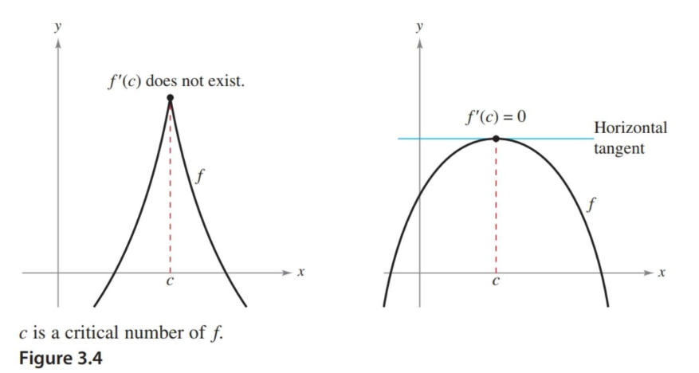

- Understand the definition of extrema of a function on an interval.
- Understand the definition of relative extrema of a function on an open interval.
- Find extrema on a closed interval.

## Assignment

- **Vocabulary** and **teal boxes**{: .teal-box}
- p217 2, 5, 11, 14, 17, 20, 23, 26, 29, 32, 35, 38, 41, 44, 45, 48, 49 *62, 68, 75–78*{: .ap-problems}

## Additional Resources

- AP Topics: 5.2, 5.4, 5.5, 5.12
- Khan Academy
  - [Extreme value theorem, global versus local extrema, and critical points](https://www.khanacademy.org/math/ap-calculus-ab/ab-diff-analytical-applications-new/ab-5-2/v/extreme-value-theorem){: target="_blank"}
  - [Using the first derivative test to find relative (local) extrema](https://www.khanacademy.org/math/ap-calculus-ab/ab-diff-analytical-applications-new/ab-5-4/v/relative-minima-maxima){: target="_blank"}
  - [Using the candidates test to find absolute (global) extrema](https://www.khanacademy.org/math/ap-calculus-ab/ab-diff-analytical-applications-new/ab-5-5/v/using-extreme-value-theorem){: target="_blank"}
  - [Exploring behaviors of implicit relations](https://www.khanacademy.org/math/ap-calculus-ab/ab-diff-analytical-applications-new/ab-5-12/v/implicit-curve-horizontal-tangent){: target="_blank"}

---

## Extrema of a Function

With your knowledge of differentiation, we'll move into applying to analyzing functions. We'll take a look at how to find key features, and then move into how those key features translate into real-life applications.

In this section we start looking at the extrema, or absolute minimum and maximum of a function. More specifically, extrema on an interval.

When analyzing functions, intervals are a focus rather than the whole function. This translates to real-life applications since we are normally only concerned about a specific domain of a function. Also, note that the theorem mentions closed intervals. If you picture a linear function on an open interval, whether to infinity in both directions are even as small as $(1,2)$, the line will continue forever, never arriving at a hightest or lowest point.

With a closed interval in mind, here is the one of the theorems you should know by name.

> ### The Extreme Value Theorem
>
> If $f$ is continuous on a **closed** interval $[a,b]$, then $f$ has both a minimum and a maximum on the interval.
{: .definition}

## Relative Extrema and Critical Numbers

There are different types of extrema, with relative and absolute[^1] maximums and minimums. Relative maxima and minima are just the highest and lowest in the area, while absolutes are—like the name entails—the absolute highest and lowest points on an interval.

If you find the value of the derivative at these local extrema, you'll get one of two possible outcomes: $0$ or does not exist. These specific $x$-values where their derivatives produce zeros or don't exist are called critical points.

> {: width="600"}
>
> **Figure 3.1.1** An example of a critical point where the derivative does not exist and another where it is $0$.
{: .figure}

Naturally, finding critical points is key to determining the extrema on an interval.

## Finding Extrema on a Closed Interval

1. **Find all the critical numbers**. This typically means differentiating, and then solving for zero and seeing where the derivative does not exist.
2. **Evaluate each critical point**. This means going back to the original function and finding the $y$-values.
3. **Evaluate the endpoints**. These are also critical points and candidates for extrema. Don't forget about them.

Once all the critical points have been run through your original function, you can determine your absolute extrema.

> ## Example 1
>
> Find the extrema of $f(x)=3x^4-4x^3$ on the interval $[-1,2]$.
{: .example}

First, find critical points by differentiating and solving for $0$.

$$\begin{align}
f'(x) &= 12x^3 - 12x^2 \\[1em]
    0 &= 12x^3 - 12x^2 \\
      &= 12x^2(x - 1)
\end{align}$$

We get tangent lines with slope of $0$ when $x=0$ and $x=1$.

As for where the derivative does not exist, we don't have an issue since this is a polynomial. The function is continuous and differentiable everywhere.

Along with $0$ and $1$, we also have to consider our endpoints of $-1$ and $2$, giving us four candidates. Now we run each through the original function.

$$\begin{align}
f(-1) = 7 \qquad f(0)=0 \qquad f(1)=-1 \qquad f(2)=16
\end{align}$$

Our absolute minimum is at $(1,-1)$ and the absolute maximum is at $(2,16)$. Don't forget to visually verify. Here's [the graph on Desmos](https://www.desmos.com/calculator/gnr5ougihw){: target="_blank"}.

$\blacksquare$
{: .qed}

Did you look at the graph for the example? You should, because there's something strange about the point $(0,0)$: despite it being a critical point, it is neither a relative maximum nor a minimum. Finding relative maxima and minima is something for later, but this is worth pointing out now so you are aware of a possible pitfall.

[^1]: They are also referred to as local and global.