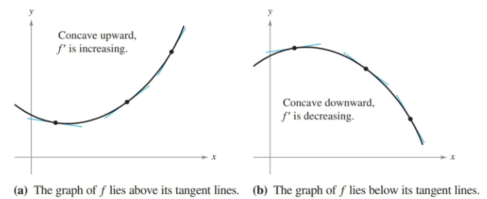

- Determine intervals on which a function is concave upward or concave downward.
- Find any points of inflection of the graph of a function.
- Apply the Second Derivative Test to find relative extrema of a function.

## Assignment

- **Vocabulary** and **teal boxes**{: .teal-box}
- p242 3, 7, 12, 13, 18, 23, 26, 27, 31, 37, 41–51 odd, 59, 67, 69–71 *74, 80, 92–94*{: .ap-problems}

## Additional Resources

- AP Topics: 5.6, 5.7
- Khan Academy
  - [Determining concavity of intervals and finding points of inflection: graphical](https://www.khanacademy.org/math/ap-calculus-ab/ab-diff-analytical-applications-new/ab-5-6a/v/concavity-concave-upwards-and-concave-downwards-intervals){: target="_blank"}
  - [Determining concavity of intervals and finding points of inflection: algebraic](https://www.khanacademy.org/math/ap-calculus-ab/ab-diff-analytical-applications-new/ab-5-6b/v/analyzing-concavity-algebraically){: target="_blank"}
  - [Using the second derivative test to find extrema](https://www.khanacademy.org/math/ap-calculus-ab/ab-diff-analytical-applications-new/ab-5-7/v/second-derivative-test){: target="_blank"}

---

## Concavity

Whether or not a graph curve upwards or downwards is described by its **concavity**. An interval where the slope is increasing is concave upward, and likewise a decreasing slope is concave downward.

> 
>
> **Figure 3.4.1** Besides the increasing/decreasing slope, you can also determine concavity by where the curve lies in relation to the tangent lines. Concave upward curves are above their tangent lines, while downwards are below their lines.
{: .figure}

A derivative's sign tells you if the original is increasing or decreasing, and we used that fact to quickly see when a function was increasing or decreasing. We can do the same with the second derivative $f^{\prime\prime}$, which tells us when the first derivative is increasing or decreasing. That in turn will let us know if $f$ is concave upward or downward.

The process for determining concavity is nearly identical to determining increasing/decreasing intervals. Use the second derivative to find ~~the critical points~~[^1] where $f^{\prime\prime}(x)=0$ or where $f^{\prime\prime}(x)$ does not exist, and then test the intervals that fall between them. If the concavity changes across intervals, that point is known as a **point of inflection**.

With the first derivative, we saw that a critical point only indicates a _possible_ point where the function switches from increasing to decreasing. The same apples with finding points of inflection. Don't assume that concavity switches just because you moved to a different interval.

> ## Example 1
>
> Determine the open intervals on which the graph of $f(x)=e^{-x^2/2}$ is concave up or concave down.
{: .example}

A rewrite will make the function easier to differentiate.

$$\begin{align}
f(x)=e^{-\frac{1}{2}x^2}
\end{align}$$

We're only concerned with concave up and down, so we can jump right to differentiating twice.

$$\begin{align}
f(x)   &= e^{-\frac{1}{2}x^2} \\
f'(x)  &= (-x)\left(e^{-\frac{1}{2}x^2}\right) \\
f''(x) &= -e^{-\frac{1}{2}x^2} + (-x)(-x)\left(e^{-\frac{1}{2}x^2}\right) \\
       &= -e^{-\frac{1}{2}x^2} + (x^2)\left(e^{-\frac{1}{2}x^2}\right) \\
       &= e^{-\frac{1}{2}x^2} \left(-1 + x^2\right) \\
\end{align}$$

The last few lines might just look like some simplification, but they are incredibly helpful for finding our boundaries. In fact, we can take it one step further and completely factor it using difference of squares.

$$\begin{align}
f''(x) &= e^{-\frac{1}{2}x^2} \left(x^2 - 1\right) \\
       &= e^{-\frac{1}{2}x^2} (x+1)(x-1) \\
\end{align}$$

$e^x$ is defined everywhere and also will never hit $0$, so our candidates for inflection points are only at $x=\pm1$, giving us three intervals to test.

This particular function gives an interesting result if we do our usual "test a large number": it produces a false $0$ on a calculator. $f^{\prime\prime}(100)$ is not actually $0$, but it's so close the calculator doesn't have the capability to display the digits needed to express the actual result.

Luckily, we only care about signs and $e^{-\frac{1}{2}x^2}$ will always be positive. If needed, test something close to the boundaries to avoid the issue.

| Interval                |            $x<-1$            |         $-1<x<1$         |            $x>1$            |
| ----------------------- | :--------------------------: | :----------------------: | :-------------------------: |
| $f^{\prime\prime}$ test | $f^{\prime\prime}(-100) > 0$ | $f^{\prime\prime}(0)=-1$ | $f^{\prime\prime}(100) > 0$ |
| Sign of $f'$            |             $+$              |           $-$            |             $+$             |
| Conclusion              |              Up              |           Down           |             Up              |

$\blacksquare$
{: .qed}

## The Second Derivative Test

Despite mostly talking about concavity this section, we're going to bounce back to extrema. The first derivative test had you looking at intervals and how they changed. Any change across intervals indicates a relative maximum or minimum.

A simpler test for extrema involves the second derivative. Assuming $c$ is a critical point, then if $f^{\prime\prime}(c) > 0$, $c$ is a relative minimum. Since the second derivate tells you the concavity, a critical point in the midst of a concave up portion of the graph must be a minimum. Likewise, if $f^{\prime\prime}(c) < 0$ then $c$ is a relative maximum as we are in a concave down portion.

What to watch for is when $f^{\prime\prime}(c) = 0$. You won't be able to draw any conclusions from this and will have to do other testing to determine the points significance.

[^1]: Critical points are specifically defined as where the first derivative is $0$ or does not exist. There is no name for these points when we are dealing with the second derivative.
