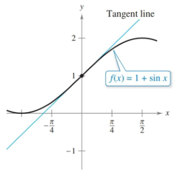
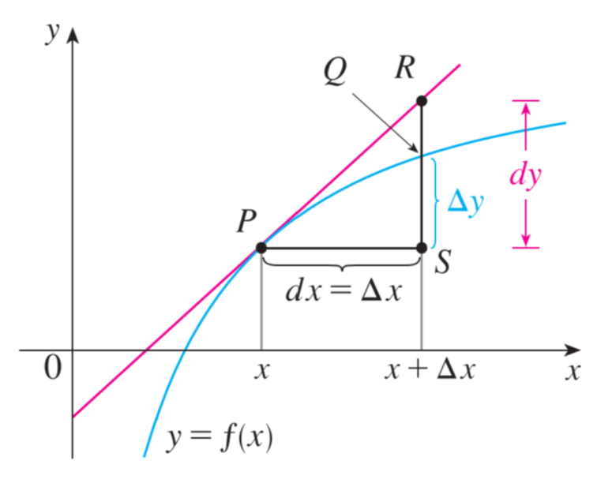

- Understand the concept of a tangent line approximation.
- Compare the value of the differential, dy, with the actual change in y, Δy.
- Estimate a propagated error using a differential.
- Find the differential of a function using differentiation formulas.

## Assignment

- **Vocabulary** and **teal boxes**{: .teal-box}
- p272 3–5, 9, 11, 14, 16–19, 25–28, 35 *40, 52–55*{: .ap-problems}

## Additional Resources

- AP Topics: 4.6
- Khan Academy
  - [Approximating values of a function using local linearity and linearization](https://www.khanacademy.org/math/ap-calculus-ab/ab-diff-contextual-applications-new/ab-4-6/v/local-linearization-intro){: target="_blank"}

---

## Tangent Line Approximations

Zoom in a part of a function's graph enough and it will begin to look like a line. We can use that fact to estimate the value of a function. Instead of getting the function's actual value, we can calculate the tangent line at a nearby convenient point and use that to estimate the function's value at the point in question.

> 
>
> **Figure 3.7.1** Zoom in close enough and curves will start to look like lines. We can use these lines to estimate values of a function.
{: .figure}

> ### Tangent Line Example
>
> Find the line tangent to $f(x)=1 + \sin x$ at $(0,1)$ and use to estimate $f(0.01)$.
{: .example}

We are given a point, so we just need a slope, which we can get from the derivative of $f$.

$$\begin{align}
y &= f'(0)(x - 0) + 1 \label{eq:1}\\
  &= (\cos0)(x) + 1 \\
  &= x + 1 \\[1em]
f(0.01) &\approx 0.01 + 1 \\
        &\approx 1.01
\end{align}$$

The true value is about $1.0099998333$, so a pretty good estimate. Keep in mind that the further away from the point, the worse the estimates.

$\blacksquare$
{: .qed}

The AP exam will refer to this concept as local linear approximation, and the local aspect is important. Also important is whether your estimate will be over or under the actual value. In figure 3.7.1, you can see that the line is above the curve when it's concave down, meaning it will be an overestimate. Conversely, when the graph is concave up the line will produce an underestimate.

> Concave up versus down means which way the curve cups, or curves. The more technical definition has to do with increasing and decreasing slopes. That will be covered later (earlier?) in 3.4.

## Differentials

Linear approximations are useful for estimating the value of a function, but there is another approach if you want to know the effect of a small change to the input. To put it another way, we're looking for how the function's value changes with respect to that small change in the input, and we do this with differentials

> ### Differentials
>
> Let $f$ be differentiable on an interval containing $x$. A small change in $x$ is denoted by the differential $dx$. The corresponding change in $f$ is approximated by the differential $dy=f'(x)dx$.
{: .definition}

Note the word "approximated". Like linear approximation, what we find with $dy$ is just an estimate. The true change is denoted with $\Delta y$, and you'll be asked to compare the two in exercises.

> {: width="300"}
>
> **Figure 3.7.2** The differential $dx$ is equal to $\Delta x$, but $dy$ will be an estimation of $\Delta y$.
{: .figure}

Also worth noting is that $dy=f'(x)dx$ looks a lot like a definition for a derivative $\frac{dy}{dx}=f'(x)$. The proof for making this jump is more complicated than performing a simple algebra step, but this is an easy way to remember the definition of a differential.

> ### Differential Example
>
> Let $y=x^2$, $x=1$, and $dx=0.01$. Find $dy$ and compare it $\Delta y$.
{: .example}

We are given $x$ and $dx$, so we need only the derivative.

$$\begin{align}
dy &= f'(x)dx \\
   &= 2x \cdot dx \\
   &= 2(1) \cdot 0.01 = 0.02
\end{align}$$

Now for the true value, which we can get by subtracting the original from the altered.

$$\begin{align}
\Delta y &= f(x + \Delta x) - f(x) \\
         &= (x+\Delta x)^2 - x^2 \\
         &= (1.01)^2 - 1^2 \\
         &= 1.0201 - 1 = 0.0201
\end{align}$$

So, our estimate is $dy=0.02$ while the true value is $\Delta y=0.0201$.

$\blacksquare$
{: .qed}

> ### Error Propagation Example
>
> The radius of a ball bearing is measured at $\units[0.7]{in}$, but with an accuracy $\units[0.01]{in}$. Estimate the propagated error in the volume of the ball bearing.
{: .example}

Physical measurements are never perfectly accurate, and those inaccuracies have an impact on calculations. Differentials are helpful in determining the accuracy of those calculations, also known as the propagated error.

The formula for the volume of a sphere is $V(r)=\frac{4}{3}\pi r^3$, so the derivative is $V'(r)=4\pi r^2$.

$$\begin{align}
dV &= V'(r)dx \\
   &= \left(4\pi r^2\right) dx \\
   &= \left(4\pi (\units[0.7]{in})^2\right) (\units[0.01]{in}) \\
   &\approx \units[0.061575]{in^3}
\end{align}$$

Our radius is accurate to $\pm \units[0.01]{in}$, which leads to a propagation error of about $\pm\units[0.06]{in^3}$ in the volume.

We can also take this one step further and get the percent error with $\frac{dv}{V}$.

$$\begin{align}
\frac{dV}{V}&\approx\frac{0.061575}{\frac{4}{3}\pi (0.7)^3} \\
            &\approx \frac{0.0616}{1.4368} \\
            &\approx 0.0429
\end{align}$$

Our percent error for the volume is about 4.29%.

$\blacksquare$
{: .qed}
