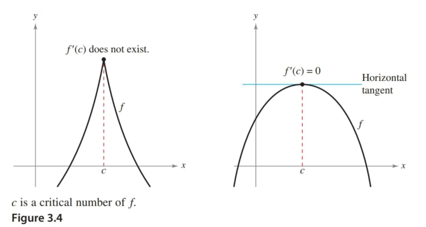

- Understand the definition of extrema of a function on an interval.
- Understand the definition of relative extrema of a function on an open interval.
- Find extrema on a closed interval.

#### Assignment

- **Vocabulary** and **teal boxes**{: .teal-box}
- p217 2, 5, 11, 14, 17, 20, 23, 26, 29, 32, 35, 38, 41, 44, 45, 48, 49 \| *62, 68, 75–78*{: .gray}

*The vertical bar indicates the AP cut-off. Problems after the bar are recommended for AP prep, but not required for the assignment.*{: .small}

#### Additional Resources

- AP Topics: 5.2, 5.4, 5.5, 5.12
- Khan Academy
  - [Extreme value theorem, global versus local extrema, and critical points](https://www.khanacademy.org/math/ap-calculus-ab/ab-diff-analytical-applications-new/ab-5-2/v/extreme-value-theorem)
  - [Using the first derivative test to find relative (local) extrema](https://www.khanacademy.org/math/ap-calculus-ab/ab-diff-analytical-applications-new/ab-5-4/v/relative-minima-maxima)
  - [Using the candidates test to find absolute (global) extrema](https://www.khanacademy.org/math/ap-calculus-ab/ab-diff-analytical-applications-new/ab-5-5/v/using-extreme-value-theorem)
  - [Exploring behaviors of implicit relations](https://www.khanacademy.org/math/ap-calculus-ab/ab-diff-analytical-applications-new/ab-5-12/v/implicit-curve-horizontal-tangent)

---

## Extrema of a Function

With your knowledge of differentiation, we'll move into applying to analyzing functions. We'll take a look at how to find key features, and then move into how those key features translate into real-life applications.

With this section, we start looking at the extrema, or minimum and maximums of a function. More specifically, extrema on an interval. This leads to the Extreme Value Theorem.

> ### The Extreme Value Theorem
>
> If $f$ is continuous on a **closed** interval $[a,b]$, then $f$ has both a minimum and a maximum on the interval.

When analyzing functions, intervals are a focus rather than the whole function, which translate to real-life applications since we normally are only concerned about a specific domain of a function. Also, note that the theorem mentions closed intervals. If you picture a linear function on an open interval, whether to infinity in both directions are even as small as $(1,2)$, the line will continue forever, never arriving at a hightest or lowest point.

## Relative Extrema and Critical Numbers

There are different types of extrema, with relative and absolute (a.k.a. global) maximums and minimums. Absolutes are the absolute highest or lowest point on an interval, while relative ones are local extremes. Think of the peaks and valleys of a sine wave.

If you find the value of the derivative at these local extrema, you'll find two possible outcomes: either 0 or does not exist. These specific $x$-values where their derivatives produce zeros or don't exist are called critical points.

Naturally, finding the critical points is key to determining the extrema on an interval.

## Finding Extrema on a Closed Interval

1. Find all the critical numbers. This typically means differentiating, and then solving for zero and seeing where the derivative does not exist.
2. Evaluate each critical point. This means going back to the original function and finding the $y$-values.
3. Do the same for the endpoints.
4. The smallest is your minimum and the largest your maximum.
