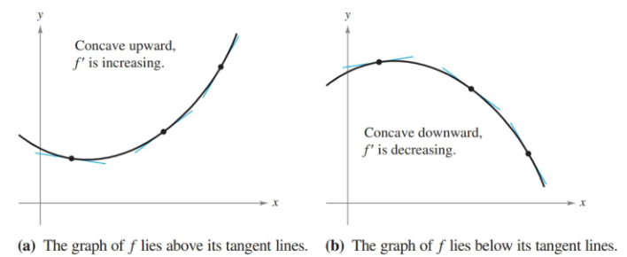
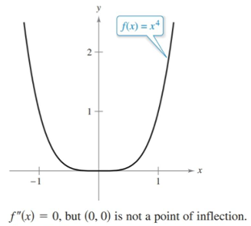

- Determine intervals on which a function is concave upward or concave downward.
- Find any points of inflection of the graph of a function.
- Apply the Second Derivative Test to find relative extrema of a function.

## Assignment

- **Vocabulary** and **teal boxes**{: .teal-box}
- p242 3, 7, 12, 13, 18, 23, 26, 27, 31, 27, 41–51 odd, 59, 67, 69–71 *74, 80, 92–94*{: .ap-problems}

## Additional Resources

- AP Topics: 5.6, 5.7
- Khan Academy
  - [Determining concavity of intervals and finding points of inflection: graphical](https://www.khanacademy.org/math/ap-calculus-ab/ab-diff-analytical-applications-new/ab-5-6a/v/concavity-concave-upwards-and-concave-downwards-intervals){: target="_blank"}
  - [Determining concavity of intervals and finding points of inflection: algebraic](https://www.khanacademy.org/math/ap-calculus-ab/ab-diff-analytical-applications-new/ab-5-6b/v/analyzing-concavity-algebraically){: target="_blank"}
  - [Using the second derivative test to find extrema](https://www.khanacademy.org/math/ap-calculus-ab/ab-diff-analytical-applications-new/ab-5-7/v/second-derivative-test){: target="_blank"}

---

## Concavity

Whether or not a graph curve upwards or downwards is measured by it's concavity. A slope that is increasing is concave upward, regardless of its negative or not, and likewise a decreasing slope is concave downward.

Well, just like we used $f'$ to quickly see when $f$ was increasing or decreasing, we can do the same with $f''$ to determine when $f'$ is increasing or decreasing, which will in turn let us know if $f$ is concave upward or downward.

## Points of Inflection

Where $f$ changes direction, from either increasing to decreasing or vice versa, $f'$ will show critical points. Just like with the first derivative, a critical point only indicates a possible point of inflection. The graph of $f(x)=x^4$ is one example of this.

## The Second Derivative Test

Despite mostly talking about concavity this section, we're going to bounce back to extrema. The first derivative test had you looking at intervals and how they changed. Any change would indicate a relative maximum or minimum.

The second derivative test instead has you looking at the specific point in question. If $f^{\prime\prime}(c) > 0$, then $f$ has a relative minimum. The second derivate tells you the rate of change of the slope. Since that rate is positive, that means the slope is going from negative to positive.

Likewise, if $f^{\prime\prime}(c) < 0$ then there is a relative maximum as the slope is going from positive to negative.
