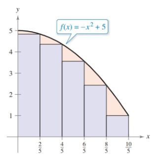
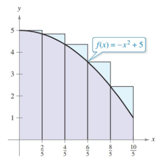

- Use sigma notation to write and evaluate a sum
- Understand the concept of area
- Approximate the area of a plane region
- Find the area of a plan region using limits

## Assignment

- **Vocabulary** and **teal boxes**{: .teal-box}
- p299 1, 4, 7–35 odd, 41, 45, 48, 53, 58, 61, 68, 69 *75, 76, 78, 81–83*{: .ap-problems}

## Additional Resources

- AP Topics: 6.1
- Khan Academy
  - [Summation Notation](https://www.khanacademy.org/math/ap-calculus-ab/ab-integration-new/ab-6-3/e/sigma-notation){: target="_blank"} (this is one specific exercise, rather than a lesson with a collection of them)
  - [Exploring accumulations of change](https://www.khanacademy.org/math/ap-calculus-ab/ab-integration-new/ab-6-1/v/introduction-to-integral-calculus){: target="_blank"}

---

Considering the time spent on antidifferentiation and integration last section, it's going to appear like we're going off-topic. Don't worry, we'll get back there soon enough.

## Sigma Notation

We're going to start off with some notation that's used in summations, which is where you need to sum up a pattern of terms. Say we wanted to add up all the numbers from 1 to 10. Instead of writing it all out, we could instead write

$$\begin{align}
\sum_{i=1}^{10} i
\end{align}$$

The $i=1$ tells us to start at 1, and the $10$ up top tells us the upper bound of the sequence. Another is below.

$$\begin{align}
\sum_{i=4}^7 \frac{1}{i^2} &= \frac{1}{4^2} + \frac{1}{5^2} + \frac{1}{6^2} + \frac{1}{7^2} \\
&= \frac{1}{16} + \frac{1}{25} + \frac{1}{36} + \frac{1}{49}

\end{align}$$

Same story here, except we start at 4 and end at 7. We plug in for $i$ each time, which is now squared and in the denominator. The general form for this is below, where $a_i$ is used to represent each term in the sequence.

$$\begin{align}
\sum_{i=1}^n a_i = a_1 + a_2 + a_3 + \dots + a_n
\end{align}$$

### Evaluating Sums

> The book spends a significant amount of time on converting sums into explicit functions. This is not covered on the AP exam, so you can skip this part completely if you wish and jump down to [Area](#area).

There are a few formulas and rules listed under Theorem 4.2 that we'll use when evaluating summations. Memorizing them is helpful, but not at all required for the AP exam.

A few other things to keep in mind:

1. If our term is being multiplied by a constant, we can factor it out, and then back in later.
2. If two terms are being added or subtracted, we can evaluate them separately.
3. If our term is just a constant, then $\sum_{i=1}^{n} c = cn$

With that knowledge, we can rewrite a sum like the one below so we can evaluate it easily.

$$\begin{align}
\sum_{i=1}^{n} \frac{i+1}{n^2}  &= \frac{1}{n^2} \sum_{i=1}^{n} (i+1)                               &&\text{Factor out the constant} \\[1.5em]
                                &= \frac{1}{n^2} \left(\sum_{i=1}^{n} i + \sum_{i=1}^{n} 1\right)   &&\text{Write as two sums} \\[1.5em]
                                &= \frac{1}{n^2} \left(\frac{n(n+1)}{2} + n\right)                  &&\text{From Theorem 4.2 and 3 above} \\[1.5em]
                                &= \frac{n+3}{2n}                                                   &&\text{Simplify}
\end{align}$$

## Area

The tangent line problem, or change at a point, was solved with derivatives. The second problem calculus addresses is the area problem, or how to find area under curves. We'll eventually get there, but for now let's estimate the area under a curve.

The basic idea is to take the area under a curve and slice it into manageable shapes. This usually means rectangles, but it can be done with other shapes as well.

With rectangles, we have to make a decision with how we draw them, specifically what part of the rectangle will touch the curve: the right, left, or middle.

> 
>
> **Figure 4.2.1** A comparison of areas drawn with left endpoints, right endpoints, and midpoints.
{: .figure}

Once we have the shapes drawn, we can calculate the area of each and add them up. But since that's just adding up lots of things, we can express it with sigma notation.

> ## Right Endpoint Example
>
> Use sigma notation to approximate the area under the curve $-x^2 + 5$ using five rectangles drawn with the right endpoint touching the curve.
{: .example}

Pictures are always helpful.

> 
>
> **Figure 4.2.2** The area under $-x^2+5$ divided into five rectangles using the right endpoint.
{: .figure}

To find the area of a rectangle, we need widths and heights. We could do this individually, the goal is to write a summation. Let's start with something simple.

$$\begin{align}
\sum_{i=1}^5 w_i\cdot h_i
\end{align}$$

So, multiply the width and height of each rectangle and add them all up. Let's start replacing things with actual values. Width is a good place to start. Since the interval we are looking at is $[0,2]$, it has a total width of $2$. We have five subdivisions (rectangles), meaning the width of each one is $2/5$.

$$\begin{align}
\sum_{i=1}^5 \left(\frac{2}{5}\right)\cdot h_i
\end{align}$$

The height is a bit tricker since it changes based on the curve itself. Plus, it's dependent on the $x$-value.

$$\begin{align}
\sum_{i=1}^5 \left(\frac{2}{5}\right)(-x_i^2+5)
\end{align}$$

OK, now we need do something with that $x_i$. Since we have a nice labeled picture, let's write our $x$-values along with the number rectangle they correspond with.

|  $i$  |  $x$   |
| :---: | :----: |
|  $1$  | $2/5$  |
|  $2$  | $4/5$  |
|  $3$  | $6/5$  |
|  $4$  | $8/5$  |
|  $5$  | $10/5$ |

Our widths being the same make this relationship linear, meaning it can be expressed in slope-intercept form. Our slope is how much it changes, and intercept where it starts, or when $i=0$. We don't have that row, so let's add it in.

|  $i$  |  $x$  |
| :---: | :---: |
|  $0$  |  $0$  |
|  $1$  | $2/5$ |
|  $2$  | $4/5$ |
|  $3$  | $6/5$ |
|  $4$  | $8/5$ |
|  $5$  |  $2$  |

So, the expression $0+\frac{2}{5}i$ represents our $x$-value. Plugging into our sum gives us this.

$$\begin{align}
\sum_{i=1}^5 \left(\frac{2}{5}\right)\left(-\left(\frac{2}{5}i\right)^2+5\right)
\end{align}$$

$\blacksquare$
{: .qed}

> ## Left Endpoint Example
>
> Same problem, but now do it with left endpoints.
{: .example}

New picture.

> 
>
> **Figure 4.2.3** The area under $-x^2+5$ divided into five rectangles using the left endpoint.
{: .figure}

Most of our work is done already. We just need to adjust the heights slightly. If we do our table again, we get this for our $x$-values.

|  $i$  |  $x$   |
| :---: | :----: |
|  $0$  | $-2/5$ |
|  $1$  |  $0$   |
|  $2$  | $2/5$  |
|  $3$  | $4/5$  |
|  $4$  | $6/5$  |
|  $5$  | $8/5$  |

Our new expression for $x$ is $-\frac{2}{5}+\frac{2}{5}i$, giving us a summation of

$$\begin{align}
\sum_{i=1}^5 \left(\frac{2}{5}\right)\left(-\left(-\frac{2}{5}+\frac{2}{5}i\right)^2+5\right)
\end{align}$$

That works, and there's not a damn thing wrong with it, but there's a cleaner way to do this. Note that we are still pulling from the same list of $x$ values, just one earlier. Meaning if this sum uses the right end points

$$\begin{align}
\sum_{i=1}^5 \left(\frac{2}{5}\right)\left(-\left(\frac{2}{5}i\right)^2+5\right)
\end{align}$$

then this sum would use the left endpoints.

$$\begin{align}
\sum_{i=0}^4 \left(\frac{2}{5}\right)\left(-\left(\frac{2}{5}i\right)^2+5\right)
\end{align}$$

No need to rewrite expressions, just start and stop counting one earlier.

$\blacksquare$
{: .qed}

I mentioned using midpoints earlier, instead of the left or right endpoints. The process for that is the same, but it's not an easy jump from one to the other.

## Finding Area by the Limit Definition

What we did above was find two approximate sums for the area under a curve, and if you take a look at the pictures, one is an underestimate and the other an overestimate. The book refers to these as upper and lower sums.

> Generally, left endpoints produce underestimates in increasing curves, while right endpoints produce overestimates. Naturally, this switches when it's a decreasing curve. When a curve switches between the two … we'll be doing this a different way by the time we get there.

Also in those sums, we also only used five rectangles. If we used more, we'd have a better estimate and those two approximate sums would get closer to both each other and the actual value. If you remember the Squeeze Theorem from back in [section 1.3](./1-limits-and-their-properties/1.3-evaluating-limit-analytically.md), if we push $n\to \infty$ for both, then the actual sum, which lies between the two, would have to be equal to those approximate sums.

In other words, if you want to find the actual area of the area under a curve, slice it up into an infinite number of rectangles, using either method (or midpoint for that matter) and add them all together.

$$\begin{align}
\text{Area} = \lim_{n\to\infty} \sum^n_{i=1} f(c_i)\,\Delta x
\end{align}$$

The book shifts some of the notation and variables to get the definition above. The width of each rectangle is defined as $\Delta x$ and $c_i$ represents any $x$ value in the rectangle.

> ## Area Using Limit Definition Example 1
>
> Find the area of the region bounded by $y=x^2, y=0, x=0$ and $x=2$.
{: .example}

OK, so that it just another way to find the area under $x^2$ on the interval $[0,2]$. The extra part about $y=0$ is often implied when saying "find the area under a curve", but it will be included in some problems.

For the summation, let's start with our definition.

$$\begin{align}
\lim_{n\to\infty} \sum^n_{i=1} f(c_i)\,\Delta x
\end{align}$$

Width, as usual, is the simpler one. Our interval width is $2$ and the number of rectangles is $n$. I'll also plug our function.

$$\begin{align}
\lim_{n\to\infty} \sum^n_{i=1} \left(x_i\right)^2\left(\frac{2}{n}\right)
\end{align}$$

Now, a table is going to be ~~difficult~~ impossible since we have an infinite number of numbers, but we can use the same slope-intercept principle. We need a place to start and a change. This is simpler than it sounds. We start at the beginning of our interval, and increase by the width. So, $0 + \frac{2}{n}i$/

That gives us a sum of

$$\begin{align}
\lim_{n\to\infty} \sum^n_{i=1} \left(\frac{2}{n}i\right)^2\left(\frac{2}{n}\right)
\end{align}$$

> The rest of this example is if you wish to evaluate this sum. Again, not covered on the exam but the book goes into it and I already spent the time writing it.

$$\begin{align}
S(n) &= \lim_{n\to\infty}\sum_{i=1}^n \left(\frac{2}{n}i\right)^2\left(\frac{2}{n}\right)\\
     &= \lim_{n\to\infty}\frac{8}{n^3}\sum_{i=1}^n i^2 \\
     &= \lim_{n\to\infty}\frac{8}{n^3} \left[\frac{n(n+1)(2n+1)}{6}\right]\\
     &= \lim_{n\to\infty}\frac{16n^3+24n^2+8n}{6n^3} \\
     &= \lim_{n\to\infty}\frac{8}{3} + \frac{4}{n} + \frac{4}{3n^2} \\
     &= \frac{8}{3}
\end{align}$$

$\blacksquare$
{: .qed}

> ## Area Using Limit Definition Example 2 
>
> Express the area under $(x-4)^2$ on the interval $[1,2]$ using sigma notation.
{: .example}

OK, summation with the width and function first.

$$\begin{align}
\sum_{i=1}^n (x_i - 4)^2 \left(\frac{1}{n}\right)
\end{align}$$

Again, starting point and change for the $x$ values, so we look to the beginning of the interval for our start and the width for the change. That gives us $1+\frac{i}{n}$.

$$\begin{align}
\sum_{i=1}^n \left(\left(1+\frac{i}{n}\right) - 4\right)^2 \left(\frac{1}{n}\right)
\end{align}$$

$$\begin{align}
\sum_{i=1}^n \left(\frac{i}{n} - 3\right)^2 \left(\frac{1}{n}\right)
\end{align}$$

$\blacksquare$
{: .qed}

### Region Bounded the $y$-Axis

When you run into problems where we want area bounded by a function of $y$ instead of $x$, nothing actually changes. You still divide your interval by $n$ to get the width, and then multiply that by $i$ to get the summation terms.

> 
>
> **Figure 4.2.4** The area to the left of a function in terms of $y$.
{: .figure}

The sum of this one is identical to the example using $x^2$ above, save for the difference in the interval.

$$\begin{align}
\lim_{n\to\infty} \sum^n_{i=1} \left(\frac{1}{n}i\right)^2\left(\frac{1}{n}\right)
\end{align}$$
