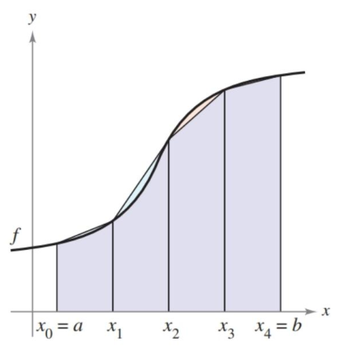
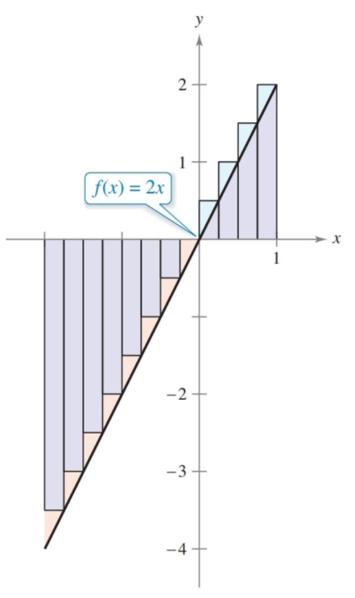

- Understand the definition of a Riemann sum.
- Evaluate a definite integral using limits and geometric formulas.
- Evaluate a definite integral using properties of definite integrals.
- Approximate a definite integral using the Trapezoidal Rule.
- Analyze the approximate error in the Trapezoidal Rule.

## Assignment

- **Vocabulary** and **teal boxes**{: .teal-box}
- p312 1–5 odd, 9–14, 18, 20, 25, 30, 31–35 odd, 40–50 even, 51, 53, 54, 57, 61–65 odd *74, 75, 89, 92, 94, 114–117*{: .ap-problems}

## Additional Resources

- AP Topics: 6.2, 6.3, 6.6, 6.8
- Khan Academy
  - [Approximating areas with Riemann sums](https://www.khanacademy.org/math/ap-calculus-ab/ab-integration-new/ab-6-2/v/simple-riemann-approximation-using-rectangles){: target="_blank"}
  - [Riemann sums, summation notation, and definite integral notation](https://www.khanacademy.org/math/ap-calculus-ab/ab-integration-new/ab-6-3/v/sigma-notation-sum){: target="_blank"}
  - [Applying properties of definite integrals](https://www.khanacademy.org/math/ap-calculus-ab/ab-integration-new/ab-6-6/v/negative-definite-integrals){: target="_blank"}
  - [Finding antiderivatives and integrals: basic rules and notation: reverse power rule](https://www.khanacademy.org/math/ap-calculus-ab/ab-integration-new/ab-6-8a/v/indefinite-integrals-of-x-raised-to-a-power){: target="_blank"}
  - [Finding antiderivatives and integrals: basic rules and notation: common indefinite integrals](https://www.khanacademy.org/math/ap-calculus-ab/ab-integration-new/ab-6-8b/v/antiderivative-of-x-1){: target="_blank"}
  - [Finding antiderivatives and integrals: basic rules and notation: definite integrals](https://www.khanacademy.org/math/ap-calculus-ab/ab-integration-new/ab-6-8c/v/reverse-power-rule-for-definite-integrals){: target="_blank"}

---

## Trapezoidal Rule

Before we get into the meat of this section, we're going to jump back to approximating area, but this time with trapezoids.

> 
>
> **Figure 4.3.1** The area under a curve approximated by trapezoids.
{: .figure}

You can see from the picture, this leads to better estimates, though when an estimate is over or under now depends on its concavity. Trapezoids give overestimates when the curve is concave up and underestimates when it's concave down. You'll likely get a question or two about these estimates, so make sure you draw pictures before guessing.

As for finding the area, summation notation doesn't really help here. Even when the width (height) of each trapezoid is same, the area still depends on two variables: the two bases. Most questions you see will tell you to use a certain number of trapezoids to estimate the area and you'll just have to work it out.

Since the area of a trapezoid is $\frac{1}{2}h(b_1+b_2)$, that means four trapezoids will look like this.

$$\begin{align}
A &\approx \frac{h}{2}(b_1+b_2) + \frac{h}{2}(b_2+b_3) + \frac{h}{2}(b_3+b_4) + \frac{h}{2}(b_4+b_5) \\
  &\approx \frac{h}{2}((b_1+b_2)+(b_2+b_3)+(b_3+b_4)+(b_4+b_5)) \\
  &\approx \frac{h}{2}(b_1 + 2b_2 + 2b_3 + 2b_4 + b_5)
\end{align}$$

You have a sum of all your bases, but the interior ones are doubled up. Then it's just a matter of multiplying by half the height.

## Riemann Sums

In the previous section, we summed up products that existed on an interval. This is known as a Riemann sum, and **does not require the use of sigma notation**. I stress that because there was a strong emphasis on using sigma notation last section. Although you will have to read and write sigma notation, you don't need to use it. If you need to approximate an area, just do the calculations and skip the notation.

Anyway, one of the uses of Riemann sums is approximating the area under a curve. One slight difference between what we did last section and Riemann sums proper is that the latter allows for subintervals of varying length. If you're given a table of values, like the one below, and asked to approximate the sum using a left Riemann sum, the fact that the subintervals are different lengths doesn't matter.

> |        |      |      |      |      |
> | :----: | :--: | :--: | :--: | :--: |
> | $x$    | $10$ | $12$ | $15$ | $16$ |
> | $g(x)$ | $5$  | $1$  | $7$  | $7$  |
> {: .headless-table .min-width}
>
> **Figure 4.3.1** A function split into three unequal subdivisions. Using a left Riemann sums yields an approximation of $20$, while a right Riemann produces $30$.
{: .figure}

This allowance for varying length does have an effect on the general formula. Our, width was $\Delta x$, but since it can vary it becomes $\Delta x_i$.

$$\begin{align}
\sum^n_{i=1} f(c_i)\,\Delta x_i
\end{align}$$

Not a huge deal in the grand scheme of things, but the big perspective switch comes with the limit version.

$$\begin{align}
\lim_{\Vert\Delta\Vert\to 0} \sum^n_{i=1} f(c_i)\,\Delta x_i
\end{align}$$

Instead of trying to pump as many rectangles as we can into the interval, we reduce their widths to zero. The $\Vert\Delta\Vert$ symbol references the width of the widest rectangle, so as long as that one gets down to zero, the others go with it.

Again, this won't have a significant impact on the problems you'll be working out, just a little shift in the underlying logic of how it all works.

## Definite Integral

The general formula for finding the area under a curve is getting a bit wild, so we're going to condense it. Here is our new general form for what's called the **definite integral**.

$$\begin{align}
\lim_{\Vert\Delta\Vert\to 0} \sum_{i=1}^n f(c_i) \Delta x_i = \int_a^b f(x) \, dx
\end{align}$$

That new notation looks a lot like what we did with antidifferentiation. The difference though, is this is a **definite integral** and produces a value, whereas before we dealt with indefinite integrals, which only produced families of functions. For instance

$$\begin{align}
\int x^2 \, dx &= \frac{x^3}{3} + C \\
\int_0^1 x^2 \, dx &= \frac{1}{3}
\end{align}$$

Let's try one out and determine the value of $\int_{-2}^1 2x \, dx$. Before we begin, we need to determine our widths and what $x$-value we'll use to determine the heights.

The function is a straightforward linear function, so we'll use the tried and true consistent-width intervals, which means $\frac{3}{n}$ in this case.

For our $x$-values, we have three choices: right endpoint, left endpoint and midpoint. For what we are doing here, right endpoint is typically the best choice as its the simplest.

> It's worth noting that throughout your entire math education, you've been given pretty problems that evaluate nicely. This is done for the sake of teaching you the material, but reality can be much different. These multiple definitions and choice of endpoints are incredibly useful outside of the classroom where flexibility is needed, and efficiency is prioritized over accuracy (how many decimal points of accuracy do we really need?).
>
> One quick example: imagine you have to find the area under a curve, but the curve is not actually a curve but a collection of data points. You don't have a function to work with, just a bunch of dots on a graph.

With our point chosen, we arrive at $(-2+\frac{3}{n}i)$ for our $x$-values and we can start work.

$$\begin{align}
\int_{-2}^1 2x \, dx &= \lim_{n\to\infty} \sum_{i=1}^n 2\left(-2 +\frac{3i}{n}\right) \frac{3}{n} \\
                     & \dots \\
                     &= \lim_{n\to\infty} \left(-12+9+\frac{9}{n}\right) \\
                     &= -3
\end{align}$$

A negative number is something new and shows the problem with the new lax definition. The function $2x$ is continuous, but it is negative left of 0. So although we got a value, it does not represent the area under the curve. This is something we will eventually tackles, but just keep it in mind for now.

You also might have noticed there is another way to find the area under this curve: find the area of the triangles. While the summation technique will work, sometimes it's easier to use what you know from geometry to evaluate certain definite integrals. Constant functions will give you rectangles, linear functions produce triangles and trapezoids, and you'll even see some semicircles with $\sqrt{a^2 - x^2}$.

## Properties of Definite Integrals

Examples 4 through 7 highlight the various properties of definite integrals, but I won't cover them here since they are essentially the same as the summations. The one notable addition is the negative definite integral, where the interval can be reversed.

$$\begin{align}
\int_a^b f(x)\, dx = - \int_b^a f(x)\, dx
\end{align}$$
