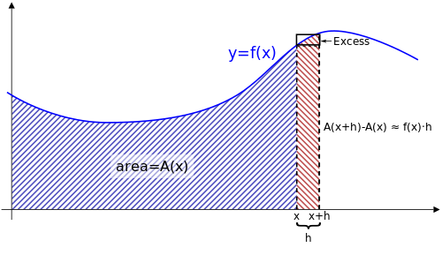
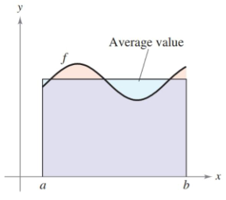

- Evaluate a definite integral using the Fundamental Theorem of Calculus.
- Understand and use the Mean Value Theorem for Integrals.
- Find the average value of a function over a closed interval.
- Understand and use the Second Fundamental Theorem of Calculus.

## Assignment

- **Vocabulary** and **teal boxes**{: .teal-box}
- p326 5–25 odd, 29, 32, 35–39 odd, 44, 45, 48, 50, 59, 65, 67, 70–72, 75, 76, 79 *80, 83, 84, 89–91*{: .ap-problems}

## Additional Resources

- AP Topics: 6.1, 6.4, 6.5, 6.6, 6.7, 8.1, 8.3
- Khan Academy
  - [Exploring accumulations of change](https://www.khanacademy.org/math/ap-calculus-ab/ab-integration-new/ab-6-1/v/introduction-to-integral-calculus){: target="_blank"}
  - [The fundamental theorem of calculus and accumulation functions](https://www.khanacademy.org/math/ap-calculus-ab/ab-integration-new/ab-6-4/v/fundamental-theorem-of-calculus){: target="_blank"}
  - [Interpreting the behavior of accumulation functions involving area](https://www.khanacademy.org/math/ap-calculus-ab/ab-integration-new/ab-6-5/v/interpreting-behavior-of-antiderivative){: target="_blank"}
  - [Applying properties of definite integrals](https://www.khanacademy.org/math/ap-calculus-ab/ab-integration-new/ab-6-6/v/negative-definite-integrals){: target="_blank"}
  - [The fundamental theorem of calculus and definite integrals](https://www.khanacademy.org/math/ap-calculus-ab/ab-integration-new/ab-6-7/v/connecting-the-first-and-second-fundamental-theorems-of-calculus){: target="_blank"}
  - [Finding the average value of a function on an interval](https://www.khanacademy.org/math/ap-calculus-ab/ab-applications-of-integration-new/ab-8-1/v/average-function-value-closed-interval){: target="_blank"}
  - [Using accumulation functions and definite integrals in applied contexts](https://www.khanacademy.org/math/ap-calculus-ab/ab-applications-of-integration-new/ab-8-3/v/area-under-rate-net-change){: target="_blank"}

---

## The Fundamental Theorem of Calculus

> **Disclaimer**: The fundamental theorem of calculus has two parts and our book covers them in the opposite order of most other sources. I am sticking with what everyone else does since I think that's the easier way to grasp the concept.
>
> College Board/AP is more descriptive with naming each part, so here is how each is referenced in different sources. I'll try to use the AP names to avoid confusion.
>
> | AP Course Description        | Ordinal Description | Our Book |
> | ---------------------------- | ------------------- | -------- |
> | Accumulation Functions (6.4) | First               | Second   |
> | Definite Integral (6.7)      | Second              | First    |

## The Accumulation Part

Let's create a function $A(x)$ that will represent the area under a curve bounded by the $y$-axis and $x$. These area functions are also called **accumulation functions** since the area accumulates as $x$ increases.

> <iframe src="https://www.desmos.com/calculator/wel1wpydvf?embed" width="500" height="350" style="border: 1px solid #ccc" frameborder=0></iframe>
>
> **Figure 4.4.1** An accumulation function $A(x)$.
{: .figure}

This is a just another way to represent the area under a curve, which we've been looking at for a while. The only difference is that we turned it into a function so the area changes as $x$ changes.

Today though, we're going to focus on how the area *changes*. As $x$ increases, more area is added, but not the same amount each time. Early on, only a little area is added since the curve isn't as high off the $x$-axis. Later on, larger chunks are added as the curve peaks. After the peak, more area is still added, but not as much as before.

> <iframe src="https://www.desmos.com/calculator/d58sht7zm3?embed" width="500" height="350" style="border: 1px solid #ccc" frameborder=0></iframe>
>
> **Figure 4.4.2** The accumulation of area as $x$ increases.
{: .figure}

This implies that how the accumulation functions changes is dictated by the curve that bounds it. If the curve is close to the $x$-axis, only a little area is added. If it's higher, more is added. If it's at zero, nothing is added, and below the $x$-axis means area is taken away.

> Remember that integrating only gives you true area if the curve is positive. What it always gives you is **signed area**, which provides a sign indicating its orientation relative to the $x$-axis.

To put the above in terms of calculus, the derivative of the accumulation function is the curve that it is integrating.

$$\begin{align}
\frac{d}{dx}\left[\int_a^x f(t)\, dt\right] = f(x)
\end{align}$$

Or more formally ...

> ### Definition: First Fundamental Theorem of Calculus (Accumulation)
>
> $$\begin{align}
> F(x)  &= \int_a^x f(t) \, dt \label{eq:fun-1a} \\[1em]
> F'(x) &= f(x) \label{eq:fun-1b}
> \end{align}$$
>
> Therefore, $F$ (the integral) is equivalent to the antiderivative of $f$.
{: .definition}

Notice that $a$ is listed as the beginning of the integral. Since we are only dealing with change, where the integral begins is irrelevant.

There is also a switch from $f(t)$ to $f(x)$. The $t$ is only there to begin with since $x$ is used as the upper bound in the integral and we needed another variable. We're able to use the $x$ again once the integral is gone.

> ### Example: Derivative of Accumulation Function
>
> Let $\displaystyle f(x)= \int_0^x \sqrt{t^2 + 1} \, dt$. What is $f'(5)$?
{: .example}

By the accumulation part of the fundamental theorem ...

$$\begin{align}
f(x) &= \int_0^x \sqrt{t^2 + 1} \, dt \\
f'(x) &= \sqrt{x^2 + 1} \\
\end{align}$$

... which means ...

$$\begin{align}
f'(x) &= \sqrt{x^2 + 1} \\
f'(5) &= \sqrt{5^2 + 1} \\
      &= \sqrt{26}
\end{align}$$

$\blacksquare$
{: .qed}

### A Slightly Rigorous Proof

Above, we took the fact that the amount of area added depends on the curve being integrated, and jumped right to a conclusion. So, here is a justification for the accumulation part of the fundamental theorem.

Let $A(x)$ be an accumulation function representing the area under a curve bounded by the $y$-axis and $x$. An increase in that area is represented by the red strip in the image below. You start off with some set amount of area $A(x)$ (the blue area), and we want to just slightly move to the right $h$ units.

> 
>
> **Figure 4.4.1** Geometric representation of the first fundamental theorem of calculus. Credit [Wikipedia](https://commons.wikimedia.org/wiki/File:FTC_geometric.svg){: target="_blank"}.
{: .figure}

That makes the new total area $A(x+h)$. We're interested in the change in area, the part we just added on, which we can represent with the expression below.

$$\begin{align}
A(x+h) - A(x)
\end{align}$$

We can also represent that new slice as a rectangle. The width is $h$ and we can use $f(x)$ as our height. Though, this leads to a little bit of excess that we can't forget about.

$$\begin{align}
f(x) \cdot h + \text{Excess}
\end{align}$$

Well, that's two different ways of expressing the same area, so we can set them equal to each other.

$$\begin{align}
f(x) \cdot h + \text{Excess} = A(x+h) - A(x)
\end{align}$$

Rearranging—and adding a limit to account for the fact we want $h$ to be as small as possible—we get

$$\begin{align}
f(x) = \lim_{h \to 0} \left(\frac{A(x+h) - A(x)}{h} - \frac{\text{Excess}}{h}\right)
\end{align}$$

That excess term will go to zero as $h \to 0$, so we ultimately end up with

$$\begin{align}
f(x) = \lim_{h \to 0} \frac{A(x+h) - A(x)}{h}
\end{align}$$

The right-hand side is the definition of a derivative, giving us our justification for the accumulation part of the fundamental theorem of a calculus.

$$\begin{align}
f(x) &= A'(x) \label{eq:1}\\
\end{align}$$

## The Definite Integral Part

Now we can take idea behind the first part and apply it definite integrals, or area with constant endpoints. We'll need two accumulation functions though, since we'll have to subtract them to find the area of the interval in question. We'll also drop the $t$ since we don't have $x$ in the interval anymore.

$$\begin{align}
\int_a^b f(x) \, dx &= \int_0^b f(x) \, dx - \int_0^a f(x) \, dx \\[1em]
                    &= F(b) - F(a)
\end{align}$$

This gives us the second part of the theorem. To find the area under a curve, evaluate the antiderivative of the upper bound minus the antiderivative of the lower bound.

> ### Definition: Second Fundamental Theorem of Calculus (Definite Integral)
>
> $$\begin{align}
> \int_a^b f(x) \, dx &= F(b) - F(a)
> \end{align}$$
{: .definition}

> ### Example: Evaluating Definite Integrals
>
> Evaluate $\displaystyle \int_1^2 (x^2-3)\,dx$.
{: .example}

Applying the fundamental theorem is straightforward, provided you can come up with the antiderivative.

$$\begin{align}
\int_1^2 (x^2-3)\,dx &= \left[ \frac{x^3}{3} - 3x \right]_1^2 \\
                     &= \left(\frac{8}{3}-6\right)-\left(\frac{1}{3}-3\right) \\
                     &= \left( \frac{7}{3}-3 \right) \\
                     &= -\frac{2}{3}
\end{align}$$

It's sometimes helpful to work with similar terms when doing the arithmetic at the end. Above, I combined the $8/3$ and $1/3$, while combining the integer terms.

> You might have noticed that $C$ is missing from the antiderivative calculations. For the sake of completion, here are the calculations above, but without omitting the constant of integration.
>
> $$\begin{align}
> \int_1^2 (x^2-3)\,dx &= \left[ \frac{x^3}{3} - 3x + C \right]_1^2 \\
>                      &= \left(\frac{8}{3}-6+C\right)-\left(\frac{1}{3}-3+C\right) \\
>                      &= \left( \frac{7}{3}-3 \right) \\
>                      &= -\frac{2}{3}
> \end{align}$$
>
> Yes, we don't know the value of $C$, but it would be the same in both evaluations, so it cancels out. Another way to think of it is that we are finding the difference between two points on a curve (the antiderivative). The location of that curve (dictated by C) doesn't impact that calculation.

$\blacksquare$
{: .qed}

> ### Example: Definite Integral with an Absolute Value
>
> Evaluate $\int_0^2 \|2x-1\|\,dx$.
{: .example}

When working with any absolute value, finding the vertex is important. This allows you to treat it like two separate non-absolute value functions. Since absolute values make all negatives positive, they "bounce" off the $x$-axis. So you can find the vertex by finding where it equals $0$.

In this case $2x-1=0$ yields $x=\frac{1}{2}$.

$$\begin{align}
\int_0^2 |2x-1|\,dx &= \int_0^\frac{1}{2} -(2x-1)\,dx + \int_\frac{1}{2}^2 2x-1\,dx
\end{align}$$

I'll negate the first one so I only need to worry about one anti-derivative.

$$\begin{align}
\int_0^2 |2x-1|\,dx &= \int_0^\frac{1}{2} -(2x-1)\,dx + \int_\frac{1}{2}^2 2x-1\,dx \\
                    &= \int_\frac{1}{2}^0 2x-1\,dx + \int_\frac{1}{2}^2 2x-1\,dx \\
                    &= \left[ x^2 -x \right]_\frac{1}{2}^0 + \left[ x^2 -x \right]_\frac{1}{2}^2 \\
                    &= \left[0 - \left(\left(\frac{1}{2}\right)^2 - \frac{1}{2}\right)\right] +
                    \left[\left(\left(2\right)^2 - 2\right) - \left(\left(\frac{1}{2}\right)^2 - \frac{1}{2}\right)\right]
                     \\
                    &= \frac{1}{4} + \left(2 + \frac{1}{4} \right) \\
                    &= \frac{5}{2}
\end{align}$$

$\blacksquare$
{: .qed}

You can check your work with Desmos. The keyword `int` will give you the integration symbol, then you can enter the bounds and the function. Make sure you include the variable of integration, usually $dx$.

## The Mean Value Theorem for Integrals

When we first started estimating area with rectangles, we saw overestimates with one endpoint and underestimates with the other. From that, we can assume that there must be some point in the middle that would give us a correct value.

So, given an interval $[a,b]$, there must exist some $c$ that would produce the exact height needed to accurately calculate the area.

> ### Definition: Mean Value Theorem for Integrals
>
> $$\begin{align}
> \int_a^b f(x) \, dx = f(c) \cdot (b-a)
> \end{align}$$
{: .definition}

## Average Value of a Function

The average value of a function over an interval can be thought of two ways.

1. Add up all the $y$ values on the interval and divide by how many (infinite in this case). The book has a proof of how this summation equals what we have in equation $\ref{eq:average}$ below.
2. Take the area for that interval and reshape it into a rectangle with the same width as the interval. Its height is the average value.

If point 2 isn't convincing, imagine the ocean with all the waves flattened out and you would have sea level.

It turns out that the mean value theorem for integrals produced the average for us already: $f(c)$. That value, when multiplied by the interval, gave us the exact same area we started with.

> ### Definition: Average Value of a Function
>
> $$\begin{align}
> \frac{1}{b-a} \int_a^b f(x) \, dx \label{eq:average}
> \end{align}$$
{: .definition}

## Accumulation Functions and the Chain Rule

The accumulation functions from earlier all had $x$ as an upper bound, but it can be functions other than that, like $x^2$ or $\sin x$. Oddly enough, the chain rule applies when differentiating accumulation functions too.

Chain rule works by differentiating like normal, but including the inner function, then multiplying by the derivative of that inner function. And the same happens here. Substitute the upper bound in for $t$, but remember to multiply by its derivative at the end.

> ### Example: Accumulation Functions and the Chain Rule
>
> Evaluate $\displaystyle \frac{d}{dx}\left[\int_{\pi/2}^{x^3} \cos t \, dt\right]$
{: .example}

$$\begin{align}
\frac{d}{dx} \left[ \int_{\pi/2}^{x^3} \cos t \, dt \right] = \left( \cos x^3 \right) \left( 3x^2 \right )
\end{align}$$

$\blacksquare$
{: .qed}
