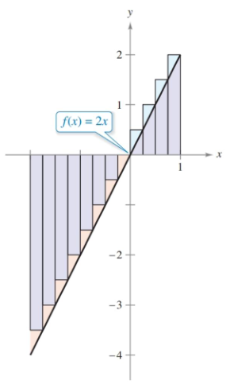

- Understand the definition of a Riemann sum.
- Evaluate a definite integral using limits and geometric formulas.
- Evaluate a definite integral using properties of definite integrals.
- Approximate a definite integral using the Trapezoidal Rule.
- Analyze the approximate error in the Trapezoidal Rule.

#### Assignment

- **Vocabulary** and **teal boxes**{: .teal-box}
- p312 1–5 odd, 9–14, 18, 20, 25, 30, 31–35 odd, 40–50 even, 51, 53, 54, 57, 61–65 odd *74, 75, 89, 92, 94, 114–117*{: .ap-problems}

#### Additional Resources

- AP Topics: 6.2, 6.3, 6.6, 6.8
- Khan Academy
  - [Approximating areas with Riemann sums](https://www.khanacademy.org/math/ap-calculus-ab/ab-integration-new/ab-6-2/v/simple-riemann-approximation-using-rectangles)
  - [Riemann sums, summation notation, and definite integral notation](https://www.khanacademy.org/math/ap-calculus-ab/ab-integration-new/ab-6-3/v/sigma-notation-sum)
  - [Applying properties of definite integrals](https://www.khanacademy.org/math/ap-calculus-ab/ab-integration-new/ab-6-6/v/negative-definite-integrals)
  - [Finding antiderivatives and integrals: basic rules and notation: reverse power rule](https://www.khanacademy.org/math/ap-calculus-ab/ab-integration-new/ab-6-8a/v/indefinite-integrals-of-x-raised-to-a-power)
  - [Finding antiderivatives and integrals: basic rules and notation: common indefinite integrals](https://www.khanacademy.org/math/ap-calculus-ab/ab-integration-new/ab-6-8b/v/antiderivative-of-x-1)
  - [Finding antiderivatives and integrals: basic rules and notation: definite integrals](https://www.khanacademy.org/math/ap-calculus-ab/ab-integration-new/ab-6-8c/v/reverse-power-rule-for-definite-integrals)

---

This section is an extension of the previous one, and will introduce some new (old?) notation along with another way to estimate area under a curve.

## Rectangles of Unequal Widths

Last section, rectangle widths were consistent, but that is not necessary and sometimes isn't desired. For instance, finding the area under $\sqrt{x}$. Trying it with our old method leads to a problem.

$$\begin{align*}
\lim_{n \to \infty} \sum_{i=1}^n \frac{1}{n} \left( \sqrt{\frac{i}{n}} \right) = \lim_{n \to \infty} \frac{1}{n\sqrt{n}} \sum_{i=1}^n \sqrt{i}
\end{align*}$$

We haven't touched how to replace $\sum \sqrt{i}$ and won't, because [harmonic numbers](https://math.stackexchange.com/questions/938225/calculate-summation-of-square-roots) are beyond what we are doing here. What would really be helpful would be if instead of $\sqrt{i/n}$, we had $\sqrt{i^2/n^2}$. This would lead to rectangles of varying width, but because we want $ n \to \infty$, that won't matter. Since $n$ is still in the denominator, the widest rectangle will still have a width approaching zero.

Speaking of width, we do have to deal with that since it will no longer be $1/n$. To find it, we subtract the left endpoint from the right one. With equal width, that looked like

$$ \frac{i}{n} - \frac{i-1}{n} = \frac{1}{n} $$

but since we've switched to a different value for our function, we need to recompute it.

$$ \frac{i^2}{n^2} - \frac{(i-1)^2}{n^2} = \frac{2i - 1}{n^2}$$

So our new summation is

$$\lim_{n \to \infty} \sum_{i=1}^n \frac{2i-1}{n^2} \cdot \sqrt{\frac{i^2}{n^2}} $$

## Riemann Sums

A Riemann sum is the general definition of what we did in the last section with our summations. There, we limited ourselves to continuous, nonnegative functions with a consistent subinterval width. Above, we saw that the width restriction isn't necessary, and the full definition of Riemann sums goes further and drops the nonnegative and continuous part.

One thing this does is change how we approach the limit of our sum. Because our widths can be inconsistent, $n\to\infty$ does not necessarily mean that our widths will approach zero. Above it did, but there are cases were it doesn't. So, our limit definition has shifted to $\lVert\Delta\rVert\to\infty$, where $\Vert\Delta\Vert$ is the width of the largest partition.

On top of all that, we're going to write it a different way. So, here is our full Riemann sum formula, along with the new notation. This assumes that $f$ is defined on the closed interval $[a,b]$.

$$\lim_{\Vert\Delta\Vert\to 0} \sum_{i=1}^n f(c_i) \Delta x_i = \int_a^b f(x) \, dx$$

## Definite Integral

That new notation looks a lot like what we did with antidifferentiation. This is a definite integral and produces a value, whereas before we dealt with indefinite integrals, which produced families of functions. For instance

$$\begin{align*}
\int x^2 \, dx &= \frac{x^3}{3} + C \\
\int_0^1 x^2 \, dx &= \frac{1}{3}
\end{align*}$$

Let's try one out and determine the value of $ \int_{-2}^1 2x \, dx $. The function is straightforward, so we'll use our tried and true consistent width intervals. Keep in mind the interval is starting at $-2$, we need to compensate for that when defining our endpoints. Also, you'll notice we still use the summation when solving.

$$\begin{align*}
\int_{-2}^1 2x \, dx &= \lim_{n\to\infty} \sum_{i=1}^n 2\left(-2 +\frac{3i}{n}\right) \frac{3}{n} \\
                                  &\dots \\
                                  &= \lim_{n\to\infty} \left(-12+9+\frac{9}{n}\right) \\
                                  &= -3
\end{align*}$$

A negative number is something new and shows the problem with the new lax definition. The function $2x$ is continuous, but it is negative left of 0. So although we got a value, it does not represent the area under the curve.

You might have noticed there is another way to find the area under this curve: find the area of the triangles. While the summation technique will work, sometimes it's easier to use what you know from geometry to evaluate certain definite integrals. Constant functions will tend to give you rectangles, linear functions produce triangles and trapezoids, and you'll even see some semicircles with $\sqrt{a^2 - x^2}$.

## Properties of Definite Integrals

Examples 4 through 7 highlight the various properties of definite integrals, but I won't cover them here since they are essentially the same as the summations. The one notable addition is the negative definite integral, where the interval can be reversed.

$$\int_a^b f(x)\, dx = - \int_b^a f(x)\, dx $$

## Trapezoidal Rule

Along with breaking an area into rectangles, there is another method for estimation that uses trapezoids. The area of a trapezoid is $\frac{1}{2}h(b_1+b_2)$, but since our trapezoids are vertical our height is really the width (\frac{b-a}{n}$, and the bases are our heights, or $y$ values.

Through a little algebra manipulation, as we start adding up our areas, we arrive at this formula.

$$ \frac{b-a}{2n}\left[f(x_0) + f(x_1)\right] + \frac{b-a}{2n}\left[f(x_1) + f(x_2)\right] + \dots + \frac{b-a}{2n}\left[f(x_{n-1}) + f(x_n)\right] = \\
\frac{b-a}{2n}\left[f(x_0) + 2f(x_1) + 2f(x_2) + \dots + 2f(x_{n-1}) + f(x_n)\right]$$

Note that the inner bases are all doubled up, while the two outer ones are not. This is because each inner base is shared with two trapezoids.
