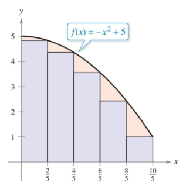
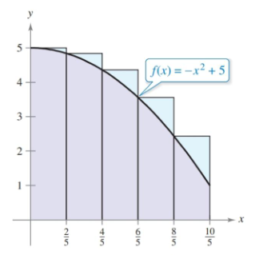
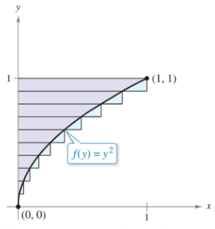

{: .lesson-dates}
Lesson date: February 7, 2025.

- Use sigma notation to write and evaluate a sum
- Understand the concept of area
- Approximate the area of a plane region
- Find the area of a plan region using limits

## Assignment

- **Vocabulary** and **teal boxes**{: .teal-box}
- p299 1, 4, 7–35 odd, 41, 45, 48, 53, 58, 61, 68, 69 *75, 76, 78, 81–83*{: .ap-problems}

## Additional Resources

- AP Topics: 6.1
- Khan Academy
  - [Exploring accumulations of change](https://www.khanacademy.org/math/ap-calculus-ab/ab-integration-new/ab-6-1/v/introduction-to-integral-calculus)

---

Considering the time spent on antidifferentiation and integration last section, it's going to appear like we're going off-topic. Don't worry, we'll get back there soon enough.

## Sigma Notation

We're going to start off with some notation that's used in summations, which is where you need to sum up a pattern of terms. Say we wanted to add up all the numbers from 1 to 10. Instead of writing it all out, we could instead write

$$\begin{align}
\sum_{i=1}^{10} i
\end{align}$$

The $i=1$ tells us to start at 1, and the $10$ up top tells us the upper bound of the sequence. Another is below.

$$\begin{align}
\sum_{i=4}^7 \frac{1}{i^2} &= \frac{1}{4^2} + \frac{1}{5^2} + \frac{1}{6^2} + \frac{1}{7^2} \\
&= \frac{1}{16} + \frac{1}{25} + \frac{1}{36} + \frac{1}{49}

\end{align}$$

Same story here, except we start at 4 and end at 7. We plug in for $i$ each time, which is now squared and in the denominator. The general form for this is below, where $a_i$ is used to represent the each term in the sequence.

$$\begin{align}
\sum_{i=1}^n a_i = a_1 + a_2 + a_3 + \dots + a_n
\end{align}$$

There are a few formulas and rules listed under Theorem 4.2 that we'll use when evaluating some summation. Memorizing them is helpful, but not required for the AP exam.

A few other things to keep in mind:

1. If our term is being multiplied by a constant, we can factor it out, and then back in later.
2. If two terms are being added or subtracted, we can evaluate them separately.
3. If our term is just a constant, then $\sum_{i=1}^{n} c = cn$

With that knowledge, we can rewrite a sum like the one below so we can evaluate it easily.

$$\begin{align}
\sum_{i=1}^{n} \frac{i+1}{n^2}  &= \frac{1}{n^2} \sum_{i=1}^{n} (i+1)                               &&\text{Factor out the constant} \\[1.5em]
                                &= \frac{1}{n^2} \left(\sum_{i=1}^{n} i + \sum_{i=1}^{n} 1\right)   &&\text{Write as two sums} \\[1.5em]
                                &= \frac{1}{n^2} \left(\frac{n(n+1)}{2} + n\right)                  &&\text{From Theorem 4.2 and 3 above} \\[1.5em]
                                &= \frac{n+3}{2n}                                                   &&\text{Simplify}
\end{align}$$

## Area

I recommend you read through what the book as written here. It does an excellent job of framing what's coming up.

## The Area of a Plane Region

Now, we'll take this concept of summations and apply it to the areas underneath a curve. First, we'll slice the area into rectangles, and then add up the areas of those rectangles.

The curve here is $-x^2 + 5$ on the interval $[0,2]$ and we'll use rectangles with their right-side touching the curve. Before we can construct our sum, we'll need to figure out the width and height of each rectangle.

Width is straightforward. Our interval distance is two and we have five rectangles, each rectangle's width is $2/5$.

In order to get the heights, which are our $y$-values, we'll need the $x$-values for the right side of each rectangle. The width of each is the same and we know where the interval starts, so they are predictable. If you remember how to construct linear expressions, this is just $0+\frac{2}{5}i$.

Now we that we have an expression for our $x$-values, we can plug it into our function to generate our $y$-values (heights). To construct our summation, we state that our bounds are from 1 to 5, and the expression we are summing is the height multiplied by the width.

$$\begin{align}
\sum_{i=1}^{5} \left[f\left(\frac{2}{5}i\right)\right]\left(\frac{2}{5}\right) = \sum_{i=1}^{5} \left[-\left(\frac{2}{5}i\right)^2+5\right]\left(\frac{2}{5}\right)
\end{align}$$

We can do the same for left endpoints with one little change. Since the left endpoints lag behind by one, our $f(2/5 \cdot i)$ becomes $f(2/5 \cdot (i-1))$. Or, if you prefer the linear equation way of thinking, $-1+\frac{2}{5}i$.

## Finding Area by the Limit Definition

> This section was rewritten for 2/10/25.

What we did above was find two approximate sums for the area under a curve, one an underestimate and the other an over. The book refers to these as upper and lower sums.

> Which sum corresponds to which endpoints will vary depending on the curve. Generally, increasing curves have the left endpoint as the smaller rectangle, and right endpoints are the smaller in decreasing curves. When a curve switches between the two … we'll be doing this a different way by the time we get there.

Also in that sum, we also only used five rectangles. If we used more, we'd have a better estimate and those two approximate sums would get closer to both each other and the actual value. If you remember the Squeeze Theorem from back in [section 1.3](./1-limits-and-their-properties/1.3-evaluating-limit-analytically.md), if we push $n\to \infty$ for both, then the actual sum, which lies between the two, would have to be equal to those approximate sums.

In other words, if you want to find the actual area of the area under a curve, add up all the rectangles using either the right or left hand method.

$$\begin{align}
\text{Area} = \lim_{n\to\infty} \sum^n_{i=1} f(c_i)\,\Delta x
\end{align}$$

The book shifts some of the notation and variables to get the definition above. The width of each rectangle is defined as $\Delta x$ and $c_i$ represents any $x$ value in the rectangle. The former is a benefit from the Squeeze Theorem; both limits approach each other, so use whatever $x$ from the rectangle you want (e.g. left or right hand summations).

Let's apply to this $x^2$ on the interval $[0,2]$. Since we are writing a summation based on $n$ rectangles, our width will be $\frac{2}{n}$ and our width is $f\left(\frac{2}{n}i\right)$. Since this curve is increasing on that interval, our right endpoints will the larger sum.

$$\begin{align}
S(n) &= \lim_{n\to\infty}\sum_{i=1}^n f(c_i) \Delta x \\
     &= \lim_{n\to\infty}\sum_{i=1}^n \left(\frac{2}{n}i\right)^2\left(\frac{2}{n}\right)\\
     &= \lim_{n\to\infty}\frac{8}{n^3}\sum_{i=1}^n i^2 \\
     &= \lim_{n\to\infty}\frac{8}{n^3} \left[\frac{n(n+1)(2n+1)}{6}\right]\\
     &= \lim_{n\to\infty}\frac{16n^3+24n^2+8n}{6n^3} \\
     &= \lim_{n\to\infty}\frac{8}{3} + \frac{4}{n} + \frac{4}{3n^2} \\
     &= \frac{8}{3}
\end{align}$$

If the area in question doesn't start at $0$, you'll have to compensate. Example 6 has $f(x) = 4 - x^2$ and an interval of $[1,2]$. The set up is below, but see the book for all the steps.

$$\begin{align}
\text{Area} &=\lim_{n\to\infty} \sum_{i=1}^n f\left(1+\frac{i}{n}\right)\left(\frac{1}{n}\right) \\
                   &= \lim_{n\to\infty} \sum_{i=1}^n \left[4 - \left(1+\frac{i}{n}\right)^2\right]\left(\frac{1}{n}\right) \\
                   & \dots \\
                   &= \lim_{n\to\infty} \left[3-\left(1+\frac{1}{n}\right)-\left(\frac{1}{3}+\frac{1}{2n}+\frac{1}{6n^2}\right)\right] \\
                   &= 3 - 1 - \frac{1}{3} \\
                   &= \frac{5}{3}
\end{align}$$

### Region Bounded the $y$-Axis

When you run into problems where we want area bounded by a function of $y$ instead of $x$, nothing actually changes. You still divide your interval by $n$ to get the width, and then multiply that by $i$ to get the summation terms.

### Approximating with midpoint

The last part of the section deals with approximating with midpoint, instead of the left or right endpoint. Your $i$ terms will now be the average of the left and right endpoints.

$$\begin{align}
\sum_{i=1}^n f\left(\frac{x_{i-1} + x_i}{2}\right)\Delta x
\end{align}$$
