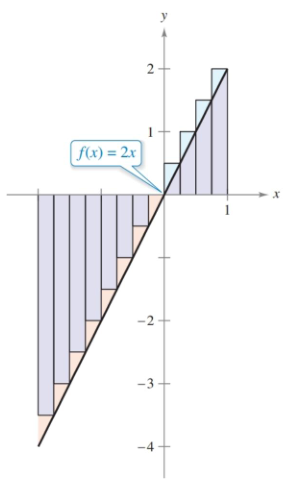
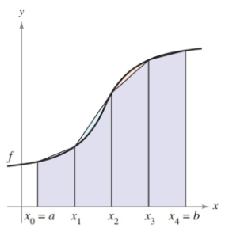

{: .lesson-dates}
Lesson date: February 11, 2025.

- Understand the definition of a Riemann sum.
- Evaluate a definite integral using limits and geometric formulas.
- Evaluate a definite integral using properties of definite integrals.
- Approximate a definite integral using the Trapezoidal Rule.
- Analyze the approximate error in the Trapezoidal Rule.

## Assignment

- **Vocabulary** and **teal boxes**{: .teal-box}
- p312 1–5 odd, 9–14, 18, 20, 25, 30, 31–35 odd, 40–50 even, 51, 53, 54, 57, 61–65 odd *74, 75, 89, 92, 94, 114–117*{: .ap-problems}

## Additional Resources

- AP Topics: 6.2, 6.3, 6.6, 6.8
- Khan Academy
  - [Approximating areas with Riemann sums](https://www.khanacademy.org/math/ap-calculus-ab/ab-integration-new/ab-6-2/v/simple-riemann-approximation-using-rectangles)
  - [Riemann sums, summation notation, and definite integral notation](https://www.khanacademy.org/math/ap-calculus-ab/ab-integration-new/ab-6-3/v/sigma-notation-sum)
  - [Applying properties of definite integrals](https://www.khanacademy.org/math/ap-calculus-ab/ab-integration-new/ab-6-6/v/negative-definite-integrals)
  - [Finding antiderivatives and integrals: basic rules and notation: reverse power rule](https://www.khanacademy.org/math/ap-calculus-ab/ab-integration-new/ab-6-8a/v/indefinite-integrals-of-x-raised-to-a-power)
  - [Finding antiderivatives and integrals: basic rules and notation: common indefinite integrals](https://www.khanacademy.org/math/ap-calculus-ab/ab-integration-new/ab-6-8b/v/antiderivative-of-x-1)
  - [Finding antiderivatives and integrals: basic rules and notation: definite integrals](https://www.khanacademy.org/math/ap-calculus-ab/ab-integration-new/ab-6-8c/v/reverse-power-rule-for-definite-integrals)

---

This section is an extension of the previous one, and will introduce some new (old?) notation along with another way to estimate area under a curve.

## Riemann Sums

Last section, rectangle widths were consistent, but that is not necessary and sometimes isn't desired. For instance, finding the area under $\sqrt{x}$. Trying it with our old method leads to a problem.

$$\begin{align}
\lim_{n \to \infty} \sum_{i=1}^n \frac{1}{n} \left( \sqrt{\frac{i}{n}} \right) = \lim_{n \to \infty} \frac{1}{n\sqrt{n}} \sum_{i=1}^n \sqrt{i}
\end{align}$$

We haven't touched how to replace $\sum \sqrt{i}$ and won't (because [harmonic numbers](https://math.stackexchange.com/questions/938225/calculate-summation-of-square-roots) are way beyond our scope).

But what would be really helpful is a $\sqrt{i^2/n^2}$ instead of $\sqrt{i/n}$. This would lead to rectangles of varying width, but because we want $n \to \infty$ the widest rectangle will still have a width approaching zero.

Speaking of width, we do have to deal with that since it will no longer be $1/n$. To find it, we subtract the left endpoint from the right one. With equal width, that looked like

$$\begin{align}
\frac{i}{n} - \frac{i-1}{n} = \frac{1}{n}
\end{align}$$

but since we've switched to a different value for our function, we need to recompute it.

$$\begin{align}
\frac{i^2}{n^2} - \frac{(i-1)^2}{n^2} = \frac{2i - 1}{n^2}
\end{align}$$

So our new summation is

$$\begin{align}
\lim_{n \to \infty} \sum_{i=1}^n \frac{2i-1}{n^2} \cdot \sqrt{\frac{i^2}{n^2}}
\end{align}$$

What we found above, and in the previous section, is called a Riemann sum. Riemann sums can be used for more than just finding area, so a more general definition is needed.

$$\begin{align}
\sum^n_{i=1} f(c_i)\, \Delta x_i
\end{align}$$

This is almost identical to what we dealt with last section, with a couple notable exceptions.

1. The width of a partition can vary, hence $\Delta x_i$ instead of $\Delta x$.
2. $f$ does not need to be continuous and nonnegative

The last point you might not have noticed, but last section we only dealt with continuous and nonnegative functions to keep things simple.

One thing this does is change how we approach the limit of our sum. Because our widths can be inconsistent, $n\to\infty$ does not necessarily mean that our widths will approach zero. So, our limit definition will have to shift to $\lVert\Delta\rVert\to 0$, where $\Vert\Delta\Vert$ is the width of the largest partition.

With that said, $n\to\infty$ and $\lVert\Delta\rVert\to 0$ are basically equivalent for everything we'll do here, so they can be used interchangeably.

## Definite Integral

Our notation for finding the area under a curve is getting a bit wild, so we're going to start writing it a different way. Here is our full Riemann sum formula, along with the new notation.

$$\begin{align}
\lim_{\Vert\Delta\Vert\to 0} \sum_{i=1}^n f(c_i) \Delta x_i = \int_a^b f(x) \, dx
\end{align}$$

That new notation looks a lot like what we did with antidifferentiation. The difference though, is this is a **definite integral** and produces a value, whereas before we dealt with indefinite integrals, which only produced families of functions. For instance

$$\begin{align}
\int x^2 \, dx &= \frac{x^3}{3} + C \\
\int_0^1 x^2 \, dx &= \frac{1}{3}
\end{align}$$

Let's try one out and determine the value of $\int_{-2}^1 2x \, dx$. Before we begin, we need to determine our widths and what $x$-value we'll use to determine the heights.

The function is a straightforward linear function, so we'll use the tried and true consistent-width intervals, which means $\frac{3}{n}$ in this case.

For our $x$-values, we have three choices: right endpoint, left endpoint and midpoint. For what we are doing here, right endpoint is typically the best choice as its the simplest.

> It's worth noting that throughout your entire math education, you've been given pretty problems that evaluate nicely. This is done for the sake of teaching you the material, but reality can be much different. These multiple definitions and choice of endpoints are incredibly useful outside of the classroom where flexibility is needed, and efficiency is prioritized over accuracy (how many decimal points of accuracy do we really need?).
>
> One quick example: imagine you have to find the area under a curve, but the curve is not actually a curve but a collection of data points. You don't have a function to work with, just a bunch of dots on a graph.

With our point chosen, we arrive at $(-2+\frac{3}{n}i)$ for our $x$-values and we can start work.

$$\begin{align}
\int_{-2}^1 2x \, dx &= \lim_{n\to\infty} \sum_{i=1}^n 2\left(-2 +\frac{3i}{n}\right) \frac{3}{n} \\
                     & \dots \\
                     &= \lim_{n\to\infty} \left(-12+9+\frac{9}{n}\right) \\
                     &= -3
\end{align}$$

A negative number is something new and shows the problem with the new lax definition. The function $2x$ is continuous, but it is negative left of 0. So although we got a value, it does not represent the area under the curve. This is something we will eventually tackles, but just keep it in mind for now.

You also might have noticed there is another way to find the area under this curve: find the area of the triangles. While the summation technique will work, sometimes it's easier to use what you know from geometry to evaluate certain definite integrals. Constant functions will give you rectangles, linear functions produce triangles and trapezoids, and you'll even see some semicircles with $\sqrt{a^2 - x^2}$.

## Properties of Definite Integrals

Examples 4 through 7 highlight the various properties of definite integrals, but I won't cover them here since they are essentially the same as the summations. The one notable addition is the negative definite integral, where the interval can be reversed.

$$\begin{align}
\int_a^b f(x)\, dx = - \int_b^a f(x)\, dx
\end{align}$$

## Trapezoidal Rule

Along with breaking an area into rectangles, there is another method for estimation that uses trapezoids. The area of a trapezoid is $\frac{1}{2}h(b_1+b_2)$, but since our trapezoids are vertical our height is really the width $\frac{b-a}{n}$, and the bases are our heights, or $y$ values.

Through a little algebra manipulation, as we start adding up our areas, we arrive at this formula.

$$\begin{align}
\frac{b-a}{2n}\left[f(x_0) + f(x_1)\right] + \frac{b-a}{2n}\left[f(x_1) + f(x_2)\right] + \dots + \frac{b-a}{2n}\left[f(x_{n-1}) + f(x_n)\right] = \\
\frac{b-a}{2n}\left[f(x_0) + 2f(x_1) + 2f(x_2) + \dots + 2f(x_{n-1}) + f(x_n)\right]
\end{align}$$

Note that the inner bases are all doubled up, while the two outer ones are not. This is because each inner base is shared with two trapezoids.
