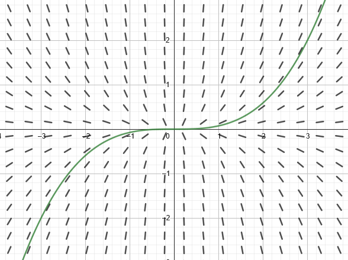

- Use initial conditions to find particular solutions of differential equations.
- Use slope fields to approximate solutions of differential equations.
- ~~Use Euler's Method to approximate solutions of differential equations.~~[^1]

## Assignment

- **Vocabulary** and **teal boxes**{: .teal-box}
- p375 1–4, 9, 11, 29, 32, 33, 37, 39, 44, 46, 50, 52, 55–57, 59–64 *89–93 odd, 99, 101*{: .ap-problems}

## Additional Resources

- AP Topics: 7.1, 7.2, 7.3, 7.4, 7.5, 7.7
- Khan Academy
  - [Modeling situations with differential equations](https://www.khanacademy.org/math/ap-calculus-ab/ab-differential-equations-new/ab-7-1/v/differential-equation-introduction){: target="_blank"}
  - [Verifying solutions for differential equations](https://www.khanacademy.org/math/ap-calculus-ab/ab-differential-equations-new/ab-7-2/v/verifying-solutions-to-differential-equations){: target="_blank"}
  - [Sketching slope fields](https://www.khanacademy.org/math/ap-calculus-ab/ab-differential-equations-new/ab-7-3/v/creating-a-slope-field){: target="_blank"}
  - [Reasoning using slope fields](https://www.khanacademy.org/math/ap-calculus-ab/ab-differential-equations-new/ab-7-4/v/slope-field-to-visualize-solutions){: target="_blank"}
  - [Finding particular solutions using initial conditions and separation of variables](https://www.khanacademy.org/math/ap-calculus-ab/ab-differential-equations-new/ab-7-7/v/finding-constant-of-integration-rational){: target="_blank"}

---

## General and Particular Solutions

We'll be working with **differential equations** these next few sections, which involve $x$, $y$ and the derivatives of $y$. A function is a solution to a differential equation when it, and its derivatives, can be substituted in without issue. For example, ${y'+2y = 0}$ is a differential equation, and its solution is ${y=e^{-2x}}$. We can verify this by substituting in for $y$, then finding its derivative and substituting that in as well.

$$\begin{align}
y'+2y &= 0 \\
\left(-2e^{-2x}\right) + 2\left(e^{-2x}\right) &= 0 \\
0 &= 0
\end{align}$$

And, it turns out that anything in the form ${y=Ce^{-2x}}$ is a solution to the differential equation above. This is called the **general solution**, and the general solution to a differential equation will have a number of constants equal to its **order**. Order is determined by the highest-order derivative present in the equation. Our example above has an order of one, and so its general solution ends up having one constant in it.

> You were introduced to differential equations [back in 4.1](./4.1-antiderivatives.md). Only $x$ and $y'$ were involved, like $y'=2x+4$, so solving only required antidifferentiating both sides. Now $y$ will enter the mix and new strategies for solving will be introduced over the next few sections. For now, don't worry too much about where these general solutions come from. We'll get there.
>
> Also, this is the likely the first time you've seen $C$ appear in a position other than added on at the end. This a consequence of $y$ now being being part of the equation. Again, how this happens is coming in later sections.

### Finding Particular Solutions

Once a general solution has been verified, it can be used to find particular solutions determined by initial conditions. The differential equation ${xy' - 3y = 0}$ has a general solution of ${y=Cx^3}$ (again, don't worry about where the solution came from), but we want the solution that passes through $(3,2)$. All that's needed to is to substitute your values into the general solution and solve for $C$.

$$\begin{align}
y &= Cx^3 \\
(2) &= C(3)^3 \\
\frac{2}{27} &= C
\end{align}$$

So, our particular solution is ${y = \frac{2}{27}x^3}$.

### Finding General Solutions

There are exercises on this topic, but no examples in the text since we covered this [back in 4.1](./4.1-antiderivatives.md). Here is #39 from the HW, which comes with a video, but I took a slightly different approach to prime you for what's coming in the next few sections.

$$\begin{align}
\frac{dy}{dx} &= 12x^2 \\
                 dy &= 12x^2 \, dx  && \text{Multiply both sides by } dx \\
\int dy &= \int 12x^2 \, dx && \text{Integrate both sides} \\
y &= 4x^3 + C
\end{align}$$

It's going to appear that you can just integrate both sides—in fact all the problems in the section work that way—but we'll soon run into differential equations where that isn't the case.

## Slope Fields

Since general solutions represent every possible particular solution of a differential equation, we use **slope fields** to help visualize an infinite number of curves.

Slope fields are created by first putting the differential in the form ${y'=F(x,y)}$ (solving for $y'$), then plugging points into ${F(x,y)}$ to get the slope at that point. The points in question will either be given to you, or you can choose them similar to how you learned to graph functions. You'll only do this once or twice by hand in the homework, just so you get the hang of how they are generated, because it is friggin' tedious.

Using the technology we can create slope fields pretty easily. My recommendation is [GeoGebra](https://www.geogebra.org/calculator){: target="_blank"}. It's similar to Desmos, but with a lot more power and complexity. Also, Desmos can't do slope fields.

Let's use the differential from earlier, ${xy' - 3y = 0}$. We'll need to solve for $y'$ first, and that gives us ${y'=3y/x}$. In GeoGebra enter `SlopeField(3y/x)` to generate your slope field. Then, you can enter the particular solution on the next line to see how it matches up with the field.

> 
>
> **Figure 5.1.1** The slope field for a differential equation along with a particular solution [graphed in GeoGebra](https://www.geogebra.org/calculator/fywn9rxh){: target="_blank"}.
{: .figure}

Now that we can "see" the general solution of ${y=Cx^3}$, it's worth pointing out that the constant isn't added on to the end like it normally is when integrating. Instead, the constant is acting as a scaler in the solution, and you can see that in the slope field where only stretches appear, without any translations.

### Identifying Slope Fields for Differential Equations

Example 4 provides three slope fields to match with three given differential equations. I have no general advice for you besides looking for patterns in the slopes. I suggest practicing a fair bit with these, and [Khan Academy has an exercise for it](https://www.khanacademy.org/math/ap-calculus-ab/ab-differential-equations-new/ab-7-3/e/slope-fields){: target="_blank"}.

[^1]: Euler's method is an AP Calc BC topic, so we'll only be looking at slope fields.
