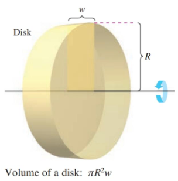
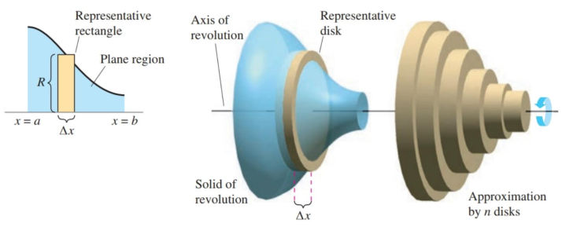
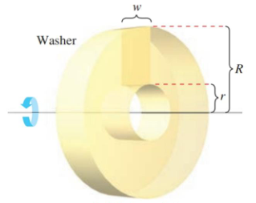
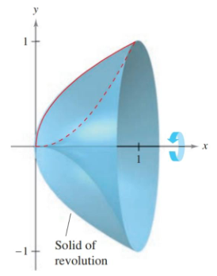
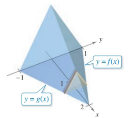

- Find the volume of a solid of revolution using the disk method.
- Find the volume of a solid of revolution using the washer method.
- Find the volume of a solid with known cross-sections.

## Assignment

- **Vocabulary** and **teal boxes**{: .teal-box}
- p427 6–9, 11, 17, 22, 25, 29–31, 35, 39, 41, 50, 51 *64, 65, 76, 80, 81, 83–85*{: .ap-problems}

## Additional Resources

- AP Topics: 8.7, 8.8, 8.9, 8.10, 8.11, 8.12
- Khan Academy
  - [Volumes with cross sections: squares and rectangles](https://www.khanacademy.org/math/ap-calculus-ab/ab-applications-of-integration-new/ab-8-7/v/volume-with-cross-sections-intro){: target="_blank"}
  - [Volumes with cross sections: triangles and semicircles](https://www.khanacademy.org/math/ap-calculus-ab/ab-applications-of-integration-new/ab-8-8/v/volume-solid-semicircle-cross-section){: target="_blank"}
  - [Volume with disc method: revolving around x- or y-axis](https://www.khanacademy.org/math/ap-calculus-ab/ab-applications-of-integration-new/ab-8-9/v/disk-method-around-x-axis){: target="_blank"}
  - [Volume with disc method: revolving around other axes](https://www.khanacademy.org/math/ap-calculus-ab/ab-applications-of-integration-new/ab-8-10/v/disc-method-rotation-around-horizontal-line){: target="_blank"}
  - [Volume with washer method: revolving around x- or y-axis](https://www.khanacademy.org/math/ap-calculus-ab/ab-applications-of-integration-new/ab-8-11/v/disc-method-washer-method-for-rotation-around-x-axis){: target="_blank"}
  - [Volume with washer method: revolving around other axes](https://www.khanacademy.org/math/ap-calculus-ab/ab-applications-of-integration-new/ab-8-12/v/washer-method-rotating-around-non-axis)
- [Visualizing the disk method](https://www.geogebra.org/m/u8KtPdqf){: target="_blank"}
- [Visualizing volumes by known cross section](https://www.geogebra.org/m/XFgMaKTy){: target="_blank"}

---

## The Disk Method

Before we get into this, let's look at the volume of a disk, or if you want, a really short cylinder.

> 
>
> **Figure 6.2.1** Determining the volume of a disk.
{: .figure}

You need two things: the area of the circle and the width of the disk. That means, we have a formula of $\pi r^2 \cdot w$.

Now, one of the ways you can make a disk is by rotating a rectangle around an axis of revolution. If you look at the figure above again, that's how it was created. And that rectangle has a width of $w$ and a radius of $R$ (you'll see why they went with a capital $R$ in a bit).

And if you remember, we first learned how to find the area under a curve with rectangles, eventually pushing that to its limit with an infinite number of infinitely thin rectangles. Now, we are going to take those rectangles and spin them around an axis to find the volume of shapes.

> 
>
> **Figure 6.2.2** The disk method.
{: .figure}

This method of finding volume is called the disk method. Each disk is formed from one of the rectangles from integration, with the radius coming from the function itself.

> ### Disk Method
>
> $$\begin{align}
> V = \pi \int_a^b [R(x)]^2 \, dx &&\text{Vertical rectangles / horizontal axis} \\
> V = \pi \int_a^b [R(y)]^2 \, dy &&\text{Horizontal rectangles / vertical axis} \\
> \end{align}$$
{: .definition}

### Example 1

> Find the volume of the solid created by revolving the function below about the $x$-axis on the interval $[0,\pi]$.
>
> $$\begin{align}
> f(x) = \sqrt{\sin x}
> \end{align}$$
{: .example}

Our function is spinning around our horizontal axis, so we can differentiate with respect to $x$. We also have bounds, which won't always be the case.

$$\begin{align}
V = \pi \int_a^b [R(x)]^2 \, dx &= \pi \int_0^\pi (\sqrt{\sin x})^2 \, dx \\
&= \pi \int_0^\pi \sin x \, dx \\
&= \pi \left[ -\cos x \right]_0^\pi \\
&= \pi(1 - (-1)) \\
&= 2\pi
\end{align}$$

$\blacksquare$
{: .qed}

### Example 2

> Find the volume of the solid bounded by $f(x)=2-x^2$ and $g(x)=1$, that also revolves around the line $y=1$.
{: .example}

This time there are no bounds given, but you can find them by setting the two functions equal to each other.

$$\begin{align}
2 - x^2 &= 1 \\
x^2 - 1 &= 0 \\
x &= \pm 1
\end{align}$$

And since the axis is moved up to $y=1$, that means our radius is needs to be adjusted.

$$\begin{align}
\pi \int_{-1}^1 ((2 - x^2) - 1)^2\, dx &= \pi \int_{-1}^1 (1 - x^2)^2\, dx \\
&= \pi \int_{-1}^1 1 - 2x^2 + x^4 \, dx \\
&= \pi \left[ x - \frac{2}{3}x^3 + \frac{1}{5}x^5 \right]_{-1}^1 \\
&= \frac{16}{15}\pi
\end{align}$$

$\blacksquare$
{: .qed}

## The Washer Method

The idea behind the disk method can be extended to washers, which are just disks with a hole in the middle.

> 
>
> **Figure 6.2.3** A washer created by an elevated rectangle.
{: .figure}

Where the disk method was rotating the area under a curve, the washer method is rotating the area between two curves.

> ### Washer Method
>
> $$\begin{align}
> V = \pi \int_a^b \left[R(x)\right]^2 - \left[r(x)\right]^2\, dx
> \end{align}$$
{: .definition}

### Example 3

> Find the volume of the solid formed by revolving the region bounded by ${y=\sqrt x}$ and ${y=x^2}$ about the $x$-axis.
{: .example}

> 
>
> **Figure 6.2.4** The region defined by $y=\sqrt{x}$ and $y=x^2$ revolved around the $x$-axis.
{: .figure}

The graph of $\sqrt x$ is above $x^2$, giving us ${R(x)=\sqrt x}$ and ${r(x)=x^2}$. Setting the two equal to each other will give us the bounds, which are $0$ and $1$.

$$\begin{align}
V = \pi \int_a^b \left[R(x)\right]^2 - \left[r(x)\right]^2\, dx
 &= \pi \int_0^1 (\sqrt x)^2 - \left(x^2\right)^2 \, dx \\
 &= \pi \int_0^1 x - x^4 \, dx \\
 &= \pi \left[\frac{1}{2}x^2 - \frac{1}{5}x^5\right]_0^1 \\
 &= \frac{3}{10}\pi
\end{align}$$

$\blacksquare$
{: .qed}

## Solids With Known Cross Sections

The disk method applied to circular cross sections, but you can extend the idea to any shape with a known cross section.

> ### Volumes of Solids with Known Cross Sections
>
> $$\begin{align}
> V = \int_a^b A(x) \, dx
> \end{align}$$
{: .definition}

With these volumes, there's no revolution to worry about. Instead, you need to find the area of each cross section in terms of the height of the rectangle from integration.

### Example 4

> 
>
> **Figure 6.2.5**
{: .figure}

> Find the volume of a the solid displayed in figure $6.2.5$. The cross sections that are perpendicular to the $x$-axis are equilateral triangles, and the base of the shape is bounded by
>
> $$\begin{align*}
> f(x)= 1-\frac{x}{2} \qquad g(x)=-1+\frac{x}{2} \qquad x=0
> \end{align*}$$
{: .example}

For an equilateral triangle, our area is defined by

$$\begin{align}
A = \frac{\sqrt3}{4}b^2
\end{align}$$

That the base of this shape is also a triangle is incidental. We need to simply add up all those cross sections, getting the base from the area between the two curves.

$$\begin{align}
b &= \left(1-\frac{x}{2}\right) - \left(-1+\frac{x}{2}\right) \\
b &= 2 - x \\[1em]

\int_0^2 \frac{\sqrt3}{4}(2-x)^2\, dx
  &= \frac{\sqrt3}{4}\int_0^2 4-4x+x^2\, dx \\
  &= \frac{\sqrt3}{4}\left[ 4x-2x^2 + \frac{1}{3}x^3 \right]_0^2 \\
  &= \frac{2\sqrt3}{3}
\end{align}$$

$\blacksquare$
{: .qed}
