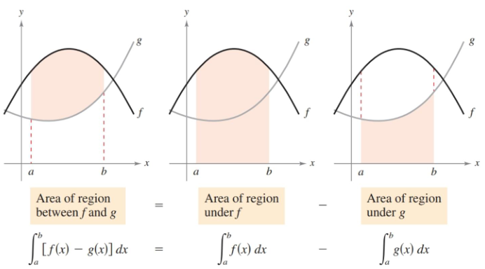
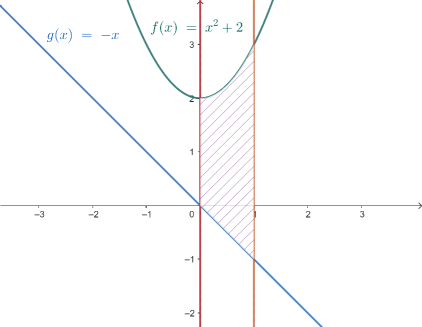
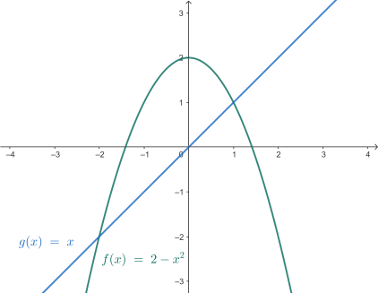
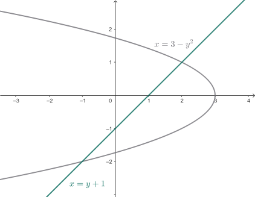
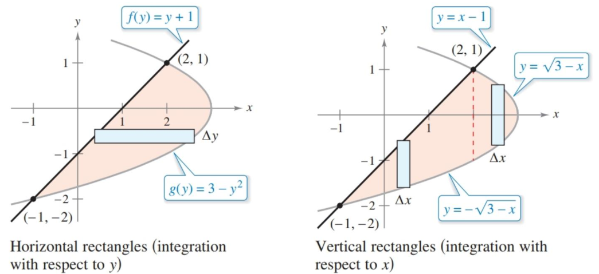

- Find the area of a region between two curves using integration.
- Find the area between intersecting curves using integration.
- Describe integration as an accumulation process.

## Assignment

- **Vocabulary** and **teal boxes**{: .teal-box}
- p416 3, 6, 7, 10, 11, 13, 15, 18, 21, 24, 27, 30, 33, 36, 39, 42, 45, 48 *53–57 odd, 66, 78, 83–85*{: .ap-problems}

## Additional Resources

- AP Topics: 8.4, 8.5, 8.6
- After this section, you can complete **Unit 3 Progress Checks MCQ, and FRQ Parts A and B**
- Khan Academy
  - [Finding the area between curves expressed as functions of x](https://www.khanacademy.org/math/ap-calculus-ab/ab-applications-of-integration-new/ab-8-4/v/evaluating-simple-definite-integral)
  - [Finding the area between curves expressed as functions of y](https://www.khanacademy.org/math/ap-calculus-ab/ab-applications-of-integration-new/ab-8-5/v/area-between-curve-and-y-axis)
  - [Finding the area between curves that intersect at more than two points](https://www.khanacademy.org/math/ap-calculus-ab/ab-applications-of-integration-new/ab-8-6/e/area-between-curves-that-intersect-at-more-than-two-points)

---

## Area of a Region Between Two Curves

This image does a better job of explaining the main idea behind this section's concept than I ever could. Find the area of the upper curve and subtract the area of the lower curve.

> 
>
> **Figure 6.1.1** Finding the area between two curves.
{: .figure}

### Example 1

> Find the area of the region between ${y=x^2+2}$, ${y=-x}$, $x=0$, and $x=1$.
{: .example}

With anything, images are good so you can get a feel of what's going on.

> 
>
> **Figure 6.1.2** Bounded area for example 1.
{: .figure}

$x^2+2$ is above $-x$, and $x=0$ and $x=1$ are just the bounds, so we can jump right into setting up the integral.

$$\begin{align}
\int_0^1 f(x)-g(x)\, dx &= \int_0^1 (x^2+2) - (-x) \, dx \\
&= \int_0^1 x^2+x + 2 \, dx \\
&= \left[ \frac{x^3}{3} +\frac{x^2}{2} + 2x\right]_0^1 \\
&= \frac{17}{6}
\end{align}$$

$\blacksquare$
{: .qed}

## Area of a Region Between Intersecting Curves

An extra step is introduced if bounds aren't defined, and intersections need to be found instead.

### Example 2

> Find the area between ${f(x)=2-x^2}$ and ${g(x)=x}$.
{: .example}.

> 
>
> **Figure 6.1.3** The area bounded by $2-x^2$ and $x$.
{: .figure}

The area itself is clearly defined by looking at the graph, we just need the bounds which will be the intersection points. Setting the two equations equal to each other will get those for us.

$$\begin{align}
2 - x^2 &= x \\
x^2 + x -2 &= 0 \\
(x - 1)(x - 2) &= 0 \\[1em]

\int_2^1 f(x) - g(x)\, dx &= \int_2^1 (2-x^2) - (x)\, dx \\
&= \int_2^1 -x^2 - x + 2 \, dx \\
&= \left[ -\frac{x^3}{3} - \frac{x^2}{2} + 2x\right]_{-2}^1 \\
&= \frac{9}{2}
\end{align}$$

$\blacksquare$
{: .qed}

Of course, the problems will get more complicated beyond that. You will have multiple regions defined, requiring multiple integrals, and also functions in terms of $y$ rather than $x$.

### Example 3

>Find the area of the region bounded by the graphs of ${x=3-y^2}$ and ${x=y+1}$.
{: .example}

> 
>
> **Figure 6.1.4** The region bounded by ${x=3-y^2}$ and ${x=y+1}$.
{: .figure}

Find your intersection points like normal and you end up with $(2,1)$ and $(-1,-2)$. But integrating with respect to $x$ is more complicated than before. If you look at the region as bounded by something above and below, the top boundary is two different functions.

Instead, it's easier to look at this as a left and right boundary and integrate with respect to $y$. Our lower bound for the integral would be $-2$ and the upper $1$. We then subtract the left curve from the right one.

$$\begin{align}
\int_{-2}^1 (3-y^2) - (y + 1) \, dy &= \int_{-2}^1 -y^2 - y +2 \, dy \\
&= \left[ -\frac{y^3}{3} - \frac{y^2}{2} + 2y \right]_{-2}^1 \\
&= \frac{9}{2}
\end{align}$$

$\blacksquare$
{: .qed}

If you keep in mind where the positive and negative are, not much changes when calculating horizontal areas compared to vertical ones. This image from the text highlights the differences between the two, and uses the example above as reference.

> 
>
> **Figure 6.1.5** Comparison of horizontal and vertical rectangles to find the area for example 3.
{: .figure}
