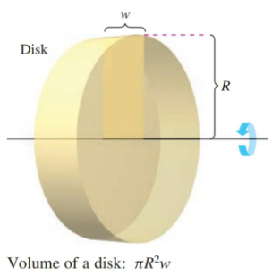
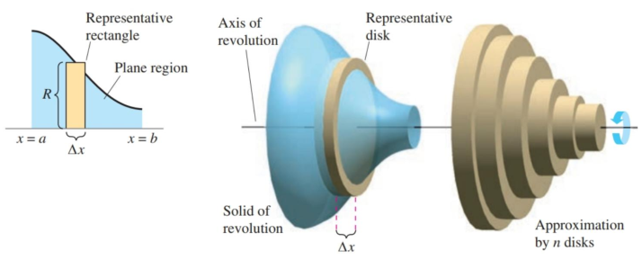

- Find the volume of a solid of revolution using the disk method.
- Find the volume of a solid of revolution using the washer method.
- Find the volume of a solid with known cross-sections.

## Assignment

- **Vocabulary** and **teal boxes**{: .teal-box}
- p427 6–9, 11, 17, 22, 25, 29–31, 35, 39, 41, 50, 51 *64, 65, 76, 80, 81, 83–85*{: .ap-problems}

## Additional Resources

- AP Topics: 8.7, 8.8, 8.9, 8.10, 8.11, 8.12
- Khan Academy
  - [Volumes with cross sections: squares and rectangles](https://www.khanacademy.org/math/ap-calculus-ab/ab-applications-of-integration-new/ab-8-7/v/volume-with-cross-sections-intro)
  - [Volumes with cross sections: triangles and semicircles](https://www.khanacademy.org/math/ap-calculus-ab/ab-applications-of-integration-new/ab-8-8/v/volume-solid-semicircle-cross-section)
  - [Volume with disc method: revolving around x- or y-axis](https://www.khanacademy.org/math/ap-calculus-ab/ab-applications-of-integration-new/ab-8-9/v/disk-method-around-x-axis)
  - [Volume with disc method: revolving around other axes](https://www.khanacademy.org/math/ap-calculus-ab/ab-applications-of-integration-new/ab-8-10/v/disc-method-rotation-around-horizontal-line)
  - [Volume with washer method: revolving around x- or y-axis](https://www.khanacademy.org/math/ap-calculus-ab/ab-applications-of-integration-new/ab-8-11/v/disc-method-washer-method-for-rotation-around-x-axis)
  - [Volume with washer method: revolving around other axes](https://www.khanacademy.org/math/ap-calculus-ab/ab-applications-of-integration-new/ab-8-12/v/washer-method-rotating-around-non-axis)

---

## Rectangles and the Disk Method

Before we get into this, let's look at the volume of a disk, or if you want, a really short cylinder.

> 
>
> **Figure 6.2.1** Determining the volume of a disk.
{: .figure}

You need two things: the area of the circle and the width of the disk. That means, we have a formula of $\pi r^2 \cdot w$.

Now, one of the ways you can make a disk is by rotating a rectangle around an axis of revolution. If you look at the figure above again, that's how it was created. And that rectangle has a width of $w$ and a radius of $R$ (you'll see why they went with a capital $R$ in a bit).

And if you remember, we first learned how to find the area under a curve with rectangles, eventually pushing that to its limit with an infinite number of infinitely thin rectangles. Now, we are going to take those rectangles and spin them around an axis to find the volume of shapes.

> 
>
> **Figure 6.2.2** The disk method.
{: .figure}

This method of finding volume is called the disk method. Each disk is formed from one of the rectangles from integration, with the radius coming from the function itself.

> ### The Disk Method
>
> $$\begin{align}
> V = \pi \int_a^b [R(x)]^2 \, dx &&\text{Vertical rectangles / horizontal axis} \\
> V = \pi \int_a^b [R(y)]^2 \, dy &&\text{Horizontal rectangles / vertical axis} \\
> \end{align}$$
{: .definition}

### Example 1

> Find the volume of the solid created by revolving the function below about the $x$-axis on the interval $[0,\pi]$.
>
> $$\begin{align}
> f(x) = \sqrt{\sin x}
> \end{align}$$
{: .example}

Our function is in terms of $x$ and it's spinning around our horizontal axis, so we can differentiate with respect to $x$.

$$\begin{align}
V = \pi \int_a^b [R(x)]^2 \, dx &= \pi \int_0^\pi (\sqrt{\sin x})^2 \, dx \\
&= \pi \int_0^\pi \sin x \, dx \\
&= \pi \left[ -\cos x \right]_0^\pi \\
&= \pi(1 - (-1)) \\
&= 2\pi
\end{align}$$

$\blacksquare$
{: .qed}

As for twists on this concept, like with regions between curves, you might need to find where the curve intersects with your axis of revolution. And the axis itself won't necessarily be at $0$.

### Example 2

> Find the volume of the solid bounded by $f(x)=2-x^2$ and $g(x)=1$, that also revolves around the line $y=1$.
{: .example}

Setting the two functions equal to each other will get your bounds.

$$\begin{align}
2 - x^2 &= 1 \\
x^2 - 1 &= 0 \\
x &= \pm 1
\end{align}$$

And since the axis is moved up to $y=1$, that means our radius is needs to be adjusted.

$$\begin{align}
\pi \int_{-1}^1 ((2 - x^2) - 1)^2\, dx &= \pi \int_{-1}^1 (1 - x^2)^2\, dx \\
&= \pi \int_{-1}^1 1 - 2x^2 + x^4 \, dx \\
&= \pi \left[ x - \frac{2}{3}x^3 + \frac{1}{5}x^5 \right]_{-1}^1 \\
&= \frac{16}{15}\pi
\end{align}$$

$\blacksquare$
{: .qed}

### The Washer Method
