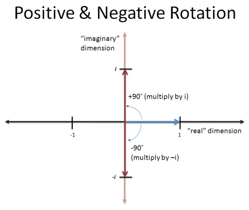
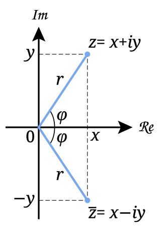

## {{ page.title }}

Today, we will solve this seemingly unsolvable equation.

$$ x^2 = -1$$

> Some context: people once thought [negative numbers were absurd](https://en.wikipedia.org/wiki/Negative_number#History) and questioned [if zero was even a number](https://en.wikipedia.org/wiki/0#Classical_antiquity). So, what we will cover here might seem wild, but that's because a) it was formalized rather recently in the 1800s, and 2) unlike the concept of zero and negative numbers, it hasn't found a way to be terribly useful in everyday mathematics.

Let's look at the equation $x^2 = 9$ first. The other way to write it would be $x\cdot x = 9$, or even more accurately

$$1\cdot x \cdot x = 9$$

Here, since we are multiplying, 1 is our starting point. We rarely see or acknowledge it, but it's there. So, we need to take one and multiply it by some number twice, and end up with 9. Our two candidates are 3 and -3. With both, we scale by 3 twice, but I want to focus on the sign instead.

If you put 1 on a number line with a line drawn to from 0, multiply by 3, then 3 again, you'll see that you keep the same direction relative to zero. 1 is to the right, so is 3, and so is 9.

With -3, we change directions twice. We start at 1, switch directions to the left at -3, then switch back to the right at 9.

This is why we assume that squaring a number always results in a positive. If we start in a positive direction (our default 1), multiplying by another positive number doesn't change your direction, and multiplying by a negative twice just puts you back where you were.

So, let's make some other assumptions and what happens.

### The Assumption

First, let's just assume that $x^2=-1$. It is, but since I might have to convince you, it's often helpful to be open-minded.

Now, let's assume that what we were doing before with multiplying by negatives and positive wasn't flipping direction (or non-flipping in the case of positives), it was instead rotations. Multiplying by a positive means no rotation, or rotation of 0º, and multiplying by a negative means rotating by 180º. So, multiplying by a negative twice gives us 360º and we've literally come full circle.

With our perspective changed to rotations instead of flips, now we can go back and reexamine our original problem.

$$ 1 \cdot x \cdot x = -1$$

What _rotation_ applied twice will give us a -1? A negative one is opposite of 1, so 180º is needed. Well what's half of 180º?

90º.

If there is some imaginary number $i$ that means "rotate by 90º", applying it twice would solve our problem.

$$\begin{align*}
x^2 &= -1\\
x   &= i \\
i^2 &= -1
\end{align*}$$

That last line is mean and potatoes of the lesson. We have devised some number $i$ such that when you square it, you get -1. And, despite us "imagining" it, it plays nicely with other mathematics, putting in on level with the discovery of zero and negative numbers.

### Solving Simple Quadratics With $i$

So, what's the solution to $x^2=-9$? If you can remember that

$$i^2=-1$$

then it follows that

$$ i = \sqrt{-1}$$

So, let's rewrite our problem.

$$\begin{align*}
x^2 &= 9 \\
\sqrt{x^2} &= \sqrt{-9} \\
x   &= \sqrt{9}\cdot\sqrt{-1}\\
x   &= 3i
\end{align*}$$

### Complex Numbers

With this whole 90º rotation thing, we've revealed that numbers are actually two-dimensional, since now they can move above and below the number line.

This new plane is called the complex plane and it houses complex numbers. This plane behaves just like the $(x,y)$ coordinate plane you are already familiar with, but instead of an $x$-axis, it has a real component, and replacing the $y$-axis is the imaginary component. And instead of writing it as a pair of coordinates, we write it as a sum. So, the complex number with 1 in the real part and 2 in the imaginary part would be written as

$$ 1 + 2i $$

And it turns out you can do the same things to complex numbers that you could do to real numbers. And $i$ behaves like any other number or variable. You can add them.

$$ (1 + 2i) + (3 - i) = 4 + i$$

And you can multiply them.

$$\begin{align*}
(1 + 2i)(3 - i) &= 3 - i + 6i -2i^2 \\
                &= 3 + 5i - 2i^2 \\
                &= 3 + 5i + 2 && \color{gray}{\text{Substitute }i^2=-1}\\
                &= 5 + 5i
\end{align*}$$

### Conjugates

In some cases, eliminating the imaginary part of a complex number is helpful. A **complex conjugate** helps with that since it is the same number flipped over the real axis of the complex plane.

So, multiplying a pair of conjugates results in a number with only a real component.

$$\begin{align*}
(3 + 4i)(3 - 4i) &= 9 - 12i + 12i - 16i^2 \\
                 &= 9 + 16 \\
                 &= 25
\end{align*}$$

You can use conjugates in order to rewrite rational expressions where a complex numbers in the denominator might be undesirable.

$$\begin{align*}
\frac{10}{2-i} \cdot \frac{2+i}{2+i} &= \frac{10(2+i)}{4+1} = 2(2+1) = 4 + 2i
\end{align*}$$

### ~~Difference~~ Addition of Squares

We've seen difference of squares in action.

$$ x^2 - 25 = (x+5)(x-5) $$

Now we can also work with the addition of squares.

$$ x^2 + 25 = x^2 - (-25) = (x + 5i)(x - 5i)
