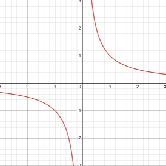

{: .lesson-dates}
Lesson: January 27, 2025. Quiz: February 13, 2025.

- Use inverse variation to write and graph reciprocal functions.
- Identify the effect of transformations on the graph of the parent reciprocal function and define the effects of $h$ and $k$ on the function $f(x)=\frac{1}{x-h} + k$.

#### Assignment

- All **5 vocabulary** copied into notes
- p199 8–25
  - Answers to [odd questions]({{site.baseurl}}/misc/alg2-odd-answers.pdf) / [even questions]({{site.baseurl}}/misc/alg2-even-answers.pdf)

---

## Inverse Variation

A while back, you learned about proportionality where $y=kx$ or $k=y/x$. Take any pair, divide them and you'll get the same constant of variation. As one variable increases, the other has to increase proportionally to the other to maintain $k$. If $x$ doubles, so does $y$.

Inverse variation (or inverse proportionality) is when $y=k/x$ or $k=xy$. As one variable increases, the other has to decrease proportionally to maintain $k$. If $x$ doubles, $y$ must be halved to maintain the constant of variation.

Identifying inverse variation is straightforward: multiply your $xy$ pairs and see if they share a common product. If they do, that's your constant of variation and they are inversely proportional.

## The Reciprocal Function

Inverse variation is a specific form of the parent function $f(x)= \frac{1}{x}$, known as the reciprocal function.

Both it's domain and range do not include 0 and it has two asymptotes, one vertically at $x=0$ and one horizontally at $y=0$. An asymptote is a line that a graph gets infinitely close to as one or both $xy$ coordinates head to infinity.

Transformation rules apply here like before. The function $f(x)=\frac{1}{x-3}+2$ shift the whole graph up 2 and to the right 3. Keep in mind that everything shifts, including the domain, range and asymptotes.
