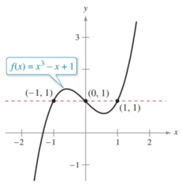

- Use tables, graphs, and equations to represent the inverse of a relation.
- Write an equation for the inverse of a function by restricting the domain.
- Verify that one function is the inverse of another, using composition.

## Assignment

- All vocabulary copied into notes
- p288 ~~9–20,~~ 23–38 ([pdf](./pdf/alg2-practice-0506.pdf))
  - Answers to [odd questions](../misc/alg2-odd-answers.pdf) / [even questions](../misc/alg2-even-answers.pdf)

---

## Inverse Relations and Functions

A word that we don't see much any more is **relation**, which is the umbrella term for any set of ordered pairs. Functions, which are a specific type of relation, tend to be the focus after they are introduced. An **inverse relation** is where the ordered pairs are reversed, so something like $(2,5)$ becomes $(5,2)$. To find an inverse, switch the variables and rearrange. So, if $y = 2x + 3$ then

$$\begin{align}
        x &= 2y + 3 \\
        y &= \frac{x-3}{2} \\
\end{align}$$

If the inverse happens to be a function, then you can refer to it as an **inverse function** and the notation is $f^{-1}$. The $f$ part is not fixed, so the inverse of the function $g(x)$ would be $g^{-1}(x)$. More on functions later.

### Inverse Verification

You can verify that the two are inverses of each other by using function composition. If they are inverses, then $f(g(x)) = x$ (and also $g(f(x)) = x$ will work). Checking one is enough to prove inversality (not a real word).

$$\begin{align}
f(g(x)) &= 2\left(\frac{x-3}{2}\right) + 3 \\
        &= x - 3 + 3 \\
f(g(x)) &= x
\end{align}$$

You can think of an inverse as undoing the original, which is why you are left with just $x$ after the composition.

Also worth noting is that when graphed, the inverse is a reflection of the original over the line $y=x$, which is where the ordered pairs equal each other. Here are our pair [graphed on Desmos](https://www.desmos.com/calculator/fv9rgwo6fa).

## Domain, Range, and Inverse Functions

When you invert a relation, it's domain and range are swapped. The relation $y=x^2$ has a domain of all real numbers and a range of $y\ge 0$. Let's find it's inverse.

$$\begin{align}
x &= y^2 \\
\pm\sqrt{x} &= y
\end{align}$$

Our inverse relation, $y=\pm\sqrt{x}$ will now have a domain of $x\ge 0$ and a range of all real numbers.

Note that I did not use the word "function" with $x^2$ and $\sqrt{x}$. If we call our new relation a function, there is the restriction that every $x$ has to map to exactly one $y$. The Vertical Line Test is one way to check if that is true: if you can draw a vertical line through the graph of a function and hit two points, it's not a function. Extra restrictions have to be made. The function $f(x)=x^2$ has an inverse of $f^{-1}(x)=\sqrt{x}$, but the range has to be redefined as $y\ge 0$.

You can use the Horizontal Line Test to see if a function has an inverse. It works exactly like the Vertical Line Test, except ... well ... horizontal.

> 
>
> **Fig. 5.6-1** The graph of $x^3-x+1$, which is a function, but fails the Horizontal Line Test, meaning it's not one-to-one and doesn't have an inverse.
{: .figure}

Functions that do invert without the need for extra restrictions are referred to as **one-to-one**, meaning not only does each $x$-value map to only one $y$-value (which is the definition of a function), but each $y$-value also matches to exactly one $x$-value.
