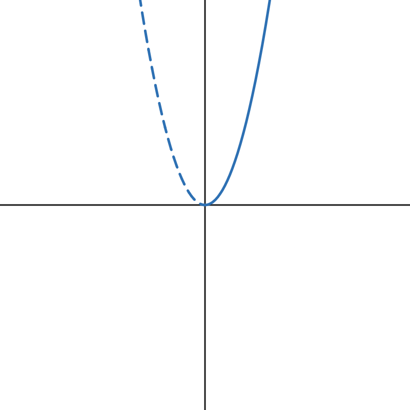
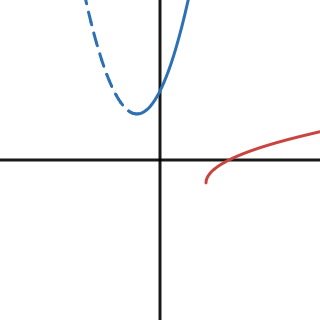

- Use tables, graphs, and equations to represent the inverse of a relation.
- Write an equation for the inverse of a function by restricting the domain.
- Verify that one function is the inverse of another, using composition.

## Assignment

- All vocabulary copied into notes
- p288 ~~9–20,~~ 23–38 ([pdf](./pdf/alg2-practice-0506.pdf))
  - Answers to [odd questions](../misc/alg2-odd-answers.pdf) / [even questions](../misc/alg2-even-answers.pdf)

---

## Inverse Relations

A word that we don't see much any more is **relation**, which is the umbrella term for any set of ordered pairs. I create the inverse of a relation, or just an **inverse relation**, take the ordered pairs and reverse them.

$$\begin{align}
(x,y) \quad\rightarrow\quad (y,x)
\end{align}$$

If the relation can be represented by an equation, then the inverse would be the same equation with the variables swapped.

$$\begin{align}
y = 2x + 3 \quad\rightarrow\quad x = 2y + 3
\end{align}$$

With some graphing utilities, like Desmos, the inverse relation above can be graphed without a problem. Others though, like a TI-84, require that the equation be written in terms of $x$.

$$\begin{align}
x = 2y + 3 \quad\rightarrow\quad y = \frac{x-3}{2}
\end{align}$$

Here are all three equations—the original and both inverses—[graphed on Desmos](https://www.desmos.com/calculator/nrv5zzf0wt). You'll see that the inverses are a reflection of the original over the line ${y=x}$, the line where all the points have equal $x$ and $y$ values. This reflection is a quick way to check if two relations *aren't* inverses of each other, but shouldn't be used to prove that they are.

## Inverse Functions

Functions are a specific type of relation, one were each input maps to exactly one output. You might remember the Vertical Line Test, where if there's any place on a curve that you can draw a vertical line through more than one point, then it's not a function.

An **inverse function** has to follow the same rules, and that means not every function has a proper inverse, at least without some adjustments. The function $f(x)=x^2$ is one of those cases. When graphed, it forms a parabola which fails the **Horizontal Line Test**. This works the same way as it's vertical counterpart, except this tests if a function has an inverse function.

So, $f(x)=x^2$ fails the test and doesn't have a proper inverse, but we can still create one if we modify the domain so there are no repeated $y$ values. With parabolas being reflected at the vertex, we can just remove one half of it, and then invert what's left.

{: .figure}
> 
>
> **Figure 5.6.1** The function $x^2$ with a domain restricted to $x\ge0$, then inverted.

We still need a function rule for our new inverse, but luckily the process is the same as before. We'll rewrite it with $y$ instead of $f(x)$, then swap and rearrange.

$$\begin{align}
y &= x^2 \\
x &= y^2 \\
\pm\sqrt{x} &= y
\end{align}$$

Since we are interested in writing a function involving the square root, we will drop the $\pm$ before it. Our new function will use the notation ${f^{-1}}$ to indicate it is an inverse.

$$\begin{align}
f^{-1}(x)=\sqrt{x}
\end{align}$$

> There is a difference between using square root to solve something, and the square root function. If we need to solve ${x^2 = 9}$, square roots are required and we get two answers with $x=\pm3$. This is in contrast to the square root function, where if ${f(x)=\sqrt{x}}$ then ${f(9)=3}$ **and only** $3$.
>
> Similarly, we don't deal with complex numbers with the square root function. When solving, they can appear and should be accounted for, but the function does not have negative numbers as part of its domain.

## Domain and Range

Let's go the other way and invert something involving a square root. Square root functions pass the Horizontal Line Test, so we can skip artificially restricting the domain, but we still need to pay attention to the domain and range. When inverting a function, those restrictions carry over to the new one, but like the coordinates, they are swapped.

Let's work with ${f(x)=\sqrt{x-2}-1}$. If we apply our transformation rules, this function has been shifted right $2$ and down $1$. We can apply both of those translations to our domain and range making them ${x\ge2}$ and ${y\ge-1}$. This means our inverted function will have a domain of ${x\ge-1}$ and a range of ${y\ge2}$.

Like before, swap $f(x)$ for $y$ before finding the inverse.

$$\begin{align}
y &= \sqrt{x-2}-1 \\
x &= \sqrt{y-2}-1 \\
x + 1 &= \sqrt{y-2} \\
(x+1)^2 &= y -2 \\
(x+1)^2 +2 &= y \\
\end{align}$$

You can expand that if you want, but it's in vertex form which is convenient for graphing.

$$\begin{align}
f^{-1}(x)=(x+1)^2+2
\end{align}$$

We have our inverse function, but the resulting rule is a parabola and doesn't match the original. Transferring the original domain and range will ensure it's a true inverse of the original.

{: .figure}
>
>
> **Figure 5.6.2** Inverting the function $\sqrt{x-2}-1$ without setting the domain to the original's range won't result in a true inverse function.

## Verifying Inverses

You can verify that two functions are inverses of each other by using function composition. If they are inverses, then $f\left(f^{-1}(x)\right) = x$, along with $f^{-1}\left(f(x)\right) = x$. Checking one is enough to prove inverseness (not a real word).

Here's the check for if we did our original example correctly.

$$\begin{align}
f\left(f^{-1}(x)\right) &= 2\left(\frac{x-3}{2}\right) + 3 \\
                        &= x - 3 + 3 \\
                        &= x
\end{align}$$

You can think of an inverse as undoing the original, which is why you are left with just $x$ after the composition.
