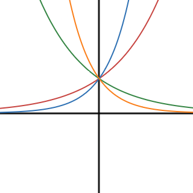
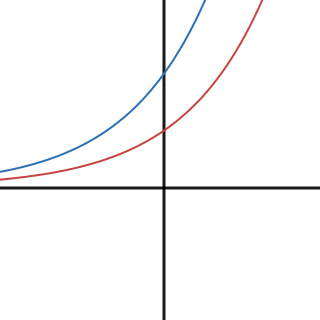

- Rewrite exponential functions to identify rates.
- Interpret the parameters of an exponential function within the context of compound interest problems.
- Construct exponential models given two points or by using regression.

## Assignment

- All **vocabulary** copied into notes
  - decay factor, exponential decay function, exponential function, exponential growth function, growth factor
- p303 9–13, 15–30 ([pdf](./pdf/alg2-practice-0601.pdf))
  - Answers to [odd questions](../misc/alg2-odd-answers.pdf) / [even questions](../misc/alg2-even-answers.pdf)

## Additional Resources

- [Additional practice worksheet](./pdf/alg2-add-practice-0601.pdf)

---

## Exponential Functions

Exponential functions are used to model situations with repeated multiplication. Here's their general form.

$$\begin{align}
f(x) = b^x
\end{align}$$

>
>
> **Figure 6.1.1** Graphs of various exponential functions.
{: .figure}

Each exponential function—without any transformations aside from a base change—have a few properties in common.

1. Domain of all real numbers, and a range of $y>0$.
2. A $y$-intercept of $(0,1)$.
3. A horizontal asymptote at $y=0$, but only for one side.

But their base is the unique feature of exponential functions, and it's because of this base that they don't really have a default state. We can talk about them in general, but each one is unique. So given a base of $b$

1. If $b>1$, the graph increases with the end behavior mentioned above only applying to the negative side of the $x$-axis.
2. If $0<b<1$ then the graph decreases and the end behavior applies only to the positive side of the $x$-axis.

All other cases you should check out on your own. You will likely end up having more questions about how this all works (like how the hell does $2^\sqrt2$ work?), and I'll the do the best I can to answer them in person, but those questions are beyond what I want to do here.

So, bases greater than $1$ produce an increasing function and referred to as **exponential growth**. Between $0$ and $1$ is a decreasing function, or **exponential decay**. After the base is settled, transformations can be applied and they work like they always have. Of particular note is your vertical transformation, or $a$ in ${f(x)=a\cdot b^x}$. This is typically your initial value as that gets all the multiplication from the exponential part of the function. Absent any translations, this will also be your $y$-intercept.

> 
>
> **Figure 6.1.2** Graphs of the $2^x$ in red and $2 \cdot 2^x$ in blue.
{: .figure}

## Modeling With Exponential Functions

Let's look at some examples of modeling with exponential functions to see how they translate from words to math-speak.

Over a four-year period, the population of an area grew at a rate of $1.3\%$ each year. The population in the initial year was $4.6$ million.

Rather than write all those zeros, we'll keep things in the millions. This means our initial value $a$ is $4.6$, which will increase by $1.3\%$ every year.

The trickier part is the base. The increase is $1.3\%$ or $0.013$, but that is *not* our base. What you have to keep in mind when multiplying is that ${100\%=1}$, and multiplying by $1$ does nothing. Multiplying by more than $1$ leads to an increase, and less than $1$ is a decrease. That's why the base has the effect it does on the shape of the graph.

So, most problems will have you adjust from $100\%$. Our population increased by $1.3\%$ each year, meaning our base is $100\%+1.3\%$, or what was there to begin with plus $1.3\%$ more.

$$\begin{align}
P(t) = 4.6(1.013)^t
\end{align}$$

For another example, let's look at a function that predicts car depreciation in thousands of dollars, meaning value lost after purchase.

$$\begin{align}
V(t) = 24(0.8)^t
\end{align}$$

We're working in thousands of dollars, so $24$ means an initial value of \\$24,000. The base of $0.8$ has to be interpreted like before, in terms of the original $100\%$. Subtracting $0.8$ from $1$ gives us $0.2$, meaning the car sees a $20\%$ decrease in value each year.
