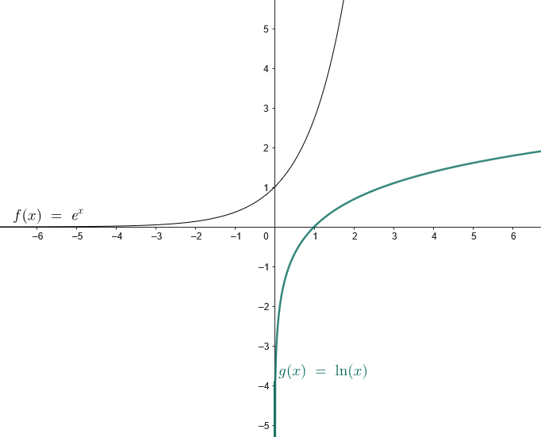

- Graph logarithmic functions and interpret their key features.
- Write and interpret the inverses of exponential and logarithmic functions.

## Assignment

- p325 7–12, 15–31 ([pdf](./pdf/alg2-practice-0604.pdf))
  - Answers to [odd questions](../misc/alg2-odd-answers.pdf) / [even questions](../misc/alg2-even-answers.pdf)

## Additional Resources

- [Additional practice worksheet](./pdf/alg2-add-practice-0604.pdf)

---

## Key Features of Logarithmic Functions

It will likely come with little shock that logarithmic functions are the inverse function of exponential functions.

> 
>
> **Figure 6.4.1** Graph of $e^x$ and $\ln{x}$.
{: .figure}

- While exponential functions have domain of all real numbers, logarithmic functions have a range of all real numbers.
- An exponential has a range of $y\ge0$, and a logarithmic has a domain of $x \ge 0$.
- The $y$-intercept in an exponential function becomes an $x$-intercept in a logarithmic function.
- Logarithmic functions have a vertical asymptote at $x=0$.
- End behavior is below.

  $$\begin{align}
  \lim_{x\to\infty}f(x)=\infty \qquad \lim_{x\to0^+}f(x)=-\infty
  \end{align}$$

  I don't think I've shown you limit notation yet, but for the sake of exposure, there it is. As $x$ heads towards infinity, $f(x)$ also goes to infinity. And as $x$ heads towards $0$ *from the right*, $f(x)$ goes to negative infinity.

## The Rest of the Section

Transformations can be applied and follow the same rules as with other functions: adding results in translations, multiplying is scaling, and where you add or multiply will determine if it's horizontal or vertical.

If you need to invert a logarithm, there's no need to restrict the domain since it's one-to-one, meaning there's no repeat $y$-values. Just solve for $x$, then adjust your variables accordingly.

Average rate of a change comes up again. That is just slope by another name, so find $\frac{\Delta y}{\Delta x}$, or the change in $y$ over the change in $x$.
