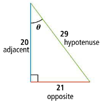
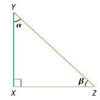

- Use special triangles to determine trigonometric ratios geometrically.
- Use trigonometric functions and the Pythagorean Theorem to find missing side lengths.
- Identify and explain trigonometric identities.

## Assignment

- All **vocabulary** copied into notes
  - cofunction, cofunction identities, cosecant, cosine, cotangent, reciprocal trigonometric function, secant, sine, tangent
- p363 17–24, 26–40 ([pdf](./pdf/alg2-practice-0701.pdf))
  - Answers to [odd questions](../misc/alg2-odd-answers.pdf) / [even questions](../misc/alg2-even-answers.pdf)

## Additional Resources

- [Additional practice worksheet](./pdf/alg2-add-practice-0701.pdf)

---

## Trigonometric Ratios

You might remember that similar triangles, or any polygon for that matter, have side lengths that are in proportion to each other. So, if ${\triangle ABC \sim \triangle XYZ}$, then ...

$$\begin{align}
\frac{\overline{AB}}{\overline{XY}} = \frac{\overline{BC}}{\overline{YZ}}
\end{align}$$

With some algebra, we can rearrange that proportion.

$$\begin{align}
\frac{\overline{AB}}{\overline{BC}} = \frac{\overline{XY}}{\overline{YZ}}
\end{align}$$

This means that the ratios between the sides are equal to each other, as long as the triangles themselves are similar. This relationship between the sides of a triangle are codified with trigonometric ratios and right triangles.

> Right triangles are used because they are, in a sense, the basic building block of geometry. The fact that two of its sides are perpendicular, or orthogonal, to each other, gives them almost universal application.

So, given a right triangle, from the perspective of one of the angles $\theta$ that is *not* the right angle, we can start by defining the three basic trigonometric functions, named **sine**, **cosine**, and **tangent**.

$$\begin{align}
\sin \theta = \frac{\text{opposite}}{\text{hypotenuse}} \qquad
\cos \theta = \frac{\text{adjacent}}{\text{hypotenuse}} \qquad
\tan \theta = \frac{\text{opposite}}{\text{adjacent}}
\end{align}$$

> 
>
> **Figure 7.1.1** The sides of a right triangle relative to angle $\theta$.
{: .figure}

Where these names come from won't make much sense at the moment, but to help you remember them there is the acronym **SohCahToa**

### Example 1

> 
>
> **Figure 7.1.2**
{: .figure}

> Given the right triangle above (hypotenuse of $29$, an opposite side of $21$ and adjacent side of $20$) write the three trigonometric ratios.
{: .example}

This comes down to memorizing your ratios. Remember to use SohCahToa in the meantime.

$$\begin{align}
\sin \theta = \frac{21}{29} \qquad
\cos \theta = \frac{20}{29} \qquad
\tan \theta = \frac{21}{20} \qquad
\end{align}$$

$\blacksquare$
{: .qed}

### The Inverse Ratios

Ratios can easily be written the other way, so naturally there are reciprocal trigonometric ratios. Their definitions are below, and their names are **cosecant**, **secant**, and **cotangent**.

$$\begin{align}
\frac{1}{\sin \theta} = \csc \theta \qquad
\frac{1}{\cos \theta} = \sec \theta \qquad
\frac{1}{\tan \theta} = \cot \theta \qquad
\end{align}$$

Memorization is easier as long as you can hold on to the word *secant* and that every function is paired with a *co*-function.

### Example 2

> Given that $\tan\theta=\frac{15}{8}$, what are the other five trigonometric ratios for $\theta$?
{: .example}

We can get cotangent easily, but we don't know the hypotenuse so we can write the other four. But since the trig ratios are based on right triangles, we can use the Pythagorean theorem to find our missing side.

$$\begin{align}
a^2 + b^2 &= c^2 \\
(15)^2 + (8)^2 &= c^2 \\
17 &= c
\end{align}$$

Now we can write all the ratios.

$$\begin{align}
\sin \theta &= \frac{15}{17} &
\cos \theta &= \frac{8}{17} &
\tan \theta &= \frac{15}{8}  \\[1em]
\csc \theta &= \frac{17}{15} &
\sec \theta &= \frac{17}{8} &
\cot \theta &= \frac{8}{15}
\end{align}$$

$\blacksquare$
{: .qed}

## Cofunction Identities

We've been referencing the angle $\theta$ in all the examples, but have been ignoring the other non-right angle.

> 
>
> **Figure 7.13** A right triangle $\triangle XYZ$ with angles $\alpha$ (alpha) and $\beta$ (beta).
{: .figure}

While the hypotenuse is always the long side and across from the right angle, the opposite and adjacent sides depend on what angle you are referencing. So, while $\sin\alpha = \frac{XZ}{YZ}$, from the perspective of $\beta$, that ratio would be for $\cos\beta$.

$$\begin{align}
\sin \alpha = \cos \beta \qquad
\csc \alpha = \sec \beta \qquad
\tan \alpha = \cot \beta
\end{align}$$

And, since $\alpha$ and $\beta$ are complementary angles, the **cofunction identities** highlight this relationship between the trigonometric ratios.

$$\begin{align}
\sin \alpha = \cos (90^\circ - \alpha) \qquad
\csc \alpha = \sec (90^\circ - \alpha) \qquad
\tan \alpha = \cot (90^\circ - \alpha)
\end{align}$$
