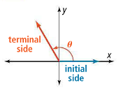
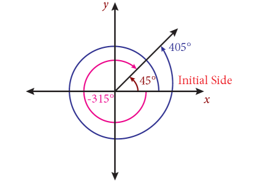
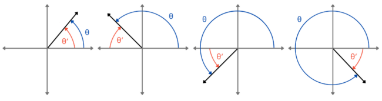
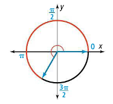

- Find the measures of an angle in standard position and its reference angle.
- Use radian measure on the unit circle to find arc length.
- Convert between degrees and radians.

## Assignment

- All **vocabulary** copied into notes
  - coterminal angles, initial side, radian, radian measure, reference angle, reference triangle, standard position, terminal side, unit circle
- p374 16–22, 25–45 ([pdf](./pdf/alg2-practice-0702.pdf))
  - Answers to [odd questions](../misc/alg2-odd-answers.pdf) / [even questions](../misc/alg2-even-answers.pdf)

## Additional Resources

- [Additional practice worksheet](./pdf/alg2-add-practice-0702.pdf)

---

## Standard Position and Coterminal and Reference Angles

Our work in trig so far has only explored acute angles. We've been limited by the fact that we are working with right triangles. In order to start working with anything else, we have to step out from the triangles, at least somewhat.

To that end, we need to establish some ground rules about how we talk about angles. First we need a standard area to work, so we'll use the coordinate plane. Angles are two-dimensional, so this works out nicely.

We need to place the angles somewhere on the plane, and we should be consistent. We'll place the vertex at the origin and one side of the angle will always be on the positive side of the $x$-axis. This is called **standard position**. The side that goes on the $x$-axis is the **initial side** and the other is the **terminal side**.

> 
>
> **Figure 7.2.1** An angle in standard position on the coordinate plane.
{: .figure}

Now, that terminal side [can spin around in a circle](https://www.geogebra.org/classic/G6EtwPhh), but there's no reason it has to stop. A circle might only have $360^\circ$, but angles aren't limited to that. There's also no reason they need to be positive. The terminal side can swing around the other way.

But, the angles end up repeating themselves. A $45^\circ$, $405^\circ$, and $-315^\circ$ angle all look exactly the same because they are separated by a complete revolution, or $360^\circ$. These angles are called **coterminal angles** because they share a terminal side.

> 
>
> **Figure 7.2.2** Coterminal angles of $45^\circ$, $405^\circ$, and $-315^\circ$.
{: .figure}

Before we go any further, let's remember the goal here: trigonometric ratios on angles other than acute ones. But those acute angles will still be useful. After all, we did define each trig ratio in terms of acute angles.

It turns out, that each angle on the coordinate plane has an acute angle built-in, which will come in handy later. These acute angles are called **reference angles**, and angles that have the same reference angle will behave similarly when we start talking about trig ratios again.

> 
>
> **Figure 7.2.3** Reference angles in the four quadrants.
{: .figure}

The book has a procedure for finding a reference angle that involves determining which quadrant the terminal side falls, then doing something based on that. Look that over and use it if you want. I like this method:

1. Drop any negatives.
2. If larger than $180^\circ$, then divide by $180^\circ$ and keep the remainder. This operation of dividing and keeping the remainder is called [modulo](https://en.wikipedia.org/wiki/Modulo).
3. If the remainder is an obtuse angle, find its supplement by subtracting it from $180^\circ$.

### Example 1

> Find the reference angles for $130^\circ$, $210^\circ$, $-45^\circ$, and $-270^\circ$.
{: .example}

$130^\circ$ is an obtuse angle, so $180^\circ-130^\circ = 50^\circ$.

$210^\circ$ is larger than $180^\circ$, so $210^\circ \bmod 180^\circ = 30^\circ$.

$-45^\circ$ can just lose the negative leaving us with $45^\circ$.

$-270^\circ$ we'll treat as positive and get the remainder. $270^\circ \bmod 180^\circ = 90^\circ$. Not obtuse, so can stop there.

$\blacksquare$
{: .qed}

### Example 2

> For all four quadrants, give a possible positive angle measure that would have a reference angle on $10^\circ$.
{: .example}

Sketching these types of problems will make them much easier.

Quadrant I is whatever the reference angle is, so no problem there.

For quadrant II, coming off the $x$-axis means subtracting, so $180^\circ-10^\circ=170^\circ$.

An angle in quadrant III is similar to II, but now we are increasing the angle, so add. $180^\circ+10^\circ=190^\circ$.

For quadrant IV, keep in mind that $360^\circ$ and $0^\circ$ are coterminal. $360^\circ-10^\circ=350^\circ$. You can also just put a negative in front of the reference angle, and then add a revolution to make it positive.

$\blacksquare$
{: .qed}

## The Unit Circle

If you take your angle in standard position and spin it all the way around, but make sure the terminal side is 1 unit long, you get the unit circle: a circle with radius of 1 that's centered on the origin.

This thing is amazing, for a bunch of reasons. First, pick a point on the circle (not in it). The $x$-coordinate is the cosine of the angle in standard position, and the $y$-coordinate is the sine value. I suggest sticking with quadrant I for now, but that rule applies to all of them. Just don't think about the negatives too much.

### Example 3

> An angle has a value of $60^\circ$. At what point does it hit the unit circle?
{: .example}

We need sine and cosine values to get that coordinate. A $60^\circ$ angle is part an equilateral triangle, and since the other angle is $30^\circ$, we can just mirror it to get the whole thing.

So, with the unit circle in mind, the hypotenuse is $1$, that means the adjacent side will be $\frac{1}{2}$. Some Pythagorean work gives us a sine of $\frac{\sqrt3}{2}$.

If the cosine of the angle is $\frac{1}{2}$ and the sine is $\frac{\sqrt3}{2}$, then the coordinate on the unit circle is $\left(\frac{1}{2},\frac{\sqrt{3}}{2}\right)$.

$\blacksquare$
{: .qed}

### Radians

One of the other reasons why the unit circle is friggin' awesome is that we get a whole new way to measure angles. If the radius of the unit circle is $1$, then the circumference of the unit circle is $2\pi$. That means a full $360^\circ$ is $2\pi$ units. $180^\circ$ is $\pi$. $90^\circ$ is $\frac{\pi}{2}$. You get the idea.

OK, so why another measurement? Well, radians are unit-less. This makes computations a lot easier. When you eventually have to deal with arc lengths, or distance traveled around a circle, you'll appreciate the lack of dimensional analysis.

But the biggest pro for radians is that it's universal and the natural way to measure angles. $360^\circ$ in a circle? Someone just made that up. Radians are expressed in terms of the radius of the circle, so no matter what measurement you use, everything works out. Degrees are similar to mixed numbers, in that they are more useful in everyday terms (people tend to not like fractions), but you hit a certain point in maths where their convenience is actually a hindrance.

My advice to you is that when you sit down to do any work or take an exam, draw a unit circle and label the radians so you start to get a feel of the system.

> 
>
> **Figure 7.2.4** The unit circle with a few radian measures labeled.
{: .figure}

To move back and forth between the two, since we $360^\circ = 2\pi \text{ radians}$, we can use this conversion ratio.

$$\begin{align}
180^\circ = \pi \text{ radians}
\end{align}$$

### Example 4

> Covert $112^\circ$ to radians and $\frac{\pi}{6}$ to degrees.
{: .example}

Dimensional analysis refresher. Multiply by a conversion ratio, but make sure the unit you want is up top, and the unit you want to go away is in the denominator.

$$\begin{align}
\frac{112^\circ}{1} \cdot \frac{\pi}{180^\circ} = \frac{112}{180}\pi = \frac{28}{45}\pi
\end{align}$$

$$\begin{align}
\frac{\pi}{6}\cdot\frac{180^\circ}{\pi} = 30^\circ
\end{align}$$

$\blacksquare$
{: .qed}
