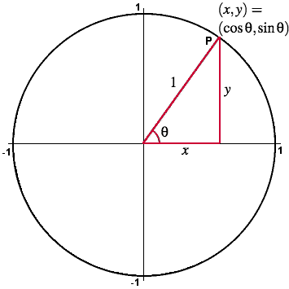
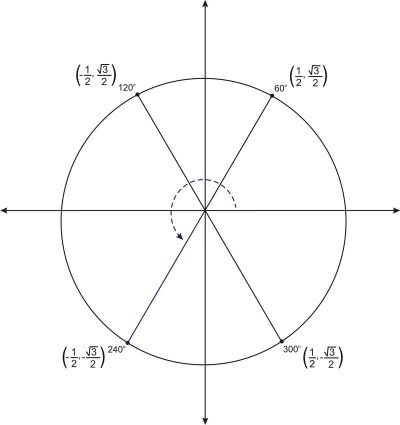
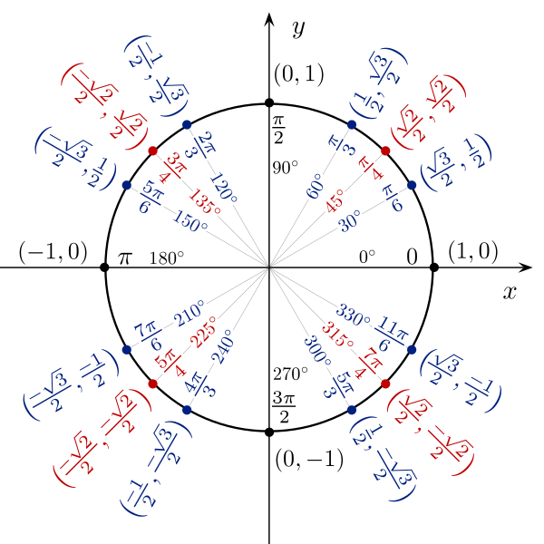

- Use reference angles and triangles to evaluate trigonometric functions and their reciprocal functions.
- Prove the Pythagorean Identity and use it to find the sine, cosine, and quadrant of an angle.

## Assignment

- p381 12–19, 22–39 ([pdf](./pdf/alg2-practice-0703.pdf))
  - Answers to [odd questions](../misc/alg2-odd-answers.pdf) / [even questions](../misc/alg2-even-answers.pdf)

## Additional Resources

- [Additional practice worksheet](./pdf/alg2-add-practice-0703.pdf)

---

## Sine and Cosine in Other Quadrants

Last section we redefined sine and cosine on the coordinate plane. While the idea behind opposite adjacent sides still hold true, we also know that for any point on the unit circle ...

$$\begin{align}
(x, y) = (\cos\theta, \sin\theta)
\end{align}$$

> 
>
> **Figure 7.3.1** Sine and cosine on the unit circle.
{: .figure}

Well, what if the terminal side went into another quadrant, and we had angles that were no longer just acute? With triangles, sine and cosine were just the ratios of two sides of the triangle. Now that we are in the coordinate plane, we've reframed that ratio as distances from the origin, or your $x$ and $y$ coordinates.

> 
>
> **Figure 7.3.2** Four angles, each with a reference angle of $60^\circ$.
{: .figure}

This means moving to other quadrants just means finding the reference angle, and then applying negatives to the right spots.

> 
>
> **Figure 7.3.3** The quadrants and their negative trigonometric ratios.
{: .figure}

The figure above has tangent included, which we haven't talked about in a while. Tangent was defined as opposite / adjacent, so that means it's now $\frac{y}{x}$. If either sine or cosine is negative, then tangent will be, too. But if they both are, like in quadrant III, tangent is positive.

> There is an initialism for remembering which ratios are positive: ASTC. That stands for **A**ll, **S**ine, **T**angent, **C**osine. Some pneumonics for remembering it (that I stole from Wikipedia)
>
> - All Students Take Calculus
> - All Science Teachers (are) Crazy
> - All Schools Torture Children
>
> I suggest making your own up if you really want to remember it. Or just draw a picture.

### Example 1

> Find sine, cosine, and tangent of the angle $\frac{2}{3}\pi$.
{: .example}

I recommend avoiding degrees unless the problem uses them. You want to get comfortable with them as soon as possible. So, draw a picture and label each axis with the radians. Then drop $\frac{2}{3}\pi$ where it belongs, and hopefully it landed in quadrant II.

> OK, so for most of the problems you can easily look up these values on a unit circle or use a calculator to get the value, and I can't stop you from doing that. But, you will **not** get either of those things on an exam.
>
> So, either get memorizing or learn to make equilateral triangles so you can derive these values. Spoilers: you won't need to know any other reference angles besides $\pi/6$, $\pi/4$, and $\pi/3$ (or $30^\circ$, $45^\circ$, $60^\circ$). Also, don't forget about the right angles.

We need a reference angle first. That means the acute angle formed between the terminal side and the $x$-axis. In this case, we need to subtract the measure of $\pi$ (or $180^\circ$) and our angle.

$$\begin{align}
\pi - \frac{2}{3}\pi = \frac{\pi}{3}
\end{align}$$

Before we get into finding values, we need to deal with negatives. We are in quadrant II, so sine will be positive, but cosine will be negative.

$\frac{\pi}{3}$ is one third of $\pi$ ($60^\circ$ is one third of $180^\circ$), so we have half of an equilateral triangle. Draw it out if you can't picture it, but since we have only the left half of it, $\cos\frac{\pi}{3}= \frac{1}{2}$.

But wait, that's only the reference angle. The actual angle is $\frac{2}{3}\pi$, and we need to account for our negative since this is cosine.

$$\begin{align}
\cos\frac{2\pi}{3} = -\frac{1}{2}
\end{align}$$

The hypotenuse is always $1$ in a unit circle, so we can use the Pythagorean theorem that $\sin\frac{\pi}{3}=\frac{\sqrt3}{2}$. But remember, that's just the reference angle. Sine is positive in quadrant II.

$$\begin{align}
\sin\frac{2\pi}{3} = \frac{\sqrt3}{2}
\end{align}$$

Tangent is $\frac{y}{x}$, or $\frac{\sin\theta}{\cos\theta}$.

$$\begin{align}
\frac{\frac{\sqrt3}{2}}{-\frac{1}{2}} = \frac{\sqrt3}{2} \cdot \left(-\frac{2}{1}\right)= -\sqrt3
\end{align}$$

$\blacksquare$
{: .qed}

Yes, that was just one angle, but notice that the amount of a calculations was minimal. Most of what happened up there goes away once you start getting familiar with the common angles and their ratios.

For the next one, I'll do it from the perspective of someone who knows the unit circle pretty well.

### Example 2
> Find sine, cosine, and tangent of the angle $\frac{3}{4}\pi$.
{: .example}

OK, three quarters of $\pi$ puts us in quadrant II again. And since it's quarters, or $45^\circ$, sine and cosine will be the same, but only sine is positive. And I also know that value is $\frac{\sqrt2}{2}$.

$$\begin{align}
\sin\frac{3\pi}{4} = \frac{\sqrt2}{2} \qquad
\cos\frac{3\pi}{4} = -\frac{\sqrt2}{2} \qquad
\tan\frac{3\pi}{4} = -1
\end{align}$$

$\blacksquare$
{: .qed}

So, yeah. It gets easier once you get familiar with the common angles. Here are some patterns you can try to pick up on.

- Radians involving halves and wholes fall right on an axis and are the $90^\circ$ angles. Either sine or cosine will be $0$, the other will be a $1$, but watch your negatives.
- Anything with a $6$ in the denominator will typically be a $30^\circ$ angle. A $4$ means $45^\circ$ and a $3$ points to a $60^\circ$ angle. Just watch out for unsimplified fractions.
- As you climb in angles, from $30^\circ$ to $45^\circ$ to $60^\circ$, so does your sine value from $\frac{1}{2}$ to $\frac{\sqrt2}{2}$ to $\frac{\sqrt3}{2}$. Cosine does the same, but in the reverse order.

> 
>
> **Figure 7.3.4** The full unit circle. Here's a [printable version](../pdfs/unit-circle.pdf).
{: .figure}
