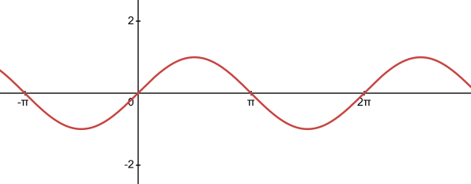
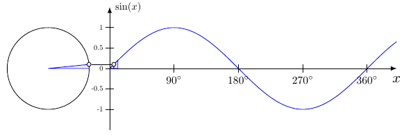
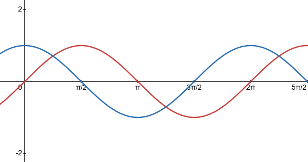
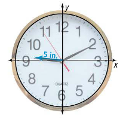
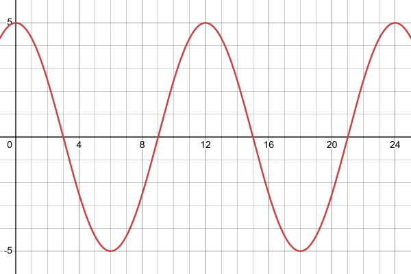

- Graph and identify the key features of sine and cosine functions.
- Find and interpret the average rate of change of a periodic function over a specified interval.
- Compare key features of different periodic functions.

## Assignment

- All **vocabulary** copied into notes
  - amplitude, frequency, midline, period, periodic function
- p390 8–23 ([pdf](./pdf/alg2-practice-0704.pdf))
  - Answers to [odd questions](../misc/alg2-odd-answers.pdf) / [even questions](../misc/alg2-even-answers.pdf)

## Additional Resources

- [Additional practice worksheet](./pdf/alg2-add-practice-0704.pdf)

---

## Graphs of a Trig Functions and Their Features

This is the graph of ${f(x)=\sin x}$.

> 
>
> **Figure 7.4.1** The graph of $\sin x$.
{: .figure}

This type of function is called a **periodic function** since the outputs repeat at regular intervals. To see where this repeating feature comes from, you just need to look at the unit circle. Since $\sin\theta = y$, when graphing $\sin x$, your output is the $y$-coordinate as the angle increases.

> 
>
> **Figure 7.4.2** The graph of $\sin x$ from the unit circle.
{: .figure}

Their periodic nature makes sine waves a popular way to model real-world repeating phenomena. There is some specific terminology to describe its features, since those features relate to their real-world counterparts.

### Period and Frequency

The **period** of a trigonometric function is length it takes before it repeats. For $\sin x$, this is straightforward since the circle repeats after $2\pi$ radians, or $360^\circ$. So, the parent function of $\sin x$ has a period of $2\pi$.

The **frequency** is simply the reciprocal of the period, so $\sin x$ has a frequency of $\frac{1}{2\pi}$. Commonly, frequency means how often something occurs, and that tracks here, too. The graph of $\sin x$ goes through one cycle every $2\pi$.

### Amplitude and Midline

The **amplitude** can be thought as the height of the graph, but specifically the height measured from the **midline**, the imaginary horizontal line splitting the graph in half. The parent function of $\sin x$ has an amplitude of $1$, which again matches up with the unit circle since the highest point is $(0,1)$ and the lowest is $(0,-1)$.

## Transforming $\sin x$

Of course we're going to transform these. It's essential for modeling anything, which we'll get to.

We've talked about period and amplitude, but those are just horizontal and vertical stretches with fancy names. This means your old rules still apply.

### Example 1

> What is the amplitude of $f(x)=3\sin x$?
{: .example}

For a trigonometric function, amplitude is the verticality, and the default is $1$. Here, the whole function is being multiplied by $3$, so the amplitude is now $3$.

Yep, that easy.

$\blacksquare$
{: .qed}

### Example 2

> What is the period of $f(x) = \sin 2{x}$?
{: .example}

Period (and frequency) are not as straightforward since the default period is $2\pi$. And horizontal transformations have that pesky habit of doing the opposite of what you'd think would happen.

To find the period, take your regular interval of $2\pi$ and divide by the factor with $x$, $2$ in this case.

$$\begin{align}
\frac{2\pi}{2} = \pi
\end{align}$$

Our period is $\pi$, also we can say the frequency is $\frac{1}{\pi}$.

$\blacksquare$
{: .qed}

### Example 3: What about cosine?

> What is the amplitude, period, and frequency of $f(x)=\frac{3}{2}\cos 3\pi x$?
{: .example}

Woah, cosine? Good news. Nothing changes. Remember, this is all based on the unit circle, but now we are graphing how the $x$-coordinate changes as the angle increases. The graph follows the same path, just offset by a bit.

> 
>
> **Figure 7.4.3** The graphs of $\sin x$ (red) and $\cos x$ (blue).
{: .figure}

Our default period is still $2\pi$ and the amplitude is $1$.

For our function $f(x)=\frac{3}{2}\cos 3\pi x$, amplitude is the factor out front, so $\frac{3}{2}$. The period is $2\pi$ divided by the factor with the $x$.

$$\begin{align}
\frac{2\pi}{3\pi} = \frac{2}{3}
\end{align}$$

That gives us a period of $\frac{2}{3}$ and a frequency of $\frac{3}{2}$.

Like any other transformation problems, make sure you graph these yourself and make sure your answers make sense.

$\blacksquare$
{: .qed}

## Modeling with Trig Functions

> 
>
> **Figure 7.4.4** A clock on the coordinate plane.
{: .figure}

Let's make a graph that models the distance from the tip of the minute hand to the horizontal axis. We'll start at $12$, which will also double as $0$, or our starting point.

Before drawing anything, it might be helpful to figure out the features. So, amplitude and either period or frequency.

Amplitude is the farthest away the tip can be from the axis, and that would be pointing straight up (or down), and since the hand is 5 inches long, our amplitude is 5.

Using either period or frequency will depend on your brain and the problem. For this one, it repeats every 12 hours, so that's our period.

There's one more thing to figure out: sine or cosine? Although they are essentially the same graph, just shifted slightly (which we are not dealing with today), the important distinction is what happens when $x=0$. With sine, we get $\sin0=0$ and cosine $\cos0=1$. So, if the model starts at $0$, sine is ideal, but if it starts at a peak, then cosine is the better fit.

With our clock, we are starting at a peak with the minute hand pointed straight up, so we'll use cosine in our model.

### Building the Function

Let's start with placeholders.

$$\begin{align}
a\cos bx
\end{align}$$

$a$ is our amplitude, which is an easy substitution. $b$ is *not* the period, but instead used to determine the period. Remember that we find the period by dividing our regular interval by $b$.

$$\begin{align}
\text{Period} = \frac{2\pi}{b}
\end{align}$$

Which we can use to arrange and find our $b$.

$$\begin{align}
b &= \frac{2\pi}{\text{Period}} \\
b &= \frac{2\pi}{12} = \frac{\pi}{6}
\end{align}$$

Now we can finish our function.

$$\begin{align}
5\cos\left(\frac{\pi}{6}x\right)
\end{align}$$

And don't forget to graph and check that it makes sense with the situation. You should see it repeat every 12, and reach of a peak of 5, both positive and negative.

> 
>
> **Figure 7.4.5** The graph of $5\cos\left(\frac{\pi}{6}x\right)$.
{: .figure}
