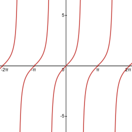
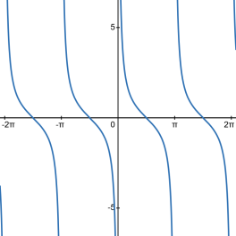
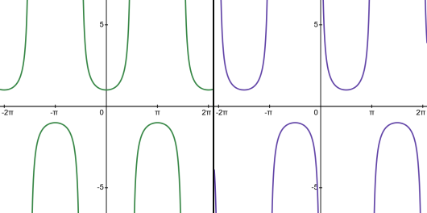
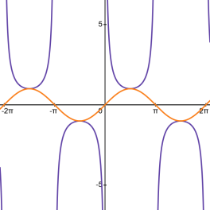

- Describe and compare key features of the graphs of trigonometric functions.
- Graph functions of the form $f(x) = a \tan (bx)$ and relate the graph of a function to the graph of the parent function.

## Assignment

- p398 6–25 **(Not 22. 22 is stupid and was made by stupid people.)** ([pdf](./pdf/alg2-practice-0705.pdf))
  - Answers to [odd questions](../misc/alg2-odd-answers.pdf) / [even questions](../misc/alg2-even-answers.pdf)

## Additional Resources

- [Additional practice worksheet](./pdf/alg2-add-practice-0705.pdf)

---

## The Others

The rest of the trig functions don't get nearly as much attention as sine and cosine, and you'll see why in a little bit. Before we get into that, just a quick review of each compared to sine and cosine, and we'll take a look at the graph of each.

- Tangent, which was originally defined as opposite over adjacent, is equivalent to $\sin\theta/\cos\theta$, or on the unit circle $y/x$.
- Cotangent is the reciprocal of tangent, so $\cos\theta/\sin\theta$.
- Cosecant is $1/\sin\theta$
- Secant is $1/\cos\theta$

## Tangent and Cotangent

Here is the graph for tangent.

> 
>
> **Figure 7.5.1** The graph of $\tan(x)$.
{: .figure}

The periodic nature is still there, and will be for all of them because angles, but it's not continuous like sine and cosine. Since we are dividing by cosine, we end up with vertical asymptotes when $\cos(x)=0$. Dividing by numbers that get get increasing close to zero lead to the graph taking off to infinity, until you actually hit zero and then it breaks.

The period itself is actually $\pi$. As far as tangent is concerned, there is no difference between quadrant I and III. Remember that $\tan\theta = \frac{\sin\theta}{\cos\theta}$. In quadrant I, both sine and cosine are positive, so tangent is, too. In quadrant III, sine and cosine are both negative, so tangent will end up being positive there also. The opposite is true in quadrants II and IV. Either sine or cosine will be negative, not both, so tangent will be negative in both quadrants. So, every two quadrants, or half a full rotation, the graph repeats.

Also worth noting is that the graph is always increasing. As the angles move through the quadrants, it moves from a very large negative number to a very large positive number.

Which highlights the last thing worth pointing out: the graph is continuous in quadrants II and III, and again in quadrants IV and I (in that order). Cosine is $0$ at $\pi/2$ and $3\pi/2$, and just after those angles is when you have a large negative number, until the next time cosine is 0, which by then tangent will be a large positive number.

Luckily, cotangent is basically the same thing as tangent.

> 
>
> **Figure 7.5.2** Graph of $\cot(x)$.
{: .figure}

Now the asymptotes appear when $\sin(x)=0$, which is at $0$ and $\pi$. And just after those angles you are in the positive quadrants, which eventually lead to the negative ones, meaning now we have a function that is constantly decreasing.

## Secant and Cosecant

Like tangent and cotangent, and also sine and cosine, these are basically the same graph, with what I'm going to call mild cosmetic differences.

> 
>
> **Figure 7.5.3** The graphs of $\sec(x)$ and $\csc(x)$.
{: .figure}

Vertical tangents are back since we are dealing with reciprocals, and they appear whenever sine or cosine is $0$. But the areas where each is positive or negative are identical to the originals. You can think of secant and cosecant as heading toward infinity before switching signs, instead of heading towards $0$.

> 
>
> **Figure 7.5.4** The graphs of $\sin(x)$ and $\csc(x)$.
{: .figure}
