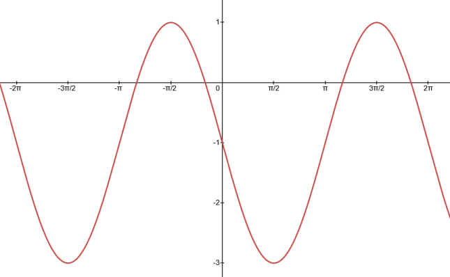

- Identify how changing the parameters of the sine or cosine function affects the graph of the function.
- Use trigonometric functions to model situations with specified amplitude, frequency, and midline.

## Assignment

- All **vocabulary** copied into notes
  - phase shift
- p406 9–15, 16–28 ([pdf](./pdf/alg2-practice-0706.pdf))
  - Answers to [odd questions](../misc/alg2-odd-answers.pdf) / [even questions](../misc/alg2-even-answers.pdf)

## Additional Resources

- [Additional practice worksheet](./pdf/alg2-add-practice-0706.pdf)

---

## Translating Trig Functions

Like with shifting functions before, adding on to the entire function is a vertical shift, while subtracting to the $x$ moves it horizontally. Also, remember that the horizontal shift is opposite what you would expect. Subtracting moves it right, while adding moves it left.

With trig functions, horizontal translations are called **phase shifts**. Vertical shifts determine where the midline will end up.

> ### Trigonometric Transformations
>
> For any sine or cosine function written in the form below
>
> $$\begin{align}
> a\sin\left[b(x-c)\right]+d
> \end{align}$$
>
> - $a$ is the amplitude (vertical stretch)
> - $\frac{2\pi}{b}$ is the period (horizontal stretch)
> - $c$ is the phase shift (horizontal shift)
> - $d$ is the midline (vertical shift)
{: .definition}

If it's not written in that form, I advise you rewrite it to make your life easier. So, with $y = \cos(2x + \frac{\pi}{4})$ your phase shift is *not* $\frac{\pi}{4}$. Factor out the $2$ so $x$ has a coefficient of $1$ and you'll get the form above.

$$\begin{align}
y = \cos2(x + \frac{\pi}{8})
\end{align}$$

Now it's a lot easier to see the phase shift, which is $\frac{\pi}{8}$.

## Writing an Equation from a Graph

The real challenge of this section is taking a graph and writing the equation for it.

> 
>
> **Figure 7.6.1** A periodic graph lacking an equation.
{: .figure}

The four items listed above will be our checklist. First the amplitude. Since this thing has been shifted vertically, we could find the midline first. It peaks at $1$ and $-3$, so $(-3+1)/2=-1$. That means our amplitude, the distance from midline to peak is $2$.

Alternatively, amplitude is also half the distance from peak to peak. $|-3-1|/2 = 2$

Period is next on the list. Make sure to use the peaks for this. Anything else can lead to weird results if you're not careful. This one peaks at $-\pi/2$ and $3\pi/2$, so the period is $2\pi$. To get $b$, divide $2\pi$ by the period, which in this case gives us $b=1$. $2\pi$ is the default period of sine and cosine, so that result makes sense.

We technically did the midline above, so we have our vertical shift of $-1$. The only thing left is the phase shift, and before we do that we need to make a decision: sine or cosine. This is personal preference. To you, does it look more like a sine way that's been shifted or a cosine wave?

My first thought was a shifted cosine, so we'll do that first. Cosine starts at a high peak, and our high peak is moved backward by $\pi/2$. So our phase shift, assuming it's cosine is $-\pi/2$.

Putting that all together we get the equation

$$\begin{align}
2\cos\left(x+\frac{\pi}{2}\right)-1
\end{align}$$

But that's not the only answer. What if I looked at the other high peak? That one was moved off the $y$-axis to the right by $3\pi/2$.

$$\begin{align}
2\cos\left(x-\frac{3\pi}{2}\right)-1
\end{align}$$

Graph them and you'll see there's no difference.

And what if you thought it was sine? Sine starts at the midline and goes up. That point is now either at $-\pi$ or $\pi$, depending on which you want to use.

$$\begin{align}
2\sin\left(x+\pi\right)-1 \\
2\sin\left(x-\pi\right)-1
\end{align}$$

Make sure you make use of Desmos as you work through these
