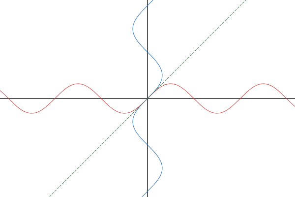
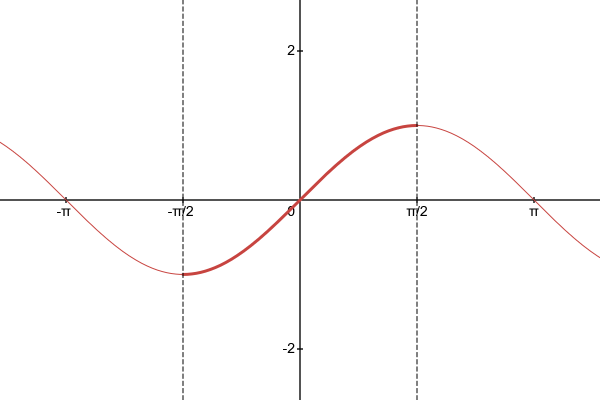
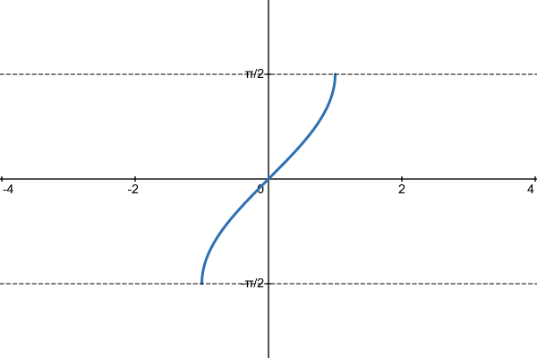
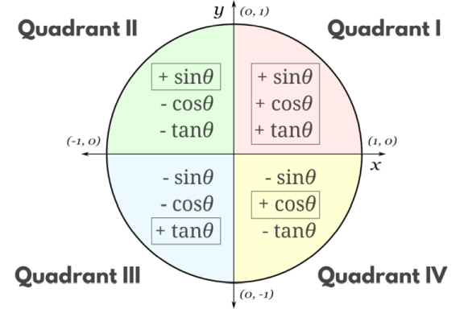

- Define and evaluate inverse trigonometric functions.
- Solve trigonometric equations using inverse functions, and interpret the solutions within a modeling context.

## Assignment

- p421 11–22, 24–39 ([pdf](./pdf/alg2-practice-0801.pdf))
  - Answers to [odd questions](../misc/alg2-odd-answers.pdf) / [even questions](../misc/alg2-even-answers.pdf)

## Additional Resources

- [Additional practice worksheet](./pdf/alg2-add-practice-0801.pdf)

---

## Defining Inverse Trig Functions

Being able to pull ratios from angles is neat, but like anything else in algebra, being able to go in the reverse direction would be even better. Enter the inverse trigonometric functions, which depending on who you talk to, is either in the form $\arcsin x$ or $\sin^{-1} x$. The book does the latter, but [ISO 80000-2](https://en.wikipedia.org/wiki/International_Organization_for_Standardization) says you should only use the former, so the book continues to be wrong.

So, $\arcsin$ and the others will give you an angle if you provide it a ratio, but there is a problem: there are an infinite number of angles that produce the same ratio. The trig functions are not one-to-one. Each output maps to an infinite number of inputs.

> 
>
> **Figure 8.1.1** Graphs of $y=\sin x$ and $x=\sin y$.
{: .figure}

That's OK, [we've dealt with this before](./5-6-inverse-relations-and-functions.md). All we need to do is restrict the domain of $\sin x$ so that we have a one-to-one and invert that. The best (i.e. only) way to go about that is to go peak-to-peak so you don't have any repeated values. With $\sin x$, the chosen peak-to-peak is $-\frac{\pi}{2}\le x \le \frac{\pi}{2}$.

> 
>
> **Figure 8.1.2** Graph of $y=\sin x$ with a restricted domain.
{: .figure}

That means the inverted version, $\arcsin x$, looks like this.

> 
>
> **Figure 8.1.3** Graph of $y=\arcsin x$.
{: .figure}

Here are the restrictions for $\arccos x$ and $\arctan x$. We won't be dealing with the other three.

- $\arccos$ uses cosine with a restriction of $0 \le x \le \pi$
- $\arctan$ uses tangent with a restriction of $-\frac{\pi}{2}\le x \le \frac{\pi}{2}$, which is the same as $\arcsin$

## Evaluate Inverse Trig Functions

So, what is $\arcsin \left(\frac{1}{2}\right)$? Evaluating expressions like these boil down to either knowing the unit circle or using a calculator. Like anything else we've covered, calculator should be a last resort. In this case ${\arcsin \left(\frac{1}{2}\right) = \frac{\pi}{6}}$.

What about $\arctan\sqrt{3}$? This is trickier without just resorting to a calculator, but if you remember that $\tan\theta = \frac{\sin\theta}{\cos\theta}$ then you can likely find the the angle with the right pairing that divides to $\sqrt{3}$. In this case it's $\frac{\pi}{3}$ since it's coordinates are $\left(\frac{1}{2},\frac{\sqrt{3}}{2}\right)$, which divide out to $\sqrt{3}$.

### The Other Solutions

OK, but there are other angles besides $\frac{\pi}{6}$ that satisfy $\arcsin \left(\frac{1}{2}\right)$. $\frac{5\pi}{6}$ also works. So does $\frac{13\pi}{6}$, and $-\frac{7\pi}{6}$.

This is the problem with inverse trig functions. They only produce one answer, but the reality is that there are infinitely more possible answers. This is similar to the square root problem: the function only produces one answer, the positive one, but the negative one is just as viable.

With inverse trig functions, the issue is a bit more complicated. You have the angle that the function produces, and all of it's coterminal angles. Then you have the angle from the *other* quadrant that would also work, and all of it's coterminal angles.

Yes, the other quadrant. Do you remember reference angles? Angles that share the same reference angle produce the same trigonometric ratios, save for the sign. The quadrant they fall in determines the sign.

> 
>
> **Figure 8.1.4** The quadrants and their negative trigonometric ratios.
{: .figure}

- Sine is associated with the $y$-coordinate in the unit circle, so its positive in I and II.
- Cosine is $x$, so quadrants I and IV.
- Tangent is the quotient of the other two, so its positive where the other signs are the same, which is I and III.
- Negatives are in the opposite quadrants.

When evaluating inverse trig functions, you will need to start with finding an angle in each appropriate quadrant. If it's $\arcsin$ and positive, you are looking for an angle in quadrants I and II. If it's $\arccos$ and negative, look in II and III.

### Actually Determining the Other Angles

All that was about which quadrant you can find the other angle, and none of it was about how to actually find that angle. If an inverse trig function gives you an angle in quadrant I, what you do to find the other one depends on which quadrant you are heading towards.

You are looking for angles that have the same reference angle, so drawing them will help immensely, but there are a couple of quick rules that can help depending on what quadrant you are moving into.

- If you are moving across the $x$-axis, just change the sign of the angle.
- If you are moving across the $y$-axis, subtract the angle from $\pi$ (or $180^{\circ}$).

Tangent has you doing both, so following both rules will produce the proper angle.

### Example

> What are all the angles that have a cosine value of $0.57$?
{: .example}

This is calculator work at first since this isn't a value on the unit circle.

$$\begin{align}
\arccos(0.57) \approx 0.96
\end{align}$$

We are dealing with cosine, and it's positive, so we want to look in quadrant IV for the other angle. That means $-0.96$ also works.

To write *all* the angles that have a cosine of $0.57$, we use a variable to describe the number of rotations.

$$\begin{align}
0.96 + 2\pi k \quad \text{and} \quad -0.96 + 2\pi k
\end{align}$$

$\blacksquare$
{: .qed}

### Example 2

> What are all the angles that have a tangent value of $-2$?
{: .example}

Calculator work again to start with.

$$\begin{align}
\arctan(-2) \approx -1.11 
\end{align}$$

Tangent and negative means quadrants II and IV. The calculator gave us IV, so we need II. I'll change the sign of the angle to get into I, then subtract from $\pi$ to get into II.

$$\begin{align}
\pi - 1.11 \approx 2.03
\end{align}$$

Performing the rules in the opposite order works, too. It will produce a different angle, but still a coterminal one.

$$\begin{align}
-(\pi+1.11) \approx -4.25
\end{align}$$

So all the angles can be written as

$$\begin{align}
-1.11 + 2\pi k \quad \text{and} \quad 2.03 + 2\pi k
\end{align}$$

$\blacksquare$
{: .qed}
