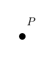

- Communicate precise definitions of angle and segment using the undefined terms: point, line and plane
- Use absolute value and the segment addition postulate
- Use the protractor postulate and angle addition postulate
- Identify congruent segments and congruent angles

## Assignment

- Five **vocabulary**{: .envision-vocab-purple} definitions
- **p12**{: .envision-hw-blue} 9–27, 30–41 (31 problems)

---

## The Basics

Welcome to geometry. We're going to spend a lot of time talking about things that don't actually exist. Like perfect circles and lines that don't have any thickness. Reality is a lot messier than math will let on, but it's still a very good approximation. Three things that don't exist but we'll talk about a lot are points, lines, and planes. Well, they do exist, but more as concepts rather than something you can pick up and throw.

A **point** is sort of like a dot, but it's more a location than anything else. It doesn't have a width or a height, so it doesn't take up any space. But we can still point to it and talk about it.

> 
>
> **Figure 1.1.1** Point $P$. Looks like a dot, but doesn't technically occupy any space.
{: .figure}

A **line** is a perfectly straight path that extends to infinity in opposite directions. That means it has a length, but it doesn't have a height (or a thickness).

And lastly a **plane**, which is a flat surface that has an infinite length and an infinite height.

> We actually won't do much with planes for a while. Most of the course focuses on two-dimensional figures, so there's only one plane to worry about. Three-dimensional space is when we'll start working with multiple planes.

## Slightly Less Basic

With points and lines in our pocket, we can start breaking them apart and combining them into other things. A line extends forever in opposite directions, but if we only want a part of that line, with two clearly defined endpoints, it's a line segment, or just segment.

With only one endpoint, we get a ray.

And with two rays sharing the same endpoint we get an angle.

