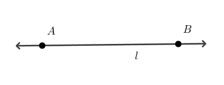
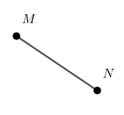
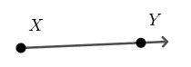
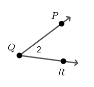
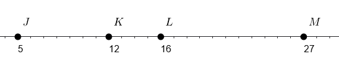
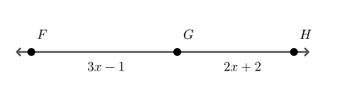
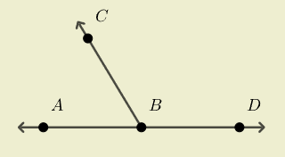
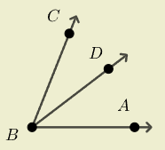
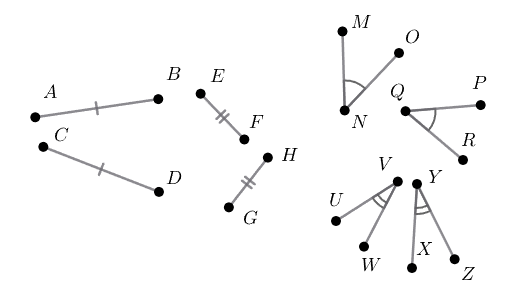
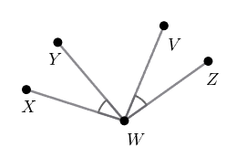

- Communicate precise definitions of angle and segment using the undefined terms: point, line and plane
- Use absolute value and the segment addition postulate
- Use the protractor postulate and angle addition postulate
- Identify congruent segments and congruent angles

## Assignment

- Five **vocabulary**{: .envision-vocab-purple} definitions
- **p12**{: .envision-hw-blue} 9–27, 30–41 (31 problems)

---

## The Basics

Welcome to geometry. We're going to spend a lot of time talking about things that don't actually exist. Like perfect circles and lines that don't have any thickness. Reality is a lot messier than math will let on, but it's still a very good approximation.

Three things that don't exist but we'll talk about a lot are points, lines, and planes. Well, they do exist, but more as concepts rather than something you can pick up and throw.

A **point** is sort of like a dot, but a better description is that it's a location. It doesn't have a width or a height, so it doesn't take up any space, but we can still point to it and talk about it.

> 
>
> **Figure 1.1.1** Point $P$. Looks like a dot, but doesn't technically occupy any space.
{: .figure}

A **line** is a perfectly straight path that extends to infinity in opposite directions. That means it has a length, but it doesn't have a height (or a thickness).

> 
>
> **Figure 1.1.2** Line $l$, or $\overleftrightarrow{AB}$.
{: .figure}

And lastly a **plane**, which is a flat surface that has an infinite length and an infinite height.

> We actually won't do much with planes for a while. Most of the course focuses on two-dimensional figures, so there's only one plane to worry about. Three-dimensional space is when we'll start working with multiple planes.

## Slightly Less Basic

With points and lines in our pocket, we can start breaking them apart and combining them into other things. A line extends forever in opposite directions, but if we only want a part of that line, with two clearly defined endpoints, it's a line segment, or just segment.

> 
>
> **Figure 1.1.3** A segment with two endpoints, points $M$ and $N$, referred to as $\overline{MN}$.
{: .figure}

With only one endpoint, we get a ray.

> 
>
> **Figure 1.1.4** A ray with endpoint of $X$ and extending through $Y$. Its notation is $\overrightarrow{XY}$.
{: .figure}

And with two rays sharing the same endpoint we get an angle.

> 
>
> **Figure 1.1.4** Two rays forming an angle. This one can be referred two a few different ways: $\angle2$, $\angle{PQR}$, or $\angle{Q}$.
{: .figure}

## Measuring Segments

Let's measure some things. Lines and points by themselves have no numbers attached to them, but we can treat lines like number lines and then match up the points to numbers. And since a ruler is basically a number line, we get

> ### The Ruler Postulate
>
> Every point on a line can be paired with a unique real number.
>
{: .definition}

> A big part of geometry is proving things, and to prove something you need some basic principles, or **postulates**, that everyone can agree on, like "people need air to breath". The ruler postulate is one example these basic geometry facts we'll use to build bigger ideas.

> ### Example: Find the Length of a Segment
>
> Find the length of $\overline{JK}$, $\overline{JL}$, and $\overline{KM}$.
> > 
> >
> > **Figure 1.1.5** Points on a line and assigned corresponding real numbers.
> {: .figure}
{: .example}

To find the distance between points, all we need to do is subtract.

$$\begin{align}
\overline{JK} &= 12 - 5 = 7\\
\overline{JL} &= 16 - 5 = 11\\
\overline{KM} &= 27 - 12 = 15\\
\end{align}$$

Since distance is always positive, just drop the negative if you accidentally reversed the order of your subtraction.

$\blacksquare$
{: .qed}

> ### Example: Distance Between Collinear Points
>
> Points $F$, $G$, and $H$ are collinear and $\overline{GH}=16$. Find $\overline{FH}$.
>
> > 
> >
> > **Figure 1.1.6** Collinear points $F$, $G$, and $H$.
> {: .figure}
{: .example}

**Collinear points** are points that lie on the same line, and we have another postulate to go with them.

> ### Segment Addition Postulate
>
> If points $A$, $B$, and $C$ are on the same line with $B$ between the other two, then
>
> $$\begin{align}
> \overline{AB} + \overline{BC} = \overline{AC}
> \end{align}$$
{: .definition}

For our situation, that means

$$\begin{align}
\overline{FH} &= \overline{FG}+\overline{GH} \\
              &= (3x - 1) + (2x + 2) \\
              &= 5x + 1
\end{align}$$

Problem is, we don't know $x$. Luckily, the problem does tell us $\overline{GH} = 16$.

$$\begin{align}
\overline{GH} &= 16 \\
2x + 2 &= 16 \\
x &= 7 \\[1em]
\overline{FH} &= 5x + 1 \\
              &= 5(7) + 1 \\
              &= 36
\end{align}$$

$\blacksquare$
{: .qed}

## Measuring Angles

With lines, we could map them to a number line or ruler in order to get some numbers to work with. But we can't measure an angle with a ruler, so a number line isn't going to cut it if we still want numbers. Enter degrees, the system where one rotation is divided into 360 equal parts. Half of that you'll see on a protractor, giving us

> ### Protractor Postulate
>
> Each angle $\angle{ABC}$ can be paired to a number between $0^{\circ}$ and $180^{\circ}$, with $\overrightarrow{BA}=0^{\circ}$ and the opposite ray being equal to $180^{\circ}$.
>
> > 
> >
> > **Figure 1.1.7** An angle formed by $\overrightarrow{BA}$ and $\overrightarrow{BC}$. $\overrightarrow{BD}$ is the ray opposite to $\overrightarrow{BA}$.
> {: .figure}
{: .definition}

And like segments, there is postulate about adding them up.

> ### Angle Addition Postulate
>
> If point $D$ is in the interior of $\angle{ABC}$, then
>
> $$\begin{align}
> m\angle{ABD} + m\angle{DBC} = m\angle{ABC}
> \end{align}$$
>
> > 
> >
> > **Figure 1.1.8** $\angle{ABC}$ with point $D$ in its interior.
> {: .figure}
{: .definition}

## Congruence

The last bit of foundational knowledge is the notation for lines and angles that have the same measure, meaning they are **congruent**. In figures, you'll tick marks and arc marks to signify any congruency.

> 
>
> **Figure 1.1.9** Congruent lines and angles. Lines with a matching number of tick marks have the same length, and angles with the same number of arc marks have the same degree measure.
{: .figure}

With symbols, we use the $\cong$ symbol. It looks just like an equals symbol, except with the ~ (tilde) above it. So, from the figure above here are the congruent statements.

$$\begin{align}
\overline{AB} &\cong \overline{CD} \\
\overline{EF} &\cong \overline{GH} \\
\angle{MNO} &\cong \angle{PQR} \\
\angle{UVW} &\cong \angle{XYZ} \\
\end{align}$$

> ### Example: Congruent Angles
>
> In the figure below, $m\angle{XWZ}=127^{\circ}$ and $m\angle{XWY}=32^{\circ}$. What is $m\angle{YWV}$?
>
> > 
>
> **Figure 1.1.10**
{: .figure}
 
{: .example}

$\blacksquare$
{: .qed}
