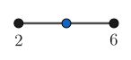
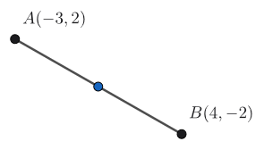
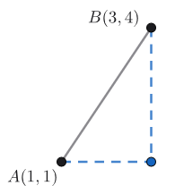

- Use the midpoint formula to find the midpoint of a segment drawn on a coordinate plane
- Find the point part of the way across a segment
- Use the distance formula to find the length of a segment drawn on a coordinate plane

## Assignment

- One **vocabulary**{: .envision-vocab-purple} definition
- **p26**{: .envision-hw-blue} 9–21, 23–28  (19 problems, [PDF link](./pdf/aga_gm_0103_pps.pdf){: target="_blank"})

---

## Midpoint

The **midpoint** of a line is the point that cuts it evenly in half.

> 
>
> **Figure 1.3.1** Midpoint on a one-dimensional number line.
{: .figure}

The best way to think of midpoint is as the average of the two points. To find average you just add the numbers and divide by how many there are. Since midpoint only involves two numbers, we end up dividing by $2$.

So, in the picture above we need to add $2+6$ and then divide by $2$, which gives us $8$.

But we can't work on just number lines in geometry, so we need to start adding in our second dimension which will complicate things a bit.

> 
>
> **Figure 1.3.2** A line that whose points have two coordinates rather than just one.
{: .figure}

That midpoint happens to lie perfectly in the middle, both horizontally and vertically. That means we can do what we did above, just twice. Once with the $x$-coordinate and again with the $y$-coordinate.

> ### Midpoint Formula
>
> The midpoint $M$ of a line is the point that divides the line into two congruent segments.
>
> $$\begin{align}
> M = \left(\frac{x_1+x_2}{2},\frac{y_1+y_2}{2}\right)
> \end{align}$$
{: .definition}

> ## Example 1: Finding Midpoint
>
> Find the midpoint of the segment with endpoints $(-3,2)$ and $(4,-2)$ (see above).
{: .example}

**SOLUTION** Use the midpoint formula to find the horizontal and vertical middle of the line.

$$\begin{align}
M &= \left(\frac{x_1+x_2}{2},\frac{y_1+y_2}{2}\right) \\
  &= \left(\frac{-3+4}{2},\frac{2+(-2)}{2}\right) \\
  &= \left(\frac{1}{2},0\right)
\end{align}$$

$\blacksquare$
{: .qed}

## Partition a Segment

If you want part of a segment, something other than half, your approach has to change a bit. For example, say we wanted the point that's one-third the way across the segment in figure 1.3.1 (I'm too lazy to make a new diagram).

Now, this will depend if we want one-third from the left or from the right. For now, we'll start on the left. What we need is the distance, and then we can find one-third of that to figure out our new point. Remember that you multiply to find part of something.

$$\begin{align}
6 - 2 = 4                         &&\text{Find the distance}\\
4 \cdot \frac{1}{3} = \frac{4}{3} &&\text{Find the partial distance}\\
2 + \frac{4}{3} = 2 \frac{4}{3}   &&\text{Add to the start to find the new point}
\end{align}$$

If we started on the right, meaning moving backwards, we would subtract instead.

Like midpoint, adding a second dimension just means you have to do it a second time.

> ## Example 2: Partition a Segment
>
> Find the coordinates of the point that is one-third the way from $(4,-2)$ to $(-3,2)$ (see figure 1.3.2).
{: .example}

**SOLUTION** We need the horizontal and vertical distances.

$$\begin{align}
4 - (-3) &= 7 && \text{Horizontal $x$ distance} \\
2 - (-2) &= 4 && \text{Vertical $y$ distance}
\end{align}$$

And then the partial distances.

$$\begin{align}
7 \cdot \frac{1}{3} &= \frac{7}{3} \\
4 \cdot \frac{1}{3} &= \frac{4}{3}
\end{align}$$

And now the last step, but we have to be careful which direction we are moving. Horizontally, we are moving left (backwards if you want), so we subtract. Vertically, we are moving up, meaning we add.

$$\begin{align}
4 - \frac{7}{3}  &= \frac{5}{3} \\
-2 + \frac{4}{3} &= -\frac{2}{3}
\end{align}$$

This gives us a new point of $\left(\frac{5}{3},-\frac{2}{3}\right)$

$\blacksquare$
{: .qed}

## Distance in Two Dimensions

Finding the distance between two points on a one-dimensional line (i.e., a number line) is straightforward. Just subtract. It's a bit more complicated when you add a second dimension.

Like the midpoint formula, we are going to need both coordinates. In this case, we'll use them to find the horizontal distance and the vertical distance.

> 
>
> **Figure 1.3.3** The vertical and horizontal distance between two points.
{: .figure}

In the figure above, we have a horizontal distance of $3-1=2$ and a vertical distance of $4-1=3$. That's fine, but we are looking for one number, not two. So, we're going to rely on the Pythagorean theorem for the next part.

> ### Pythagorean Theorem
>
> Given a right triangle, the sum of the squares of the two shorter sides (legs) is equal to the square of the longer side (hypotenuse).
>
> $$\begin{align}
> c^2 = a^2 + b^2
> \end{align}$$
{: .definition}

Since what we have is basically just a right triangle, we'll square both those distances, add them up, and find the square root of that to get our distance.

$$\begin{align}
c^2 &= a^2 + b^2 \\
    &= (2)^2 + (3)^2 \\
    &= 4 + 9 \\
    &= 13 \\
c &= \sqrt{13}
\end{align}$$

If you want, you can keep going and put that in a calculator to get an estimate. Turns out it's about $3.61$.

To speed things, we can take what we did above and make a formula. We started by subtracting to get our two distances, then squaring each, adding them, and then square rooting them. That gives us the distance formula.

> ### Distance Formula
>
> To find the distance $d$ between two points
>
> $$\begin{align}
> d = \sqrt{\left(x_1 - x_2\right)^2 + \left(y_1-y_2\right)^2}
> \end{align}$$
{: .definition}

> ## Example 3: Finding Distance
>
> Find the distance between $(-3,2)$ and $(4,-2)$ (see figure 1.3.2).
{: .example}

**SOLUTION** Drawing a picture will help (not shown), then use the distance formula.

$$\begin{align}
d &= \sqrt{\left(-3 - 2\right)^2 + \left(4-(-2)\right)^2} \\
  &= \sqrt{\left(-5\right)^2 + \left(6\right)^2} \\
  &= \sqrt{25 + 36} \\
  &= \sqrt{61} \\
  &\approx 7.81 \\
\end{align}$$

$\blacksquare$
{: .qed}
