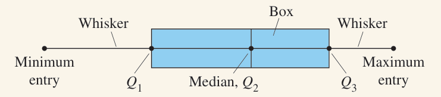

## {{ page.title }}

Box-and-whisker plots (or bloxplots) are a way of displaying data using its quartiles. Before making one, you need five numbers.

1. Minimum
2. $Q_1$
3. Median or $Q_2$
4. $Q_3$
5. Maximum

This set of numbers is known as the five-number summary, and can be thought of as percentage markers.

1. Minimum (0% of the data is below this point)
2. $Q_1$ (25% of the data is below this point)
3. Median or $Q_2$ (50%)
4. $Q_3$ (75%)
5. Maximum (100%)

To make your boxplot, start with a line, either horizontal or vertical, and plot your five numbers on it. The minimum and maximum should go on either end, with the others between. Make sure it's to scale so the distance between each number is meaningful.

Then, draw a box from $Q_1$ to $Q_3$ and make an extra line through the median.

