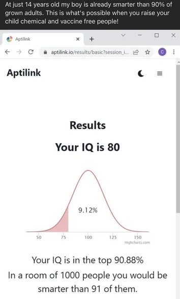

## {{ page.title }}

### Percentiles

Earlier, we looked at medians and quartiles. Each ones of those was equivalent to a percentage. At $Q_1$, 25% of the data fell below it. With the median, 50% of the data fell below that mark. We're going to extend that idea with percentiles, where all percentages from zero to 100 are in play.

**A percentile tells us what percent of observations are *less than or equal* to a given value in a distribution.** So if you hear that something is in the 30th percentile, that means 30% of data is below that and 70% is above it. Be careful that you don't read it wrong way.

### Determining Percentile

Say you want to know what the cutoff is for 30th percentile. First, you would need to know how many data points you are working with.