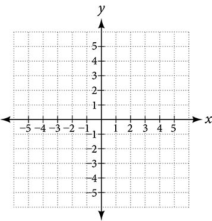
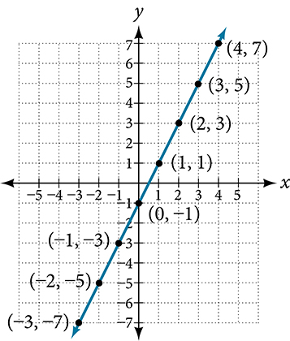

- Plot ordered pairs in a Cartesian coordinate system.
- Graph equations by plotting points.
- Graph equations with a graphing utility.
- Find x-intercepts and y-intercepts.
- Use the distance formula.
- Use the midpoint formula.

## Assignment

- 1–4, 5–47 odd ([link](https://openstax.org/books/college-algebra-2e/pages/2-1-the-rectangular-coordinate-systems-and-graphs#fs-id1553580))
- *Recommended*: all **vocabulary** and concept blocks copied into notes

---

## Plotting Ordered Pairs in the Cartesian Coordinate System

Cartesian Coordinate System is the fancy name for this:

It consists of an **$x$-axis** (horizontal) and a **$y$-axis** (vertical), and the point where they meet is the **origin**. The four areas that are created by the intersecting axes are **quadrants** and are numbered I through IV starting with the top-right and moving counter-clockwise.

An **ordered pair** is used to identify the location of a point on the plane, for example $(3,-1)$. The first number is the **$x$-coordinate** and the second is the **$y$-coordinate**. Starting from the origin, you use these numbers to locate your point. In this case, you move along the $x$-axis by $3$ and the $y$-axis by $-1$.

## Graphing Equations by Plotting Points

Equations with two variables can be graphically represented on the coordinate plane since each axis can represent one of the variables. An equation with to variables typically looks like

$$\begin{align}
y= 2x-1
\end{align}$$

The equation has an infinite number of solutions, and you can find any one of those solutions by plugging in one number, then solving for the other. In the one above, the equation is written in terms of $x$, meaning it's easiest to use $x$-values to determine $y$-values, though there's nothing stopping you from doing it the other way. Below are some coordinate pairs that were determined by choosing an $x$-value first.

And when you plot those points on the coordinate plane, you get an idea of the equation's shape.

Note that you shouldn't automatically connect the dots of a graph. I can tell you that this equation doesn't have any gaps in it, but that's not always the case. More on that later on.

## Finding $x$-intercepts and $y$-intercepts

Intercepts are where the graph of an equation crosses either axis. Every intercept has the property that at least one of the values is $0$. More specifically, every $x$-intercept will have a $y$-value of $0$, and vice-versa for $y$-intercepts.

To find intercepts algebraically, simply plug $0$ in for the appropriate variable and solve for the other.

$$\begin{align}
y &= 2x - 1 \\
y &= 2(0) - 1  \\
y &= -1 \\
&(0,-1) &&\text{The $y$-intercept} \\[1.5em]
y &= 2x - 1 \\
0 &= 2x-1 \\
1 &= 2x \\
\frac{1}{2} &= x \\
&\left(\frac{1}{2},0\right) &&\text{The $x$-intercept} \\[1.5em]
\end{align}$$
