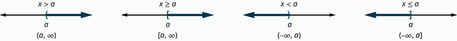

- Graph inequalities on the number line
- Solve inequalities using the Subtraction and Addition Properties of inequality
- Solve inequalities using the Division and Multiplication Properties of inequality
- Solve inequalities that require simplification
- Translate to an inequality and solve

## Assignment

- [#431–509 1-5-9s](https://openstax.org/books/elementary-algebra-2e/pages/2-7-solve-linear-inequalities#fs-id1168345256702)

---

## Graph Inequalities on the Number Line

An equation is a statement that claims two things are equal. An **inequality** does the opposite and is statement about two things not being equal to each other.

$$\begin{align}
x+3 &> 5
\end{align}$$

Fortunately, finding the solution to an inequality is exactly the same as finding the solution to an equation, except for one big exception.

$$\begin{align}
-x < -10
\end{align}$$

In the above statement, you'd naturally want to multiply/divide by $-1$, resulting in a new statement of ${x<10}$. But when we go back to check, with say $5$

$$\begin{align}
-x < -10 \\
-(5) < -10
\end{align}$$

it fails. Whn you multiply or divide by a negative number, you also have to flip the inequality symbol as well.

### An Attempt to Explain Flipping the Inequality

Why this happens is a little clearer when you think of operations as moving on a number line. If you graph $10$ on a number line and add $3$, the point moves $3$ units to the right. If you instead started at $20$ and added $3$, you would still be moved $3$ to the right. Addition and subtraction result in shifts on the number line.

Now take $10$ and multiply it by $2$. The result is moving $10$ units up the number line. If you did the same thing with $20$, you'd move $20$ units. Unlike with addition or subtraction, the starting point matters because multiplication and division are scaler operations. Their effect scales based on what you started with.

So, now what about negatives? Adding or subtracting is straightforward, they just shift you in the opposite direction. Adding $-3$ moves you left instead of right. but multiplying or dividing by a negative results in a flip to the other side of $0$. Multiply $10$ by $-2$ and now you've moved $10$ units *and* flipped to the negative side of the number line. Do it again, and now you've moved back to the positive side.

So, when you perform operations on equations and inequalities, you are essentially moving around on the number line, shifting and scaling as you add and multiply. With equations, multiplying by a negative was never an issue since it was "equals". A single point. Now with inequalities, which have ranges of numbers with arrows and directions, they get transformed as well.

## Representing Solutions to Inequalities

The one you've likely seen before is the number line with a open or closed dot and a line. The book instead uses parentheses and brackets, like below.

> 
>
> **Figure 2.7.1** Inequalities expressed with symbols, graphs, and interval notation.
{: .figure}

Also pictured is **interval notation**, which also uses parentheses and brackets along with the infinity symbol. All three are valid ways of expressing an inequality (including the open/closed-circle version of the graph), just make sure you know how to read each one.
