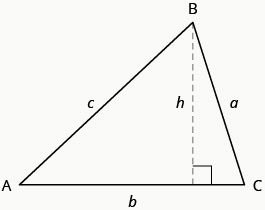
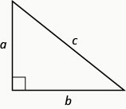
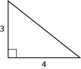
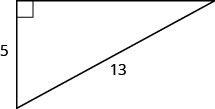
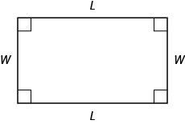

- Solve applications using properties of triangles
- Use the Pythagorean Theorem
- Solve applications using rectangle properties

## Assignment

- [#211–281 1-5-9s](https://openstax.org/books/elementary-algebra-2e/pages/3-4-solve-geometry-applications-triangles-rectangles-and-the-pythagorean-theorem#fs-id1168345462054)

---

## Solve Applications Using Properties of Triangles

Triangles are three sided shapes, and each has the following properties we're interested in at the moment.

> 
>
> **Figure 3.4.1**
{: .figure}

1. The sum of the measure of their three angles is $180^\circ$.

   $$\begin{align}
   m\angle A + m\angle B + m\angle C = 180^\circ
   \end{align}$$

2. Its perimeter is the sum of the measure of the three sides.

   $$\begin{align}
   P = a + b + c
   \end{align}$$

3. Its area is one-half of the base times the height. The base is always perpendicular to the height.

   $$\begin{align}
   A = \frac{1}{2}bh
   \end{align}$$

### Example 1

> The measures of two angles of a triangle are 55 and 82 degrees. Find the measure of the third angle.
{: .example}

Since the focus is on angles, we can use the fact that all three add to $180^\circ$ to answer this.

$$\begin{align}
55^\circ + 82^\circ + x &= 180^\circ \\
137^\circ + x &= 180^\circ \\
x &= 43^\circ
\end{align}$$

$\blacksquare$
{: .qed}

### Example 2

> The perimeter of a triangular garden is 24 feet. The lengths of two sides are four feet and nine feet. How long is the third side?
{: .example}

They give us two sides and the perimeter, so we can easily find the third.

$$\begin{align}
4 + 9 + x &= 24 \\
x &= 11
\end{align}$$

$\blacksquare$
{: .qed}

### Example 3

> The area of a triangular church window is 90 square meters. The base of the window is 15 meters. What is the window’s height?
{: .example}

Start with the area formula, then substitute and solve. Since it involves $\frac{1}{2}$, you might find it easier to multiply both sides by $2$ as your first step.

$$\begin{align}
A &= \frac{1}{2}bh \\
(90) &= \frac{1}{2}(15)h \\
180 &= 15h \\
12 &= h
\end{align}$$

$\blacksquare$
{: .qed}

### Example 4

> The measure of one angle of a right triangle is 20 degrees more than the measure of the smallest angle. Find the measures of all three angles.
{: .example}

A right triangle is a specific type of triangle, one that has a $90^\circ$ angle. The other two angles will be smaller and make up the remaining $90^\circ$.

So, for this problem you can either add up to the full $180^\circ$, or just find the two angles that add up to $90^\circ$. I'll do the slightly longer way here. Remember to write the one angle in terms of the other, so if the unknown is $x$, the other one is $(x+20)$.

$$\begin{align}
x + (x+20) + 90 &= 180 \\
x + (x + 20) &= 90 \\
2x + 20 &= 90 \\
x &= 35
\end{align}$$

Our two angles are $35^\circ$ and $55^\circ$.

$\blacksquare$
{: .qed}

## Use the Pythagorean Theorem

The Pythagorean theorem relates the three sides of a right triangle. So, given the length of any two, you can find the third.

> ### The Pythagorean Theorem
>
> > 
> >
> > **Figure 3.4.2** A right triangle with legs $a$ and $b$, and hypotenuse $c$.
> {: .figure}
>
> For any right triangle, let $a$ and $b$ be legs, which are adjacent to the right angle, and $c$ the hypotenuse, which is across from the right angle, then
> $$\begin{align}
> a^2 + b^2 = c^2
> \end{align}$$
{: .definition}

### Example 5

> Use the Pythagorean Theorem to find the length of the hypotenuse shown below.
>
> > 
> >
> >**Figure 3.4.3**
> {: .figure}
{: .example}

The two sides given to us are right next to the right angle, so they are the legs $a$ and $b$.

$$\begin{align}
a^2 + b^2 &= c^2 \\
(3)^2 + (4)^2 &= c^2 \\
25 &= c^2 \\
\sqrt{25} &= \sqrt{c^2} \\
5 &= c
\end{align}$$

$\blacksquare$
{: .qed}

## Example 6

> Use the Pythagorean Theorem to find the length of the leg shown below.
>
> > 
> >
> > **Figure 3.4.4**
> {: .figure}
{: .example}

Now we have one leg and the hypotenuse. Plug in for either $a$ or $b$.

$$\begin{align}
a^2 + b^2 &= c^2 \\
(5)^2 + b^2 &= (13)^2 \\
25 + b^2 &= 169 \\
b^2 &= 144 \\
\sqrt{b^2} &= \sqrt{144} \\
b &= 12
\end{align}$$

$\blacksquare$
{: .qed}

## Solve Applications Using Rectangle Properties

> 
>
> **Figure 3.4.5** A rectangle with width $W$ and length $L$.
{: .figure}

Just like with triangles, you'll see problems that revolve around rectangles.

1. Rectangles have four right angles.
2. The opposite sides are the same length.
3. The area of a rectangle is
   $$\begin{align}
   A = w \cdot l
   \end{align}$$
4. The perimeter can be found by adding up all the sides, but since opposites are the same, there is a shorter formula.
   $$\begin{align}
   P = 2l + 2w
   \end{align}$$

Also worth noting is the names of the dimensions are essentially meaningless. Width, length, height, base, depth, whatever. Just keep track of the fact that one dimension is perpendicular to the other.
