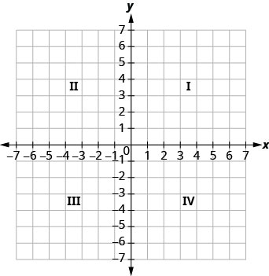
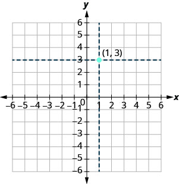

- Plot points in a rectangular coordinate system
- Verify solutions to an equation in two variables
- Complete a table of solutions to a linear equation
- Find solutions to a linear equation in two variables

## Assignment

- [#1–49 1-5-9s](https://openstax.org/books/elementary-algebra-2e/pages/4-1-use-the-rectangular-coordinate-system#fs-id1169596379762)

---

## Plot Points on a Rectangular Coordinate System

In order to show the relationship between two variables, like someone's height and weight, we can plot them on a coordinate plane. The coordinate plane is really just a two-dimensional number line. Instead of just one horizontal number line (the **$x$-axis**), there is a second one in the vertical direction (**$y$-axis**). Those two axes (plural of 'axis') meet at their zeroes, which break the plane into four quadrants.

> 
>
> **Figure 4.1.1** The coordinate plane and the four quadrants.
{: .figure}

Any point on the coordinate plane is represented by an **ordered pair**, like $(1,3)$. The first number is the **$x$-coordinate** and the second the $y$-**coordinate**. Each tells you where to move along the respective axis. With $(2,3)$, you move horizontally $1$ and then $3$ vertically.

> 
>
> **Figure 4.1.2** The points $(2,3)$ plotted on the coordinate plane.
{: .figure}

If the ordered pair has negatives, that just means you look on the negative side of the axis. A zero means you don't move at all in that direction.

## Verify Solutions to an Equation in Two Variables

We're going to leave the coordinate plane behind for a bit and focus on equations again, but this time equations with two variables.

$$\begin{align}
y=-3x+5
\end{align}$$

These are called **linear equations in two variables**, or often just **linear equations**. These do not have a single solution, but instead an infinite number of them. And each of those solutions is represented as an ordered pair $(x,y)$.

We'll eventually get to how to work with that kind of information, but for now we'll just verify if something is a solution, as well complete a partial solution.

To verify that an ordered pair is a solution, you just plug the $x$-coordinate in for $x$ and the $y$-coordinate in for $y$. Let's try it out with $(1,2)$.

$$\begin{align}
y & = -3x + 5 \\
(2) & = -3(1) + 5 \\
2 &= 2
\end{align}$$

Both sides come out to be the same, so it's a solution.

## Complete a Table of Solutions to a Linear Equation in Two Variables

In this situation, we'll have a number of incomplete solutions. Ordered pairs with only one coordinate. To find the missing piece, plug in the one coordinate you do have to determine the other.

We'll us the equation $y=4x-2$ to complete the table below.

|  $x$ |  $y$ | $(x,y)$ |
| ---: | ---: | ------: |
|  $0$ |      |         |
| $−1$ |      |         |
|  $2$ |      |         |

$$\begin{align}
y &= 4x - 2 \\[1em]
y &= 4(0) - 2 \\
y &= -2 \\[1em]
y &= 4(-1) - 2 \\
y &= -4 - 2 \\
y &= -6 \\[1em]
y &= 4(2) - 2 \\
y &= 8 - 2 \\
y&= 6 
\end{align}$$

|  $x$ |  $y$ |   $(x,y)$ |
| ---: | ---: | :--------: |
|  $0$ | $-2$ |  $(0,-2)$ |
| $−1$ | $-6$ | $(-1,-6)$ |
|  $2$ |  $6$ |   $(2,6)$ |

### Find Solutions to a Linear Equation

If you are asked to find *any* solution to a linear equation, you are free to pick any number you want for one coordinate and then solve for it's match. Make your life easier by picking easy numbers. I recommend $0$, $1$, and then either $-1$ or $2$.
