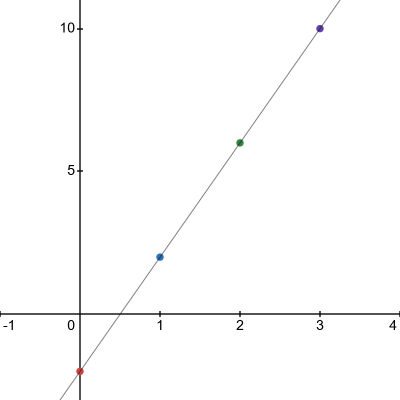

- Recognize the relationship between the solutions of an equation and its graph
- Graph a linear equation by plotting points
- Graph vertical and horizontal lines

## Assignment

- [#55–135 1-5-9s](https://openstax.org/books/elementary-algebra-2e/pages/4-2-graph-linear-equations-in-two-variables#fs-id1169594028663)

---

## Recognize the Relationship Between the Solutions of an Equation and its Graph

A linear equation has an infinite number of solutions, but there is a pattern to those solutions. Some of the solutions to the linear equation $y=4x-2$ are below.

|  $x$ |  $y$ | $(x,y)$  |
| ---: | ---: | :------: |
|  $0$ | $-2$ | $(0,-2)$ |
|  $1$ |  $2$ | $(1,2)$  |
|  $2$ |  $6$ | $(2,6)$  |
|  $3$ | $10$ | $(3,10)$ |

If take those points an graph them, they form a straight line.

> 
>
> **Figure 4.2.1** Graph of some of the solutions to $y=4x-2$.
{: .figure}

This holds true for every solution and every linear equation. **Every point on a line is a solution of the matching equation, and every solution of a linear equation is a point on the mathcing line.**

With that in mind, graphing a linear equation is great way to visualize all the solutions to it, even though there an infinite number of them. To graph these, use the strategy from last section where you found three solutions to an equation. Pick three solutions, any three solutions.

## Graph Vertical and Horizontal Lines

These look a little different, and technically don't have two variables. Two examples are below.

$$\begin{align}
x = 3 \qquad y = -2
\end{align}$$

You read these as "no matter what, $x$ is always 3" or "every point has a $y$ value of $-2$". The results are lines that are either horizontal or vertical.

In the case of $x=3$, or $x=c$ in general, this produces vertical lines. Because the $x$ coordinate is always the same, the line only moves up and down.

The opposite is true for $y=-2$ or $y=c$. The line can only move left and right since the $y$ coordinate is locked, producing a horizontal line.
