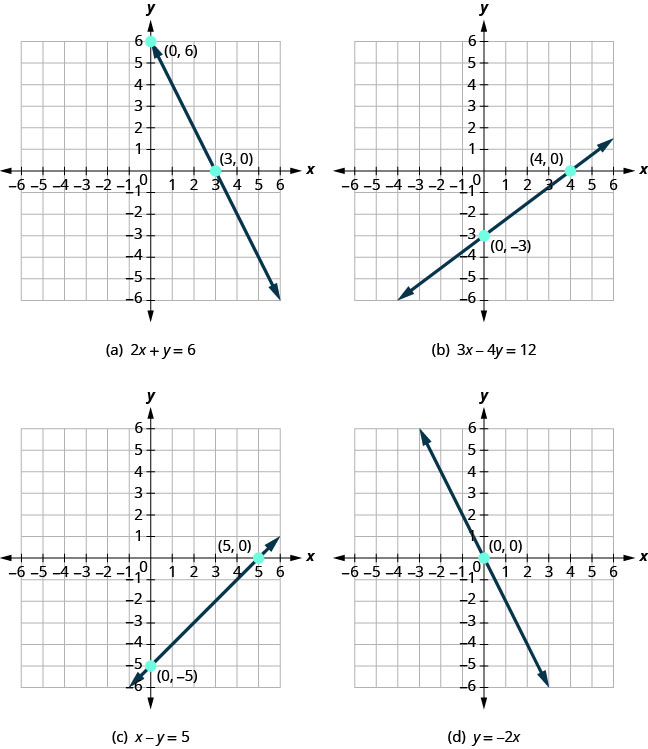

 
- Identify the $x$- and $y$-intercepts on a graph
- Find the $x$- and $y$-intercepts from an equation of a line
- Graph a line using the intercepts

## Assignment

- [#139–205 1-5-9s](https://openstax.org/books/elementary-algebra-2e/pages/4-3-graph-with-intercepts#fs-id1169597726063)

---

## Identify the $x$- and $y$-Intercepts on a Graph

It's good practice to use three points to graph a line, just to make sure there are no mistakes, but you technically only need two. Two convenient points are the **intercepts**, where the line crosses the $x$- and $y$-axis.

> 
>
> **Figure 4.3.1** Some equations, their lines and their intercepts.
{: .figure}

These points are visually convenient because it's usually easy to spot where they cross each axis. And they are numerically convenient because one of the coordinates is $0$.

- An $x$-intercept crosses the $x$-axis at a point where the $y$-coordinate is $0$.
- A $y$-intercept crosses the $y$-axis at a point where the $x$-coordinate is $0$.

## Finding and Graphing Intercepts from an Equation

Finding intercepts from an equation involves using the $0$ rule from above. If you want to find the $x$-intercept, plug a $0$ in for $y$. If you want the $y$-intercept, plug $0$ in for $x$.

$$\begin{align}
2x + y &= 6 \\[1em]
2(0) + y &= 6 \\
y &= 6\\[1em]
2x + (0) &= 6 \\
x &= 3
\end{align}$$

For the equation above, your $y$-intercept is $(0,6)$ and the $x$-intercept is at $(3,0)$.

To graph, plot those two points, and then do one more. Finding a third point is still best practice for making sure you get a proper line from the equation. For this equation, plugging in $1$ yields $y=4$, so $(1,4)$ is our third point.
