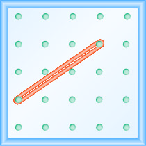
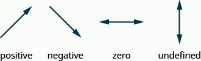

- Use geoboards to model slope
- Use $m=\text{rise}/\text{run}$ to find the slope of a line from its graph
- Find the slope of horizontal and vertical lines
- Use the slope formula to find the slope of a line between two points
- Graph a line given a point and the slope
- Solve slope applications

## Assignment

- [#211–279 1-5-9s](https://openstax.org/books/elementary-algebra-2e/pages/4-4-understand-slope-of-a-line#fs-id1169597872953)

---

## Use Geoboards to Model Slope

The lines you've been graphing and looking at all have a slant, or a tilt, to them. This slant is called the **slope** of the line and it's measured by ratio, two numbers written as a fraction.

To see that ratio, you can take the line in question and turn it into a right triangle. The book shows this off using Geoboards, boards with pegs and rubber bands. The two images below show how to transform a line into a right triangle.

> 
>
> **Figure 4.4.1** A line on a Geoboard.
{: .figure}

> 
>
> **Figure 4.4.2** The same line now as the hypotenuse of a right triangle.
{: .figure}

The triangle version shows how we can move from one end of the line to the other using only vertical and horizontal movements. In this case, we moved up $2$ and right $3$. We use these two numbers to write the ratio describing the slope, so $\frac{2}{3}$.

> ### Slope of a Line
>
> The slope of a line is $\frac{\text{rise}}{\text{run}}$
>
> The rise measures the vertical change between two points on the line, and the run measures the horizontal change.
{: .definition}

Positive slopes mean a line goes up when looking at them from left to right, and negative slopes are when it goes down from left to right.

## Find the Slope of a Line from its Graph

To do what we did above on an actual line, we just need two points. Literally any two points on the line. It helps if they fall on the grid so you can count, but there is another way: subtraction.

One of the words used to describe subtraction is "difference", which is what we want to know here. What is the difference, or distance, from one point to the next vertically? What is the difference horizontally?

So, given any two points on a line, you can find the slope by subtracting.

> ### Slope Formula
>
> The slope of the line between two points $(x_1,y_1)$ and $(x_2,y_2)$ is
>
> $$\begin{align}
> m = \frac{y_1-y_2}{x_1-x_2}
> \end{align}$$
>
> Which point is the first or second does not matter.
{: .definition}

If we want to find the slop of the line between the points $(1,2)$ and $(4,5)$, then

$$\begin{align}
m &= \frac{y_1-y_2}{x_1-x_2} = \frac{2-5}{1-4} 
  = \frac{-3}{-3} 
  = \frac{1}{1} = 1
\end{align}$$

You might want to keep your slopes as fractions so you can see the ratio of rise versus run. In the example above, the line goes up $1$ for every $1$ is moves to the right.

## The Slope of Horizontal and Vertical Lines

Earlier I mentioned positive slopes mean a line goes up and negative down, but I neglected to mention a slope of $0$. Well, that just means it doesn't go up or down at all, it stays flat. Horizontal lines have this property, and you can see it with the formula as well.

The points $(3,7)$ and $(4,7)$ both lie on at $y=7$ horizontal line. To find the slope between those two points, we would get

$$\begin{align}
m &= \frac{7-7}{3-4} = \frac{0}{-1} = 0
\end{align}$$

Well, what about vertical lines? Unfortunately, the answer is a bit strange. Let's start with the formula for the points $(2,3)$ and $(2,4)$, two points on the vertical line at $x=2$.

$$\begin{align}
m = \frac{3-4}{2-2} = \frac{-1}{0} = \text{undefined}
\end{align}$$

You can't divide by zero, and vertical lines aren't really something that you would naturally consider having a slope anyway. They're more like walls.

---

Here's a nice summary of the types of slopes you'll run into.

> 
>
> **Figure 4.4.3** Types of slopes.
{: .figure}
